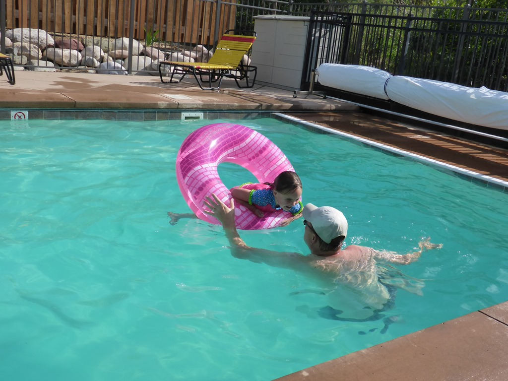
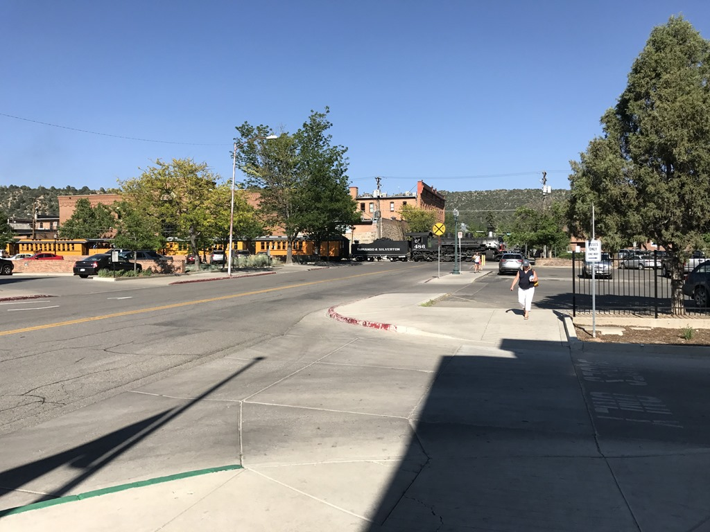
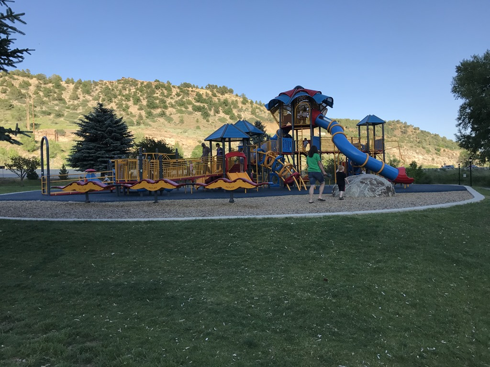
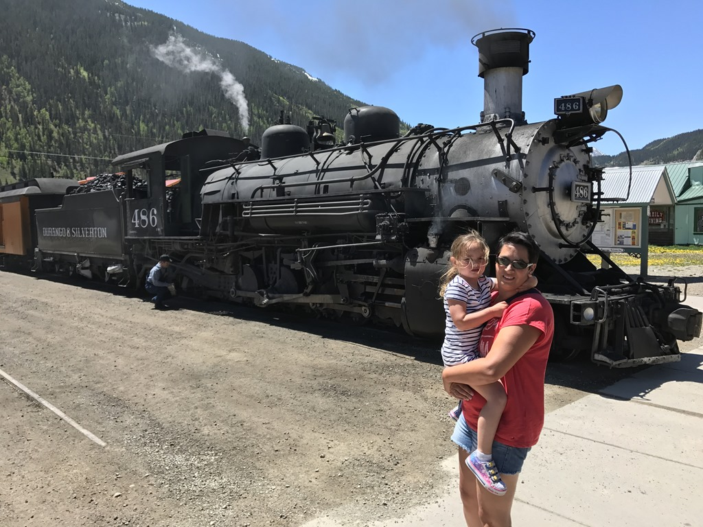
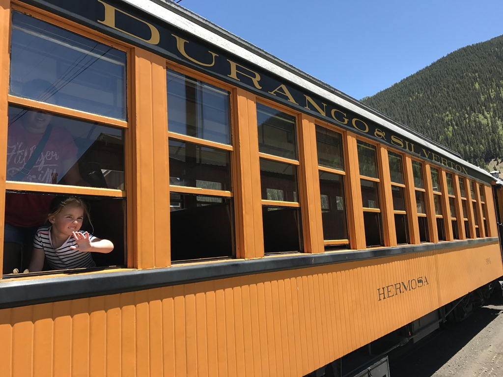
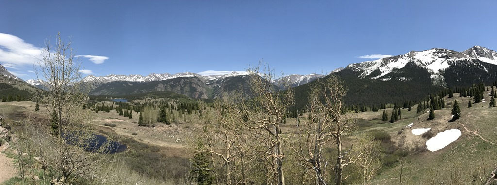
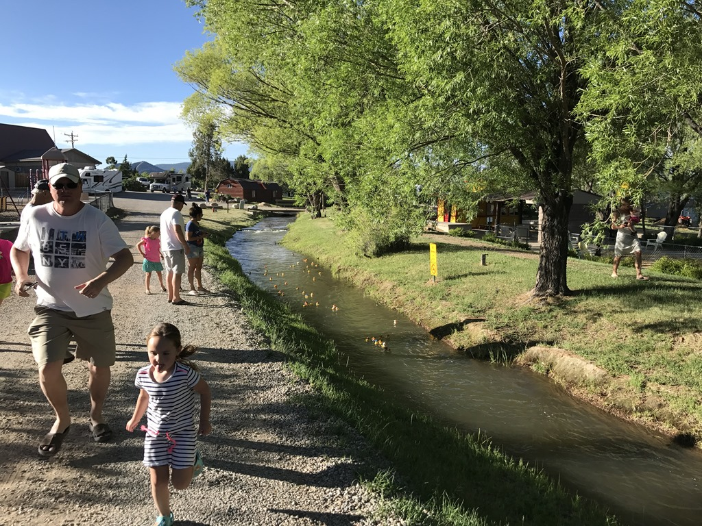
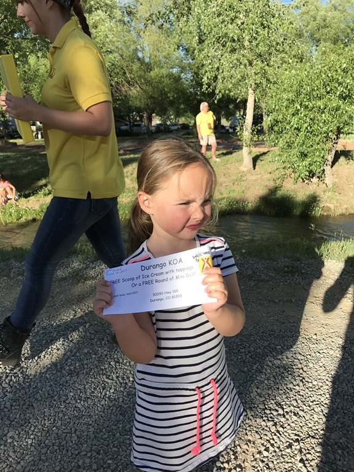
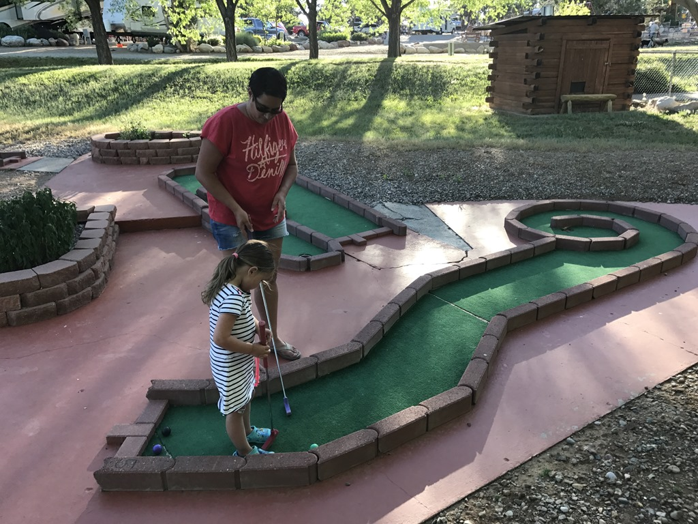

Omdat we vandaag Durango en morgen Silverton willen bezoeken, leek  het ons handiger om een auto te huren. Met de RV de stad in, is meestal niet zo'n goed idee, omdat je het ding nergens kwijt kunt. Dus hebben we bij de lokale Enterprise een Hyundai op de kop getikt en zijn we naar de KOA in Durango gereden. Dit is voor de verandering weer eens een goede KOA (de kwaliteit wisselt nogal per camping, van slecht tot erg goed). Direct na aankomst hebben we het zwembad aan een intensieve keuring onderworpen, en met name de kleinste van het stel is erg in haar sas.

We zijn gaan eten bij Carver Brewing Company, een brouwerij en restaurant bij elkaar midden in het historische centrum van Durango. In de tuin staat 's werelds grootste fiets, en de bijbehorende Big Bike Double IPA smaakt meer dan goed, misschien iets te goed, want hij hakt er behoorlijk in bij me. Downtown Durango is alleraardigst met heel veel restaurantjes en winkeltjes en natuurlijk het vertrekpunt van de Durango Silverton Narrow Gauge stoomtrein. Toen we de auto geparkeerd hadden, hoorden we de trein net aankomen.

Na het eten zijn we op de terugweg nog even gestopt bij een speeltuin om de laatste restjes energie te verbranden.

De volgende morgen zijn we met de auto naar Silverton gereden. Dit is een oud mijnstadje hoog in de bergen, en is dus het eindpunt van de Durango Silverton stoomtrein. Een paar jaar geleden zijn we al eens met deze trein naar boven gereden, en dat was erg leuk. We vermoeden dat de rit van ruim 3 uur wat te lang is voor Sofie, dus dat houdt ze nog te goed voor een volgende keer. Toen we in Silverton aankwamen, hoorden we de fluit van de trein al in de verte. Toeval of niet, maar we kwamen wederom tegelijk met de trein aan in Silverton.

We hebben wat door het stadje gewandeld en geluncht, en daarna zijn we weer terug gereden naar het zwembad. De lunch was qua hoeveelheid van dien aard, dat we 's avonds gewoon een boterham hebben gegeten.

's Avonds werd een duck race gehouden op de camping, waarbij een aantal bad eendjes worden losgelaten in de beek die de camping doorkruist. En het eendje van Sofie heeft gewonnen! De prijs was een gratis potje mini golf, dus de tegoedbon hebben we maar meteen verzilverd.

