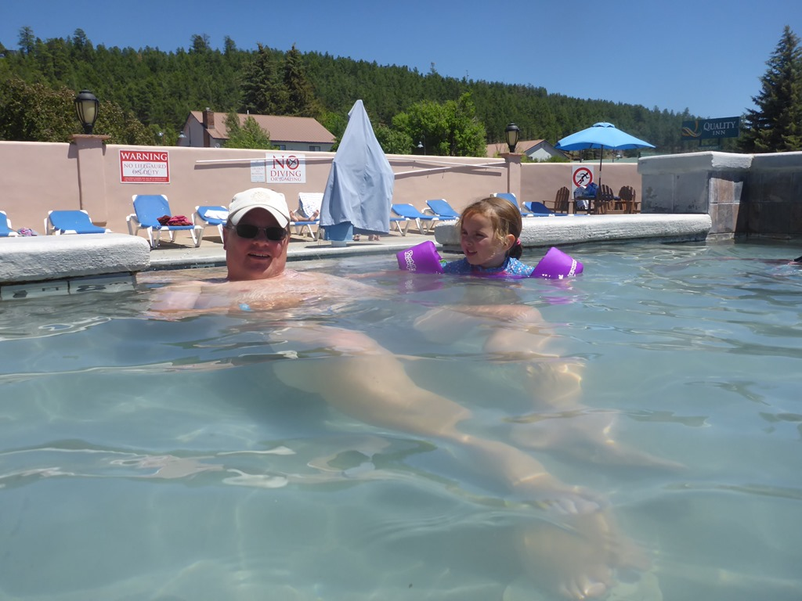
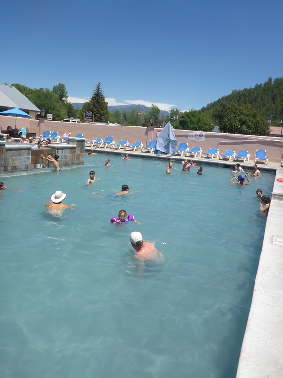
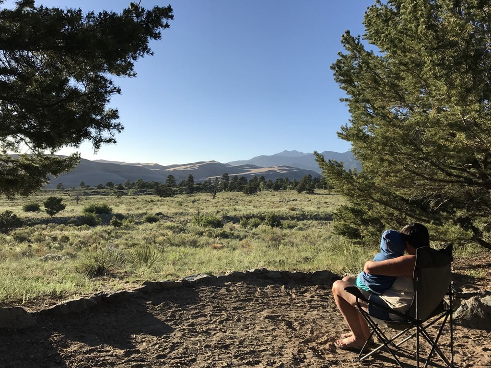

De rit naar dit park onderbreken we door halverwege een stop te maken bij Pagosa Hot Springs. Er is een heel aantal warm water bronnen waarin je kunt baden en kunt genieten van de rotte eieren lucht vanwege het vrijkomende zwavel.

We hebben een aantal uurtjes hier doorgebracht en van de 23 verschillende baden genoten. Sommige waren onaangenaam warm, maar in de meerderheid was erg prettig vertoeven.

Nadat we de zwavellucht van ons af hadden gedoucht, hebben we de laatste twee uurtjes gereden naar Great Sand Dunes National Park: dit park is, de naam zegt het al, beroemd vanwege de duinen, en wel de hoogste van Noord Amerika (zo’n 230 meter hoog!). We waren er pas rond half zes, dus na aankomst hebben we meteen de BBQ aangezwengeld en gegeten. We hebben vanaf onze site een mooi uitzicht op de duinen en de achterliggende bergen.

