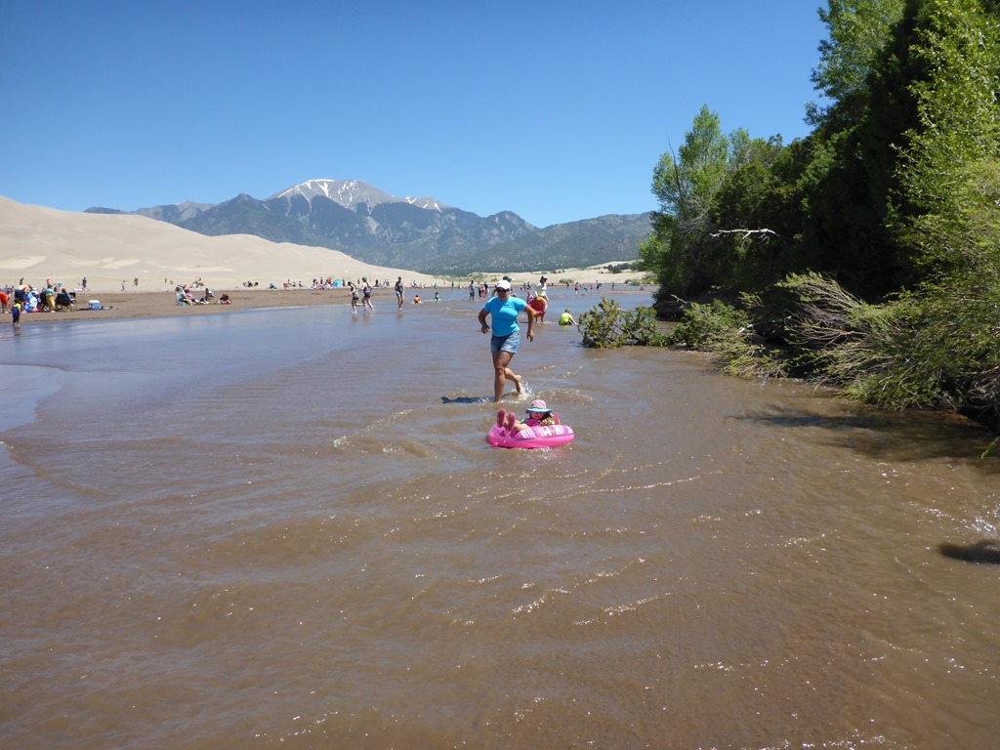
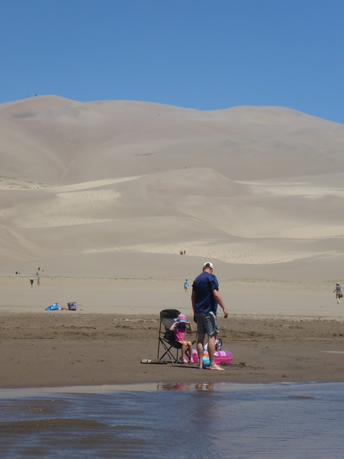
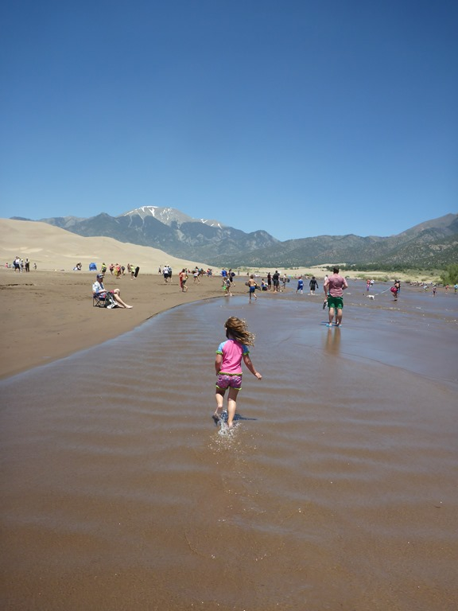
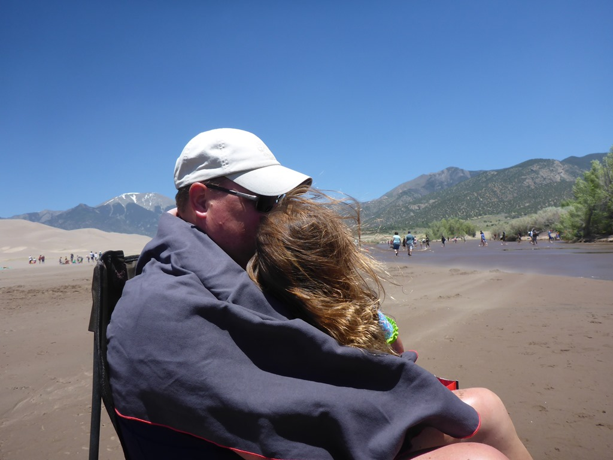
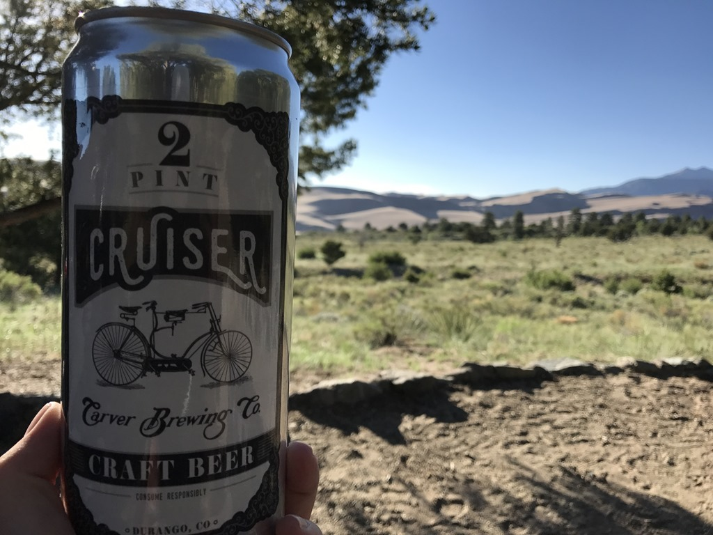
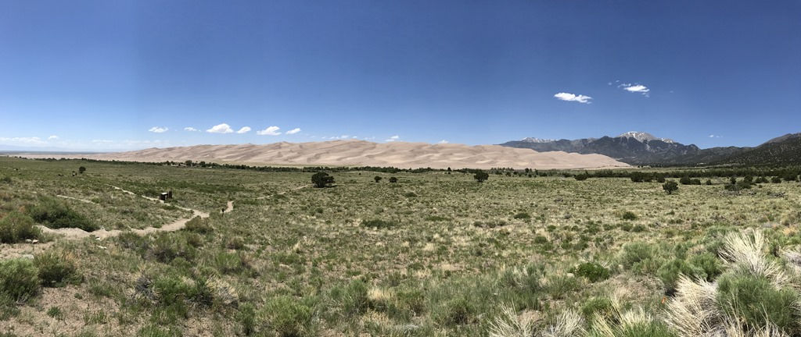

De duinen zijn natuurlijk hartstikke mooi om te bekijken, maar om ze nou te gaan beklimmen… dat leek ons niet zo’n goed idee. Gelukkig is er gedurende een korte periode (een paar weken per jaar) een snelstromend riviertje in het duinengebied van al het smeltwater van de omliggende bergen. In dat riviertje (hooguit enkele tientallen centimeters diep) kun je met een zwemband meevaren op de stroming. Erg leuk, en ook erg populair, het zag zwart van ‘t volk.

In de middag ging helaas erg hard waaien, wat onaangenaam was voor lijf en leden. Dus we zijn op tijd weer teruggekeerd naar de camping en hebben wat gerommeld rond de camper. Achter onze camper zat je lekker in de schaduw, redelijk uit de wind en je kon ondertussen een mooie blik werpen op de duinen.

Voordat we het park verlaten, zijn we eerst nog bij de visitor center de junior ranger badge gaan ophalen, en hebben we een laatste keer gekeken naar de duinen.

Van hieruit gaan we naar een KOA doorreis-camping in Pueblo, nog steeds in Colorado.
