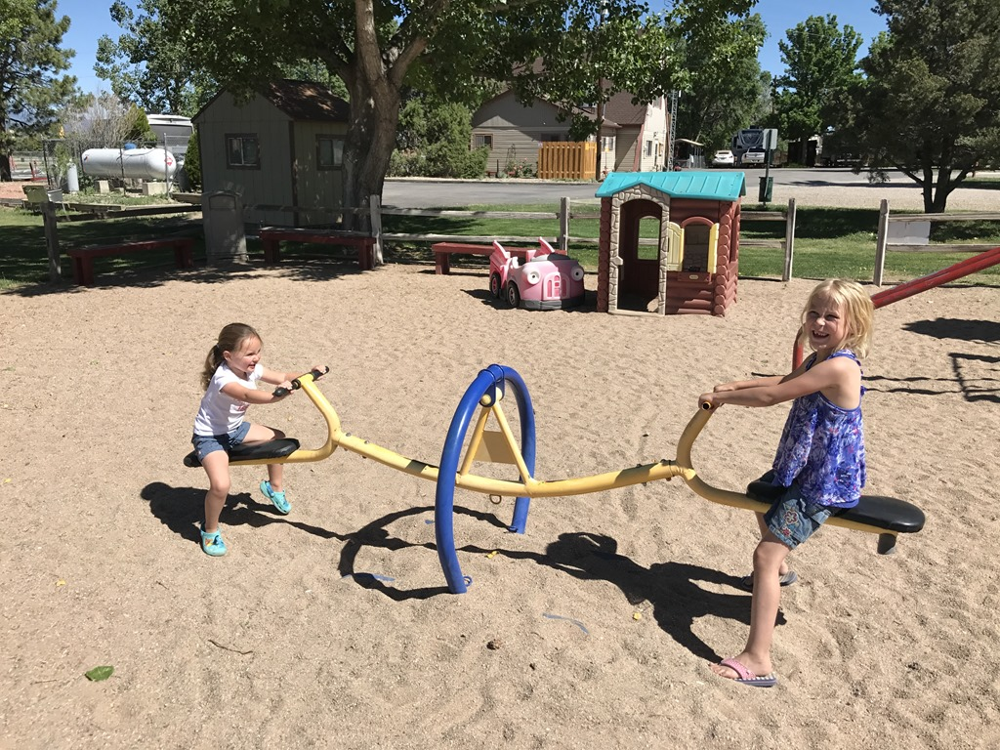
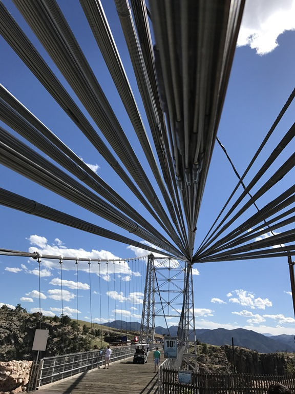
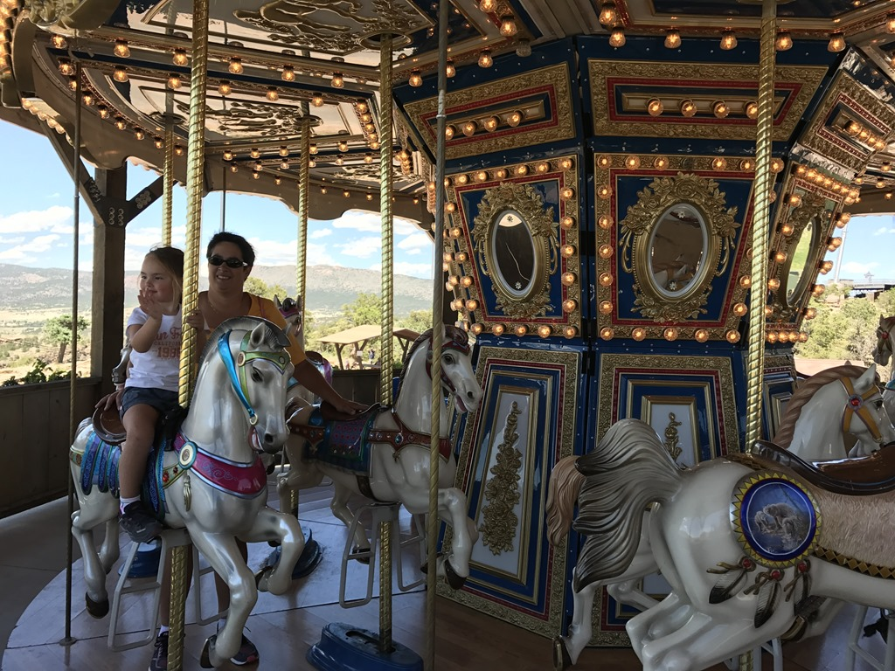
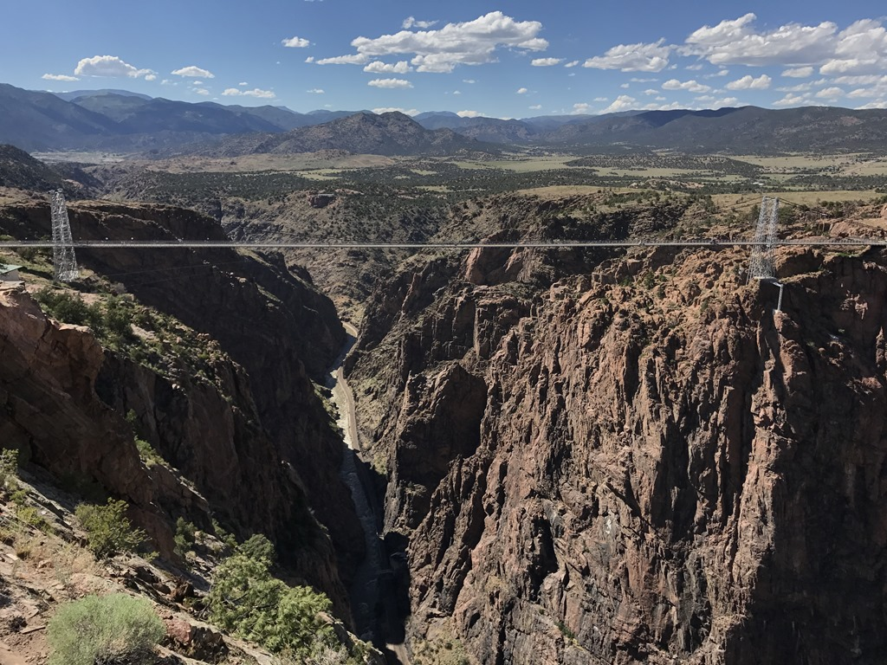

Vanuit de Sand Dunes zijn we naar overnachtingscamping KOA Pueblo gereden. Landschappelijk gezien niet al te interessant, voornamelijk vlak en veel gras. Het is weer eens wat anders dan zand en rotsen zal ik maar zeggen. Het is de gebruikelijke KOA, maar deze keer met zeer goede wifi, bijna als thuis! We zijn even gaan zwemmen, maar het water was veel te koud. En dus zijn maar naar de speeltuin geweest en hebben we nog een potje mini golf gespeeld.

De volgende morgen zijn we weer verder gereden naar Royal Gorge Park. Basis van dit park is een van de hoogste hangbruggen ter wereld (tot 2003 waren ze nummer 1, totdat een stel Chinezen een hogere brug bouwden). De brug gaat over een kloof en je hangt op een hoogte van 291 meter boven de Arkansas river. Het is best spectaculair om er overheen te lopen.

Aan de overkant is een soort ieniemienie pretparkje gemaakt met een carrousel, een mega klim- en klauterkasteel. Verder kun je aan een soort reuzenschommel gaan hangen waardoor je de indruk krijgt het ravijn in te storten, en je kunt met een zipline terug naar de overkant. Dat is allemaal te spectaculair voor ons, dus we hebben het bij de carrousel en het speelding gelaten. Al met al is het parkje best de moeite waard om een paar uurtjes te spenderen.

De volgende camping Royal View Campground (met uitzicht op de brug) lag op slechts een paar minuten rijden van het park.

## 1 opmerking

### Gerard 26 juni 2017 om 20:54

We lopen door onze drukke vakantie een beetje achter in de blog maar nu, 26-6, de vrije avond voor de inhaalslag. Dat is weer genieten van mooie plaatjes
