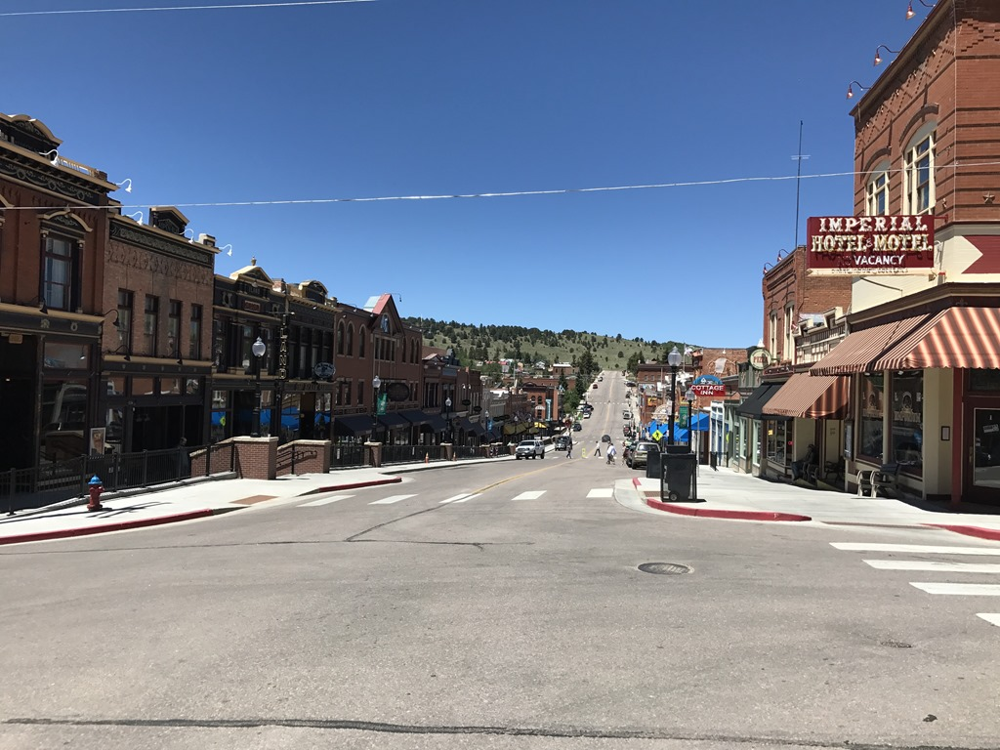
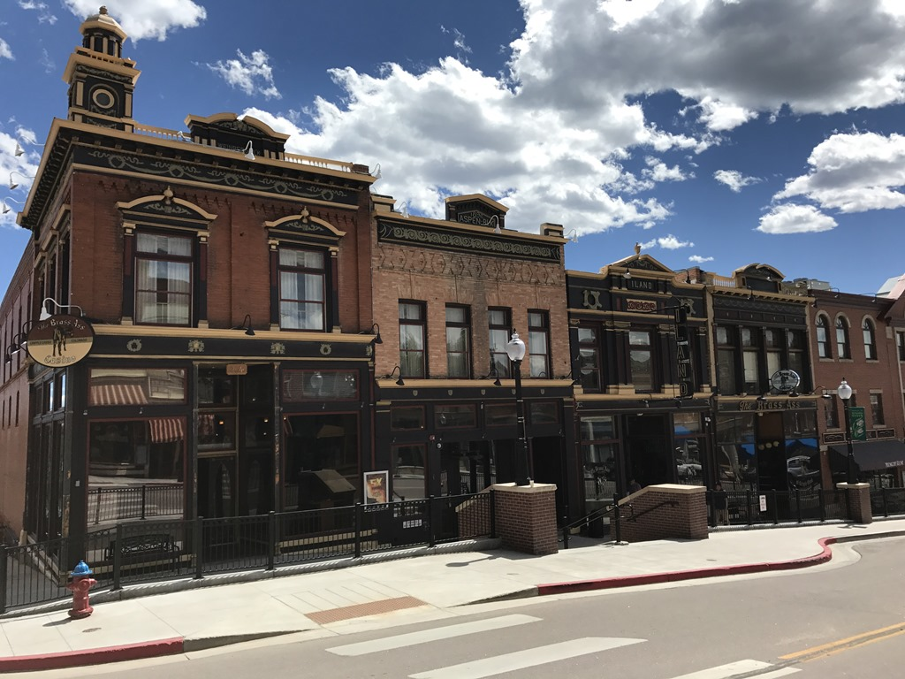
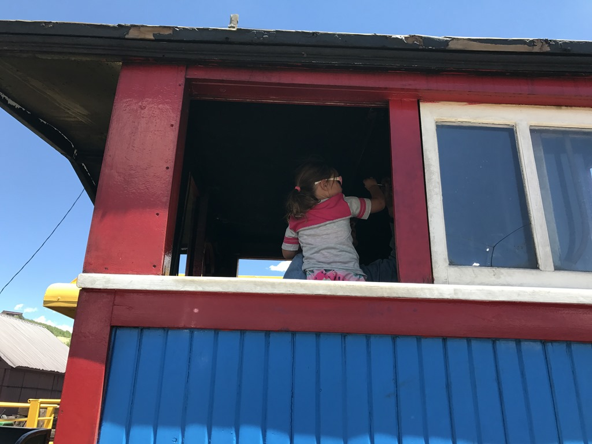
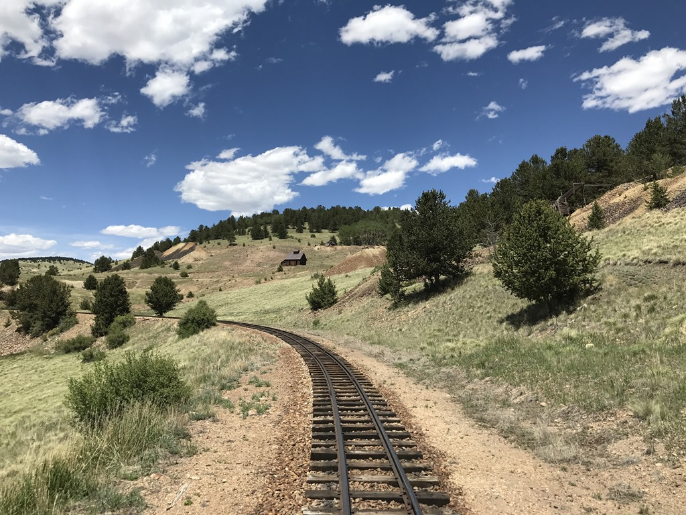
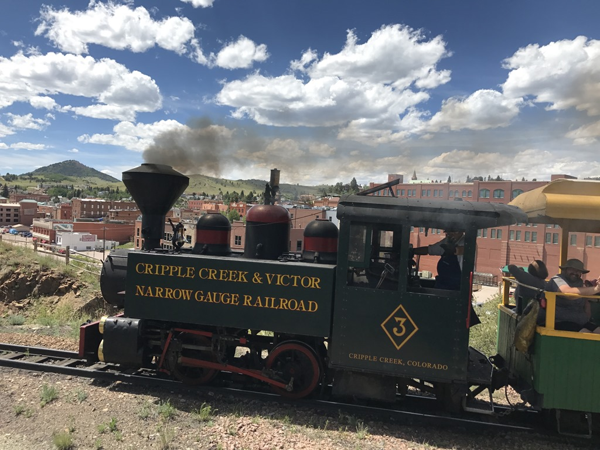

Cripple Creek is een oude mijnstad hoog in de bergen, waar nog steeds goud wordt gevonden overigens. Er zijn veel oude mijnen waarvan je een aantal kunt bezoeken middels een ritje met een stoomtrein. Het stadje zelf ademt de sfeer uit van begin 1900 en is erg gezellig, ondanks het hoge aantal casino's en inmiddels failliete etablissementen. We hebben door de hoofdstraat gewandeld, geluncht in een casino (we konden niks anders fatsoenlijks vinden), en toen zijn we naar de trein gegaan.

Bij de trein aangekomen bleek iets verderop een bermbrandje te zijn waardoor we dus niet mochten vertrekken van de brandweer. Om de tijd te doden mochten alle kinderen aan de fluit trekken van de locomotief, wat spannend!

Na het sein brand meester vertrokken we uiteindelijk met drie kwartier vertraging.

De trein maar ook het ritje is geen vergelijk met de Durango Silverton trein, maar was toch erg leuk.

Toen we weer terug waren in het stadje, hebben we de camper opgehaald en zijn we naar Mueller State Park gereden voor de overnachting. Wat een mooie camping zeg! We hebben weer eens een kampvuurtje gemaakt en marshmallows geroosterd.

## 1 opmerking

### Gerard 26 juni 2017 om 20:57

Leuk onze kleine machinist
