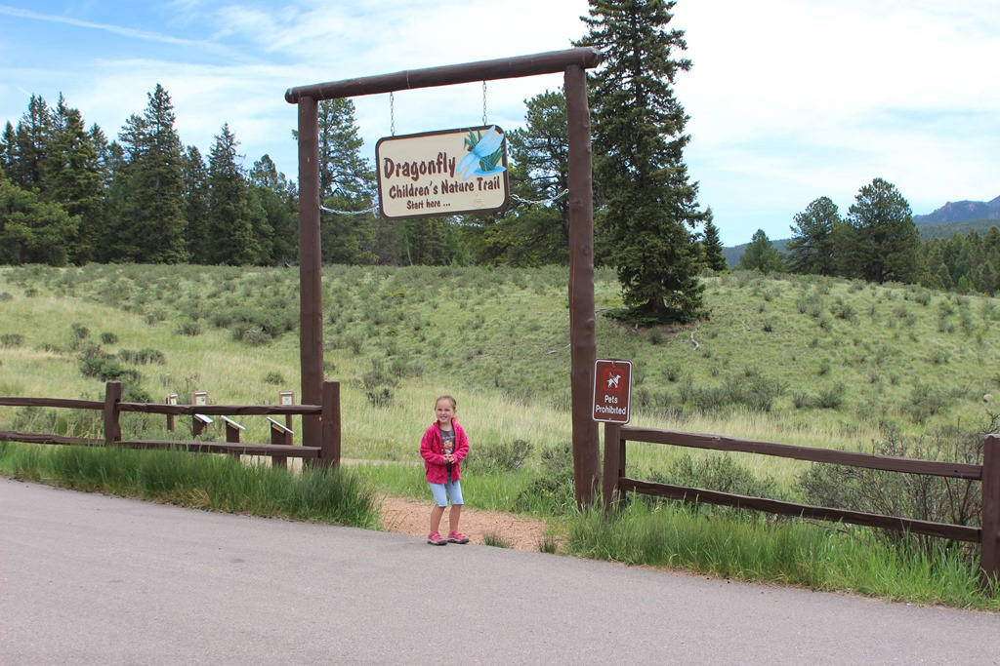
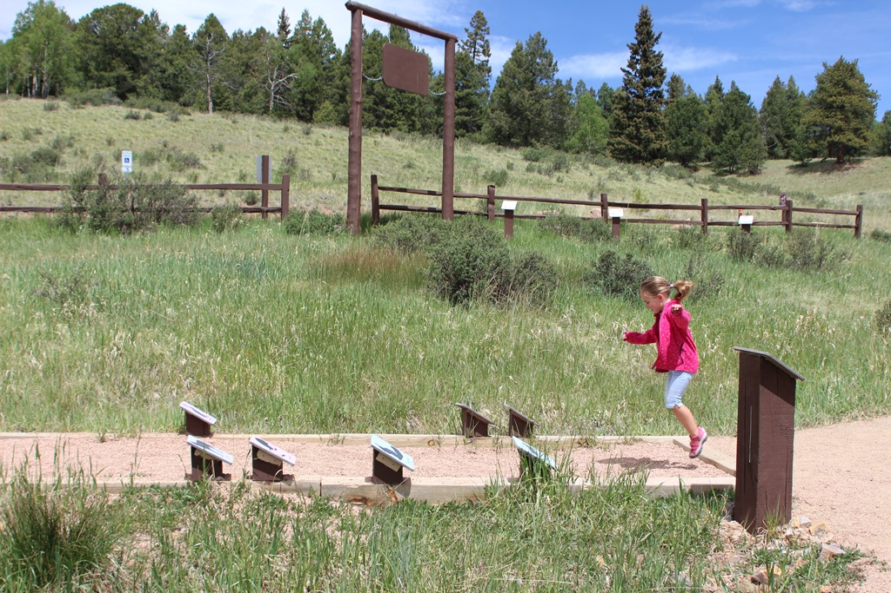
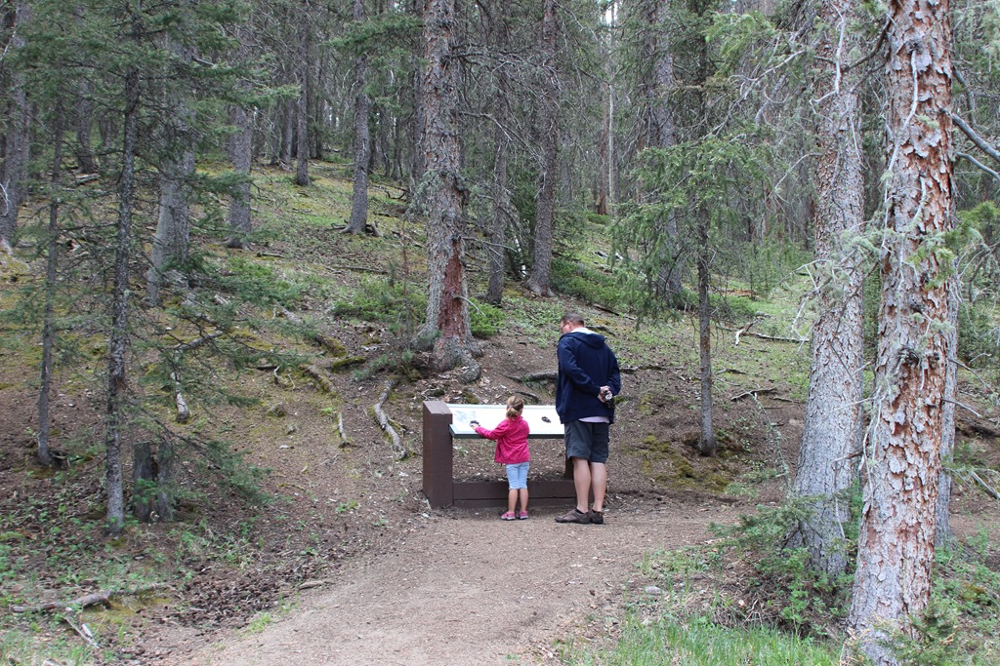

Voordat we het park verlaten hebben we eerst nog de Dragonfly Children's Nature Trail gewandeld. Het padje is slechts een paar honderd meter lang, maar er is een heel aantal activiteiten te doen voor de kindertjes onder ons. Zo kun je bijvoorbeeld kijken hoever je kunt springen, en het resultaat vergelijken met een dier. Sofie springt net zo ver als een konijn met zwakke knieën.

Ook wordt er van alles uitgelegd over het bos en zijn inwoners.

Na de wandeling zijn we doorgereden naar onze camping voor de komende vier nachten: Garden of the Gods RV Park in Colorado Springs. Het is een grote camping, met vooral heel veel grote RV's (de meeste semi-permanent verblijvend), en de plaatsen zijn nogal krap. Dat betekent dat onze picknicktafel zowat onder de slide (en aansluiting op riool) van de buurman staat. Voor Amerikanen is dat niet zo erg, want die zitten toch liever in hun motorhome met airco en 70 inch televisie. Gezellig is natuurlijk anders, hoewel ik moet toegeven dat we met de huidige hitte overdag ook vaak binnen in de airco blijven.

## 1 opmerking

### Gerard 26 juni 2017 om 20:59

Sofie wordt echt een grote meid
