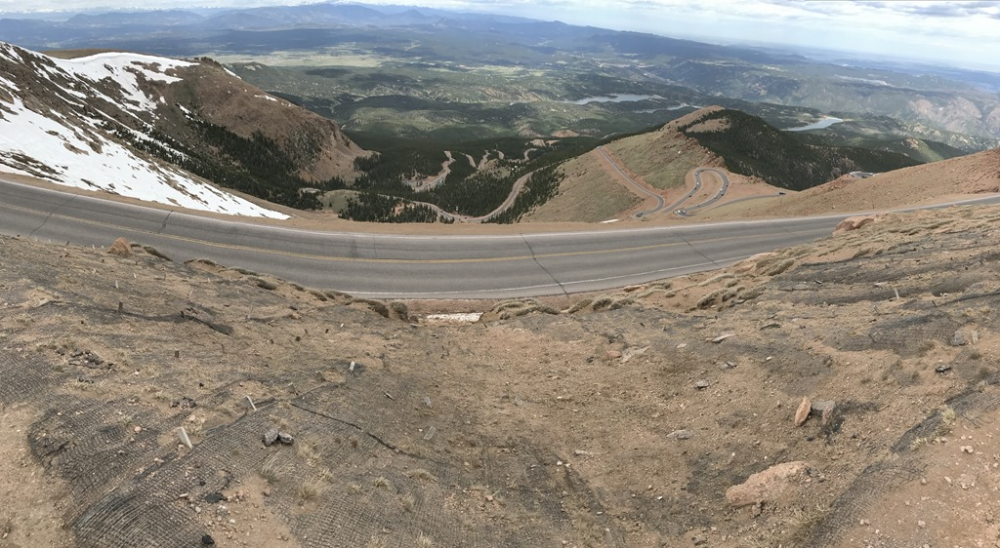
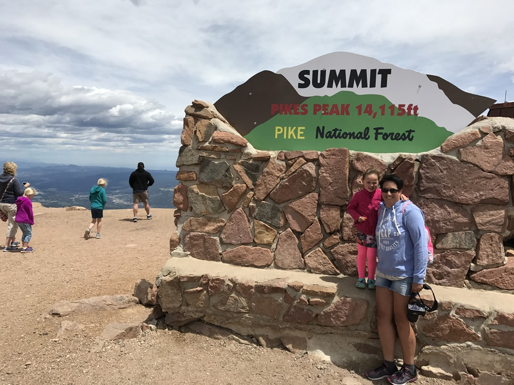
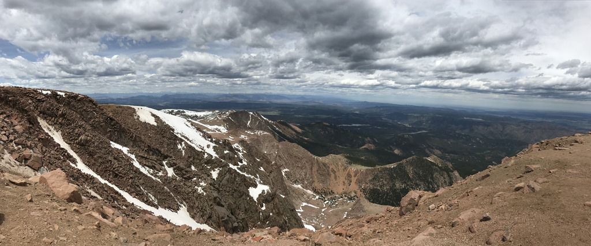
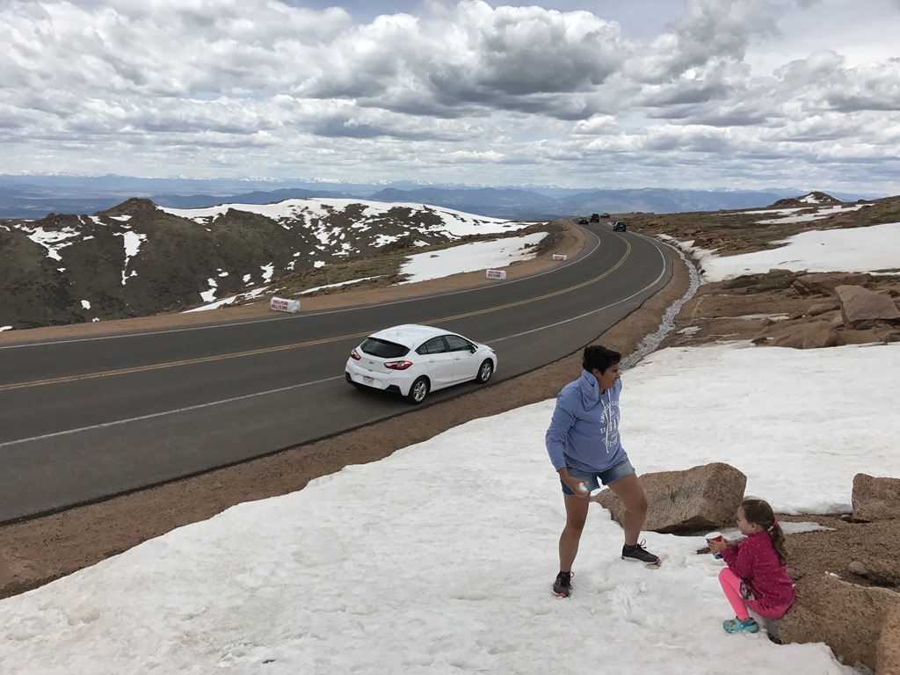
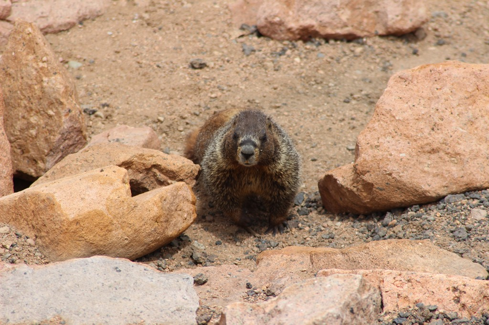
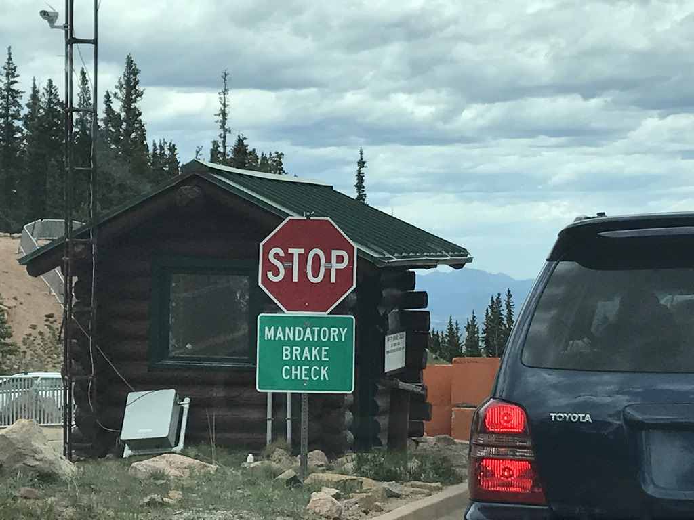
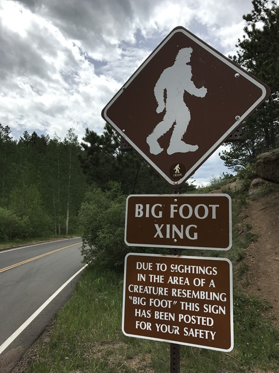

Vandaag gaan we Pikes Peak bezoeken. Van een redelijk betrouwbaar Nederlands blog hebben we begrepen dat het niet altijd verstandig is om met een RV deze 4301 meter hoge berg te gaan bezoeken (want smal, steil en af en toe wat winderig) en dus hebben we besloten om voor de komende drie dagen een autootje te huren (wellicht kunnen we onkostenvergoeding, BBQ is ook goed, verhalen bij hen?).

Om de berg op te mogen rijden moet je entree betalen, en direct na het loketje waar je betaald hebt, begint het geslinger omhoog. Je kunt met de auto helemaal naar de top rijden en hoe hoger je komt, hoe scherper de haarspeldbochten worden en hoe mooier de uitzichten. We hadden gelukkig zonnig weer, hoewel het zeker bovenop de top behoorlijk fris was.

Op de top staat een restaurant en we hebben de fout gemaakt om daar te gaan lunchen. Het was niet zo heel goed, eigenlijk was het gewoon ruk. Zonde van het geld. Dus maar weer vlug wat foto's gemaakt en weer in de auto gesprongen. Onderweg hebben we nog even in de sneeuw gespeeld.

Op de weg terug naar beneden worden halverwege je remmen gecontroleerd... We hebben hele stukken in de laagste versnelling gereden, en nog moest ik bijremmen voor sommige bochten.

Terug op de camping zijn we gaan zwemmen in het heerlijke zwembad en hebben daarna de BBQ aangestoken.

Oh ja, op deze berg schijnt Big Foot gespot te zijn!

## 1 opmerking

### Gerard 26 juni 2017 om 21:04

Leuke plaatjes van de meisjes en de omgeving!
