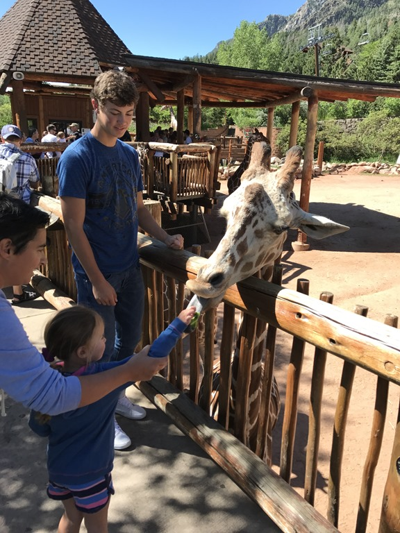
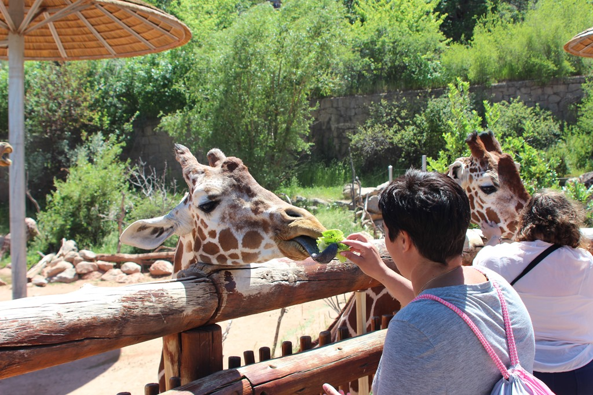
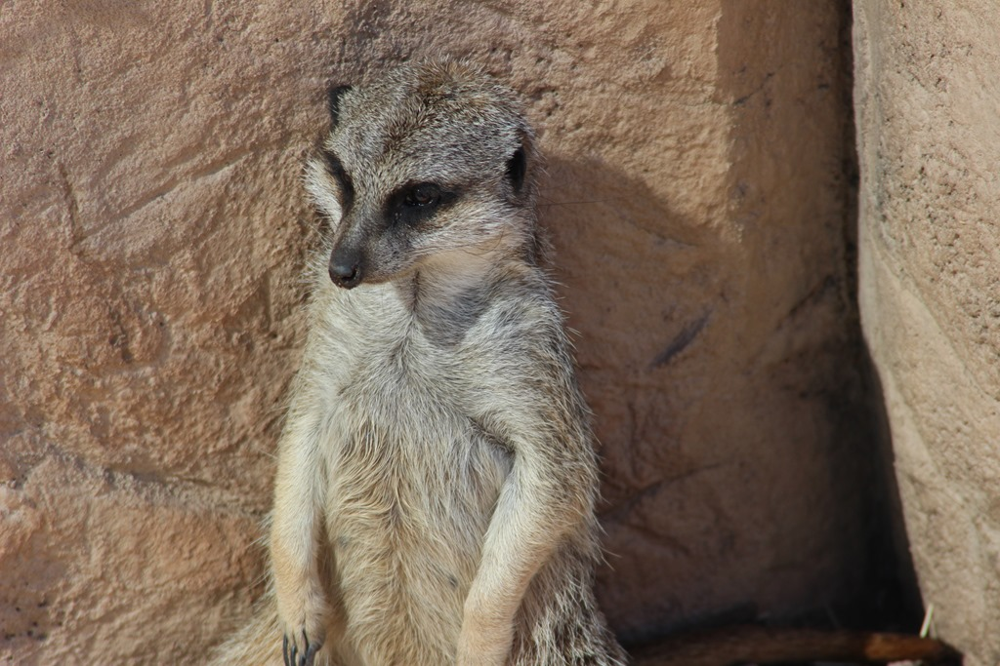
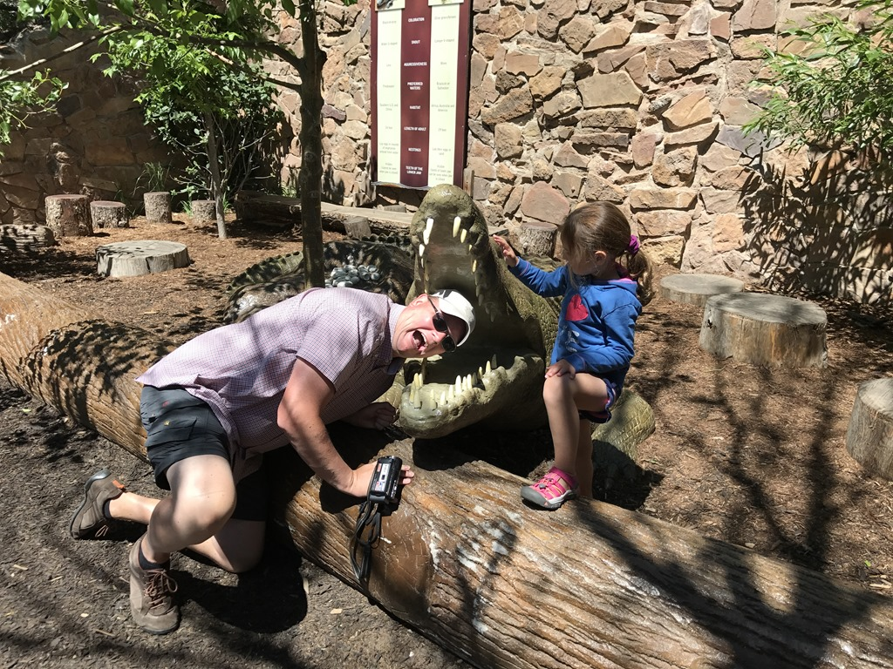

Op 20 minuutjes rijden van de camping ligt de Cheyenne Mountain Zoo. Het is een heel leuk dierentuintje waar je zelf de giraffen mag voeren. Sofie vond het toch een beetje spannend, al die langnekken met hun zwarte lange tong.

Van apen, leeuwen, olifanten en beren tot stokstaartjes, alle gebruikelijke dieren waren aanwezig.

Van de warmte werden vader en dochter wat melig, en stelden we tot tweemaal toe ons leven in de waagschaal.

Omdat we te lui waren om te koken en omdat het vaderdag is, zijn we 's avonds gaan uit eten. Fine dining bij de Applebee's...

## 1 opmerking

### Gerard 26 juni 2017 om 21:08

Roger, het lijkt alsof de happende krokodil jouw Vaderdag presentje van Sofie is!
