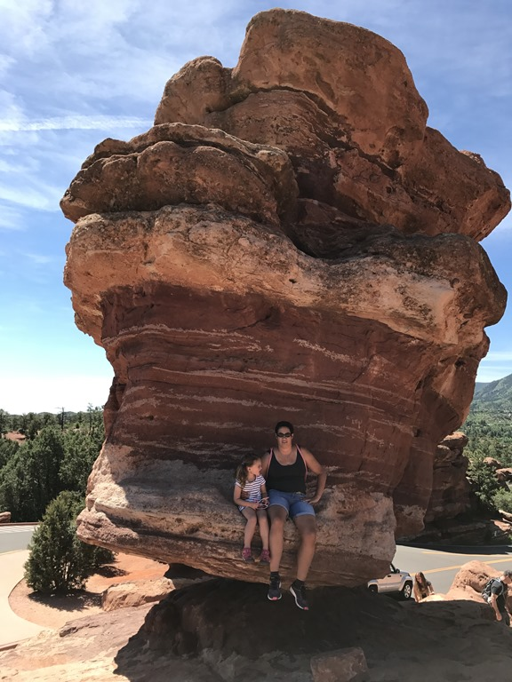
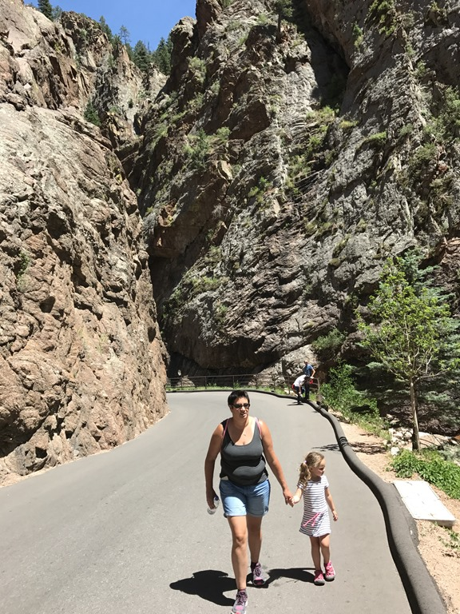
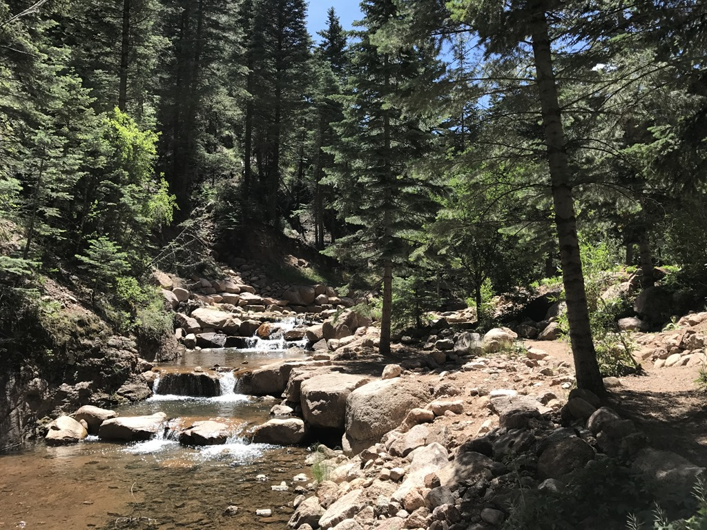
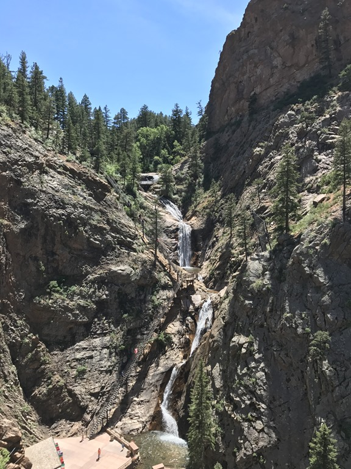
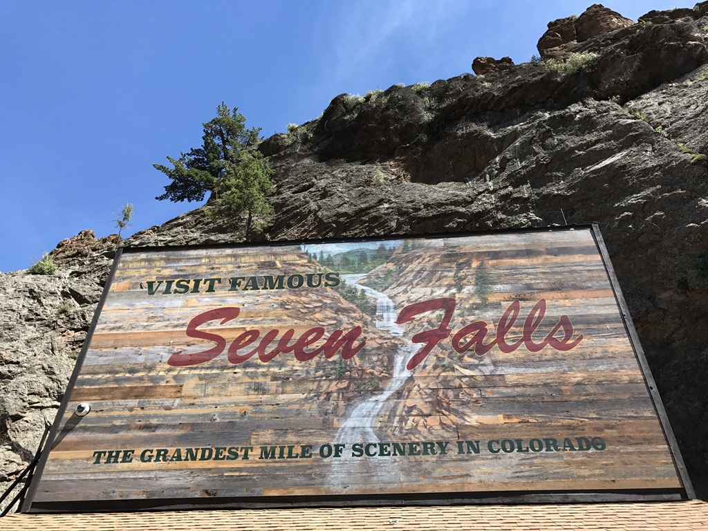

Garden of the Gods is een vrij toegankelijk park in Colorado Springs. Er is een mooi rondje te rijden, en bevat diverse bezienswaardigheden. Zoals ieder zichzelf respecterend park, hebben ze hier ook een Balanced Rock.

We hebben het rondje gereden en ironisch genoeg konden we de auto nergens parkeren terwijl er legio plek was voor RVs. En dus besluiten we om de volgende dag hier terug te komen, en zijn we doorgereden naar Seven Falls. Dit parkje neemt zichzelf erg serieus door de vele bezoekers erop te wijzen dat je je in de wildernis bevindt, en dat je dus "proper footware" moet dragen. Detail: de wandeling gaat over een geasfalteerde weg van 10 meter breed...

Je wandelt langs een beekje omhoog en na iets meer dan een kilometer eindigt de weg bij een mooie waterval. Het lijken wel zeven watervallen, vandaar de treffend gekozen naam Seven Falls.

## 2 opmerkingen

### opa 22 juni 2017 om 21:32

Prachtig, die waterval. Hebben wij hier bij Saumur niet. Wel kastelen en wijn. Héél veel wijn. Ook niks mis mee. Doei.

### Gerard 26 juni 2017 om 21:10

Wat is de wereld toch mooi, we genieten met jullie mee
