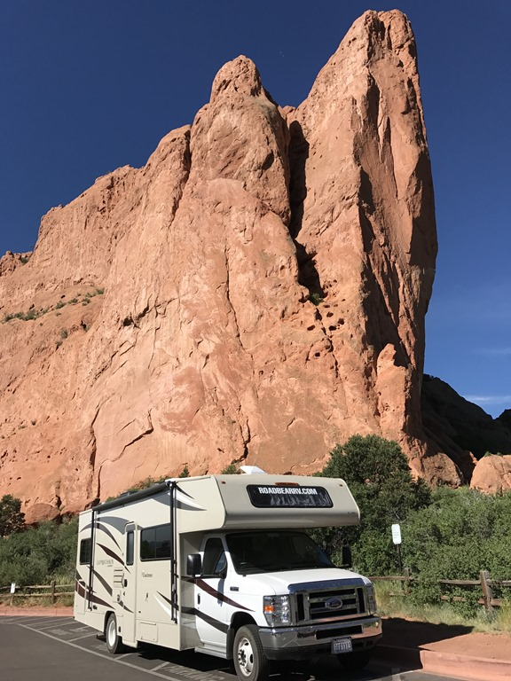
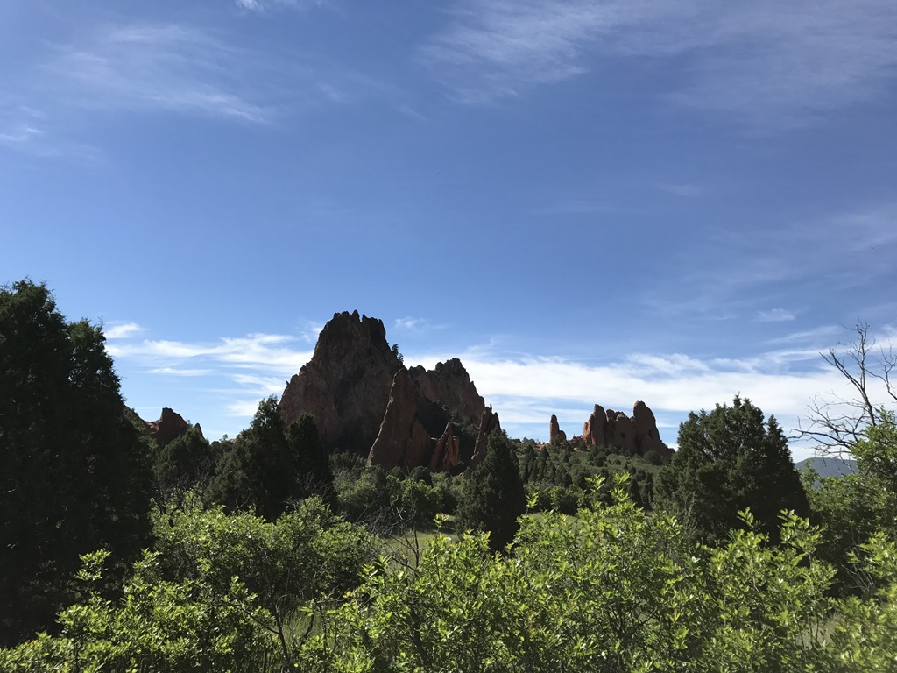
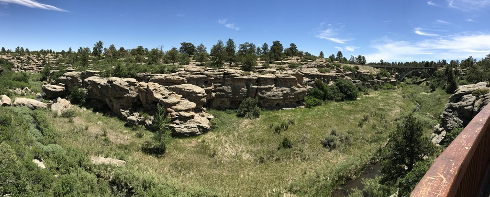
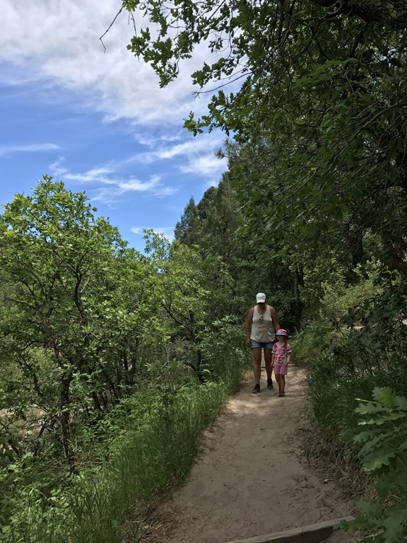
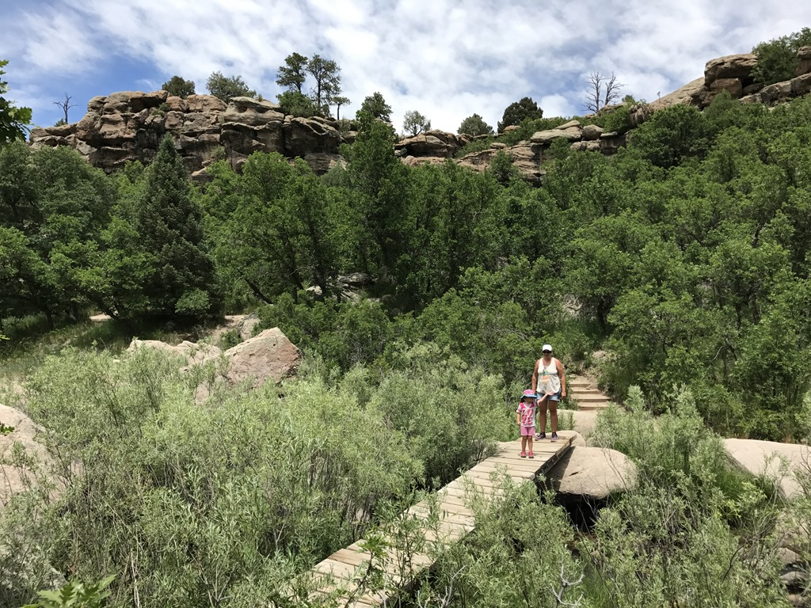
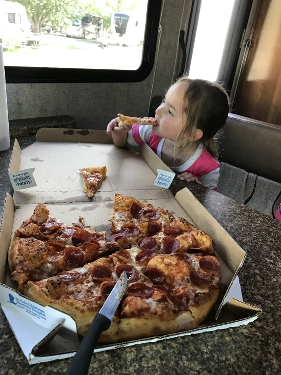

Vanmorgen hebben we de huurauto terug gebracht naar Enterprise en zijn daarna met de camper nogmaals naar de Garden of the Gods gegaan, want we wilden nog een wandelingetje doen en Sofie moest nog wat opdrachtjes doen voor het junior ranger programma.

Na het ochtendprogramma zijn we naar Castlewood Canyon State Park gereden om daar van een lekkere lunch te genieten en een kort wandelingetje te doen. Het is ongehoord warm hier, dus we waren blij dat de wandeling door het bos ging zodat we de broodnodige schaduw konden meepikken.

Hierna nog een uurtje of zo via de interstate naar de Fort Collins Lakeside KOA in het noorden van Colorado gereden. Op deze camping is van alles te vinden voor de jeugdigen onder ons. Denk aan springkussens, skelters, waterfietsen, etc. We waren wat aan de late kant, dus hebben we geheel in Yankee-stijl een pizza laten bezorgen op onze site, die na deze lange en drukke dag verrukkelijk smaakte.

## 1 opmerking

### Gerard 26 juni 2017 om 21:13

Sofie eet Pizza en zo te zien vindt ze het lekker
