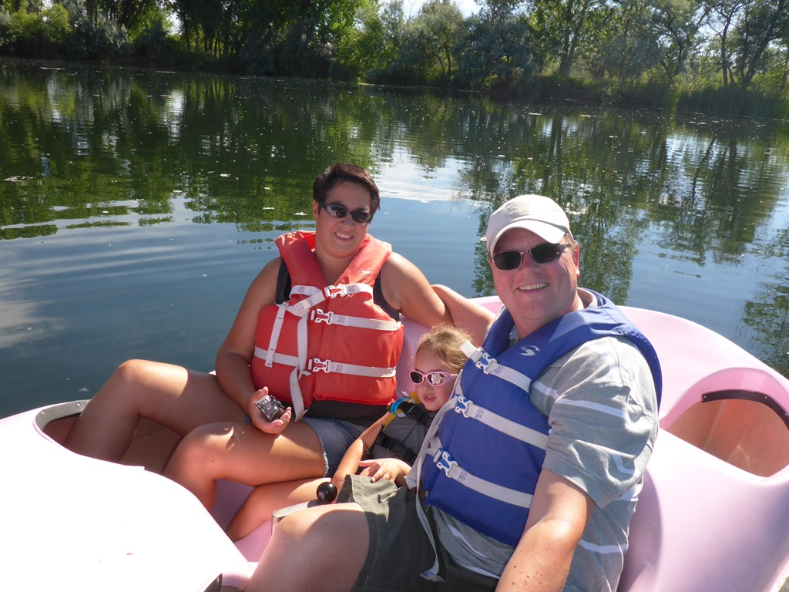
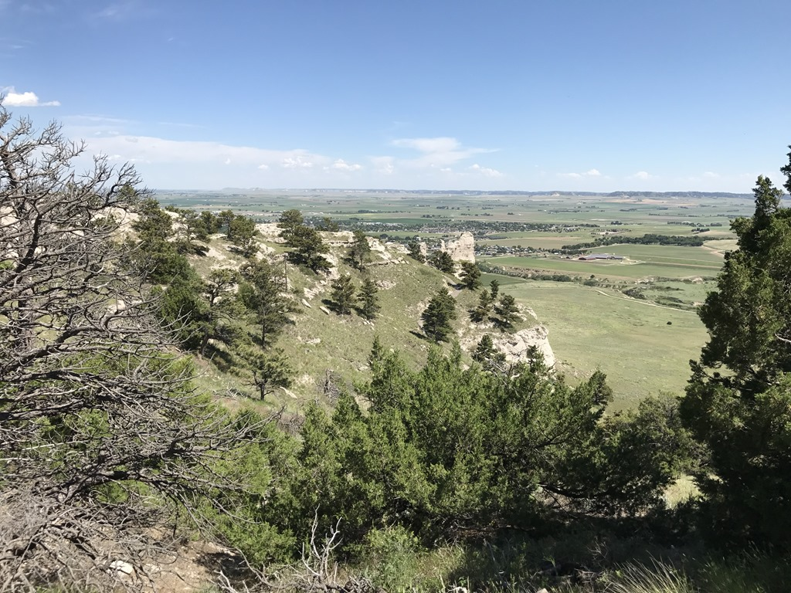
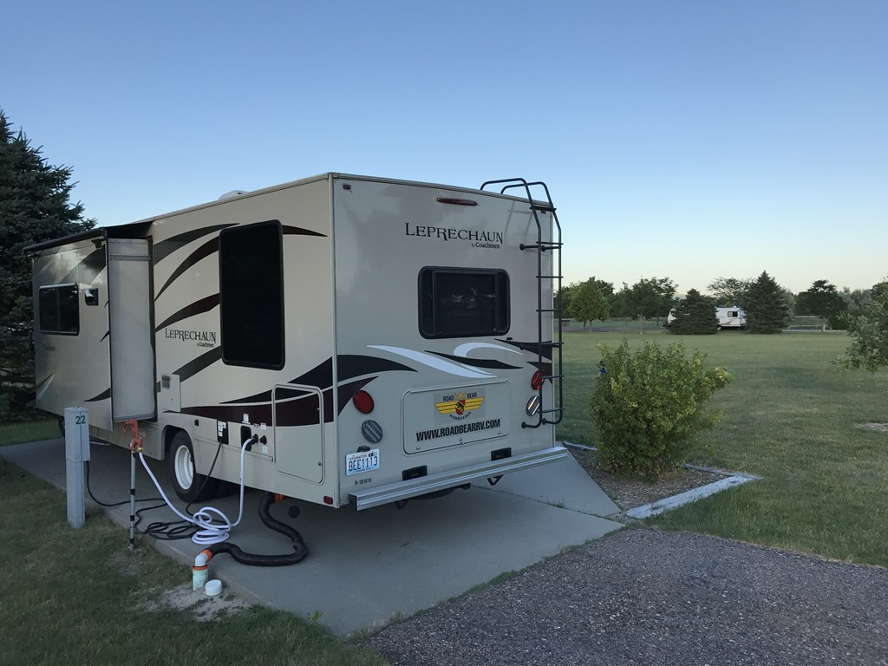
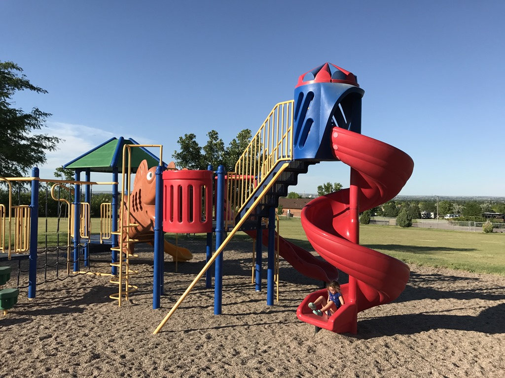

Vanmorgen op het meertje van de camping hebben we nog even de meest mannelijke waterfiets (een roze flamingo) aan een duurtest onderworpen. Hier werden we weer aan de Amerikaanse regelgeving herinnerd: ook papa en mama moesten een zwemvest aan. Het water komt amper tot aan je knieen, maar ja, federal law schrijft voor dat je in een boot altijd zo'n stinkding aan moet. Gelukkig had Sofie het redelijk vlot wel gezien en dus konden we op weg naar onze volgende bestemming: Scotts Bluff National Monument.

We hebben Colorado inmiddels achter ons gelaten, en zijn inmiddels (via een klein stukje Wyoming) aangekomen in Nebraska. De rit hier heen was erg enerverend, 100 kilometer nagenoeg rechtdoor door grasland. Na die 100 kilometer vlak, rijdt je tegen een rots aan en die heet Scotts Bluff. Schijnbaar is dat zo uniek hier dat ze er een National Monument van gemaakt hebben. Met de camper mag je de rots niet op, want er is een aantal tunnels waar we niet in zouden passen. Gelukkig rijdt er wel een shuttlebusje met een bijzonder vriendelijke chauffeur die ons (en een stel Texanen) mee neemt op een kort wandelingetje.

Na een lange, erg hete dag zijn we uiteindelijk geland op het Robidoux RV Park in Gering, Nebraska. Een aardige camping (eindelijk weer goede wifi!) en we hebben een mooi plekje aan de rand van een enorm grasveld, zodat Sofie lekker kan rennen.

## 2 opmerkingen

### Anoniem 22 juni 2017 om 20:13

Staan toch goed die zwemvesten!
Geen sneeuwschuivers tegengekomen op Pikes Peak? Je kunt je afvragen wie wie nu moet uitnodigen voor een BBQ....haha
Groetjes BHV

### Gerard 26 juni 2017 om 21:20

Ouders geven het goede voorbeeld, dus ook een zwemvest..... verrrrry secure!
