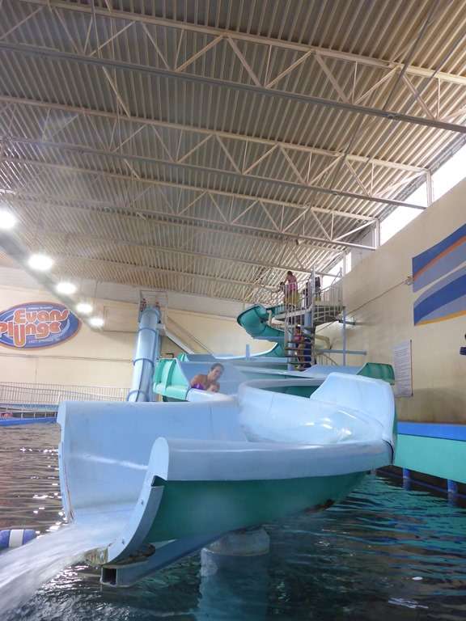
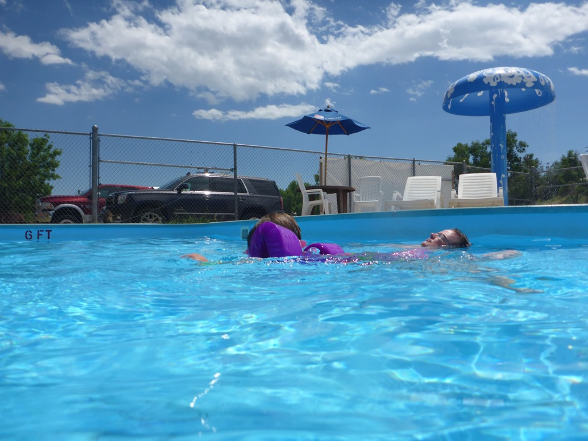
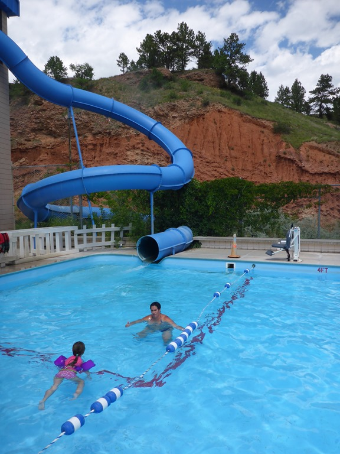
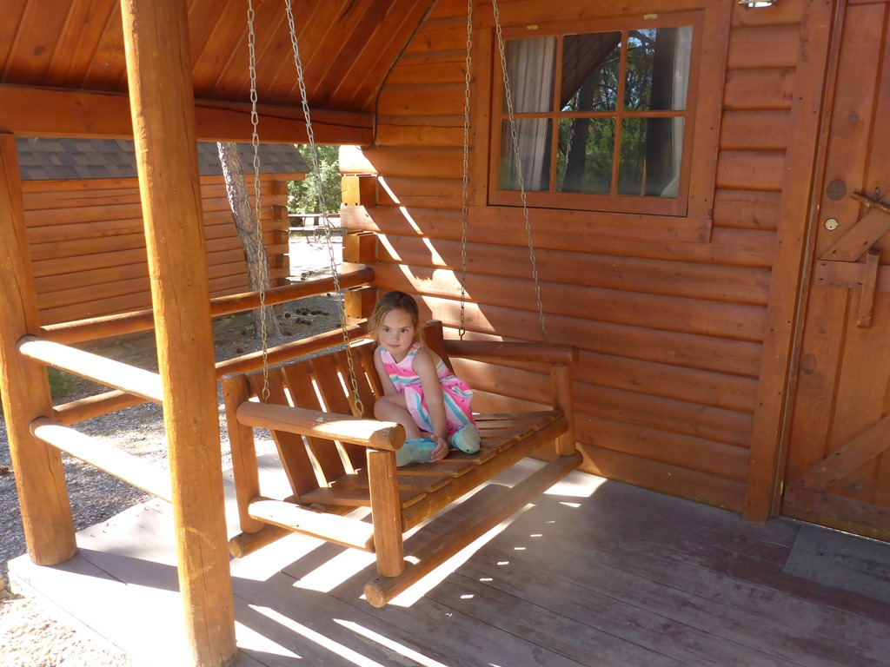

Vandaag weer eens een rustige dag. Na iets van drie uurtjes rijden vanuit Scotts Bluff kwamen we rond lunchtijd aan in Hot Springs, South Dakota. Hier hebben ze, je raadt het al, warm water bronnen. Warm is eigenlijk niet echt het goede woord, want het water is slechts rond de 30 graden Celsius. Naar eigen zeggen is de zogenaamde Evans Plunge wereldberoemd, maar dat waag ik te betwijfelen.

Er is een binnen- en een buitenbad, twee glijbanen en een hottub. We hebben er een paar uurtjes doorgebracht alvorens we naar de camping gegaan zijn.

Het zag er allemaal wat verlopen uit, maar het water was heerlijk en we hebben een paar leuke uurtjes gehad. Daarna zijn we een stukje verder gereden naar de KOA in Hot Springs. Het was behoorlijk laveren tussen de bomen door, en we kregen extra hoge levelers van de campingbaas, want onze site liep nogal sterk naar beneden af. Maar toen we eenmaal geïnstalleerd waren, hadden we een mooie plek, en hebben we nog even lekker buiten gezeten.

