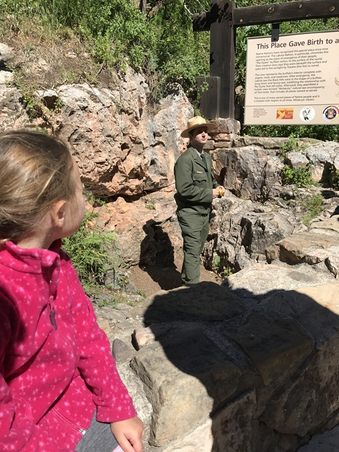
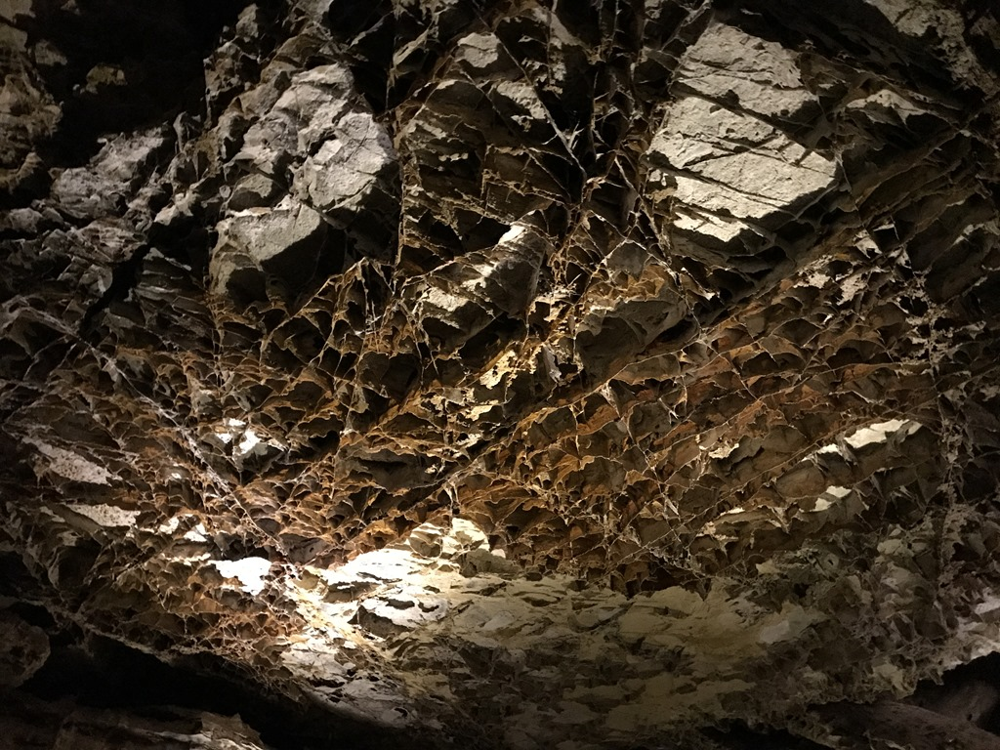
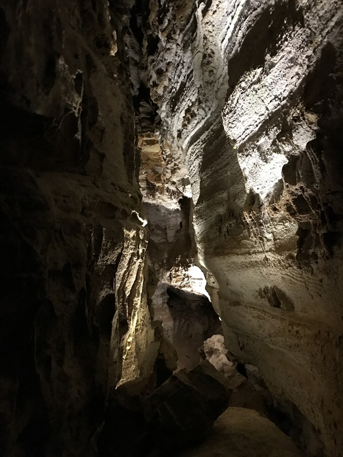
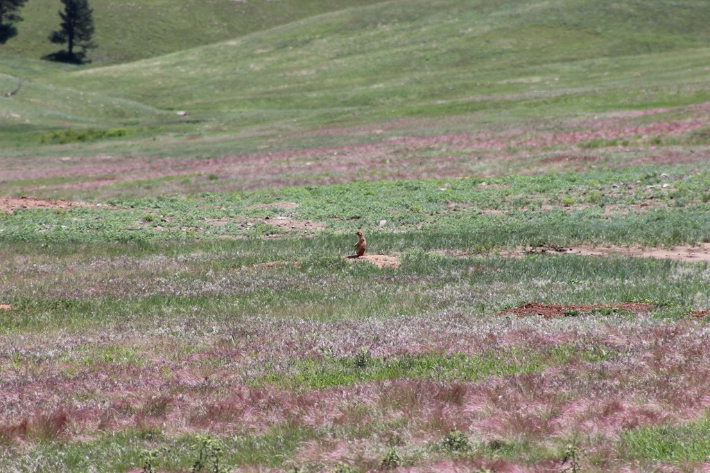
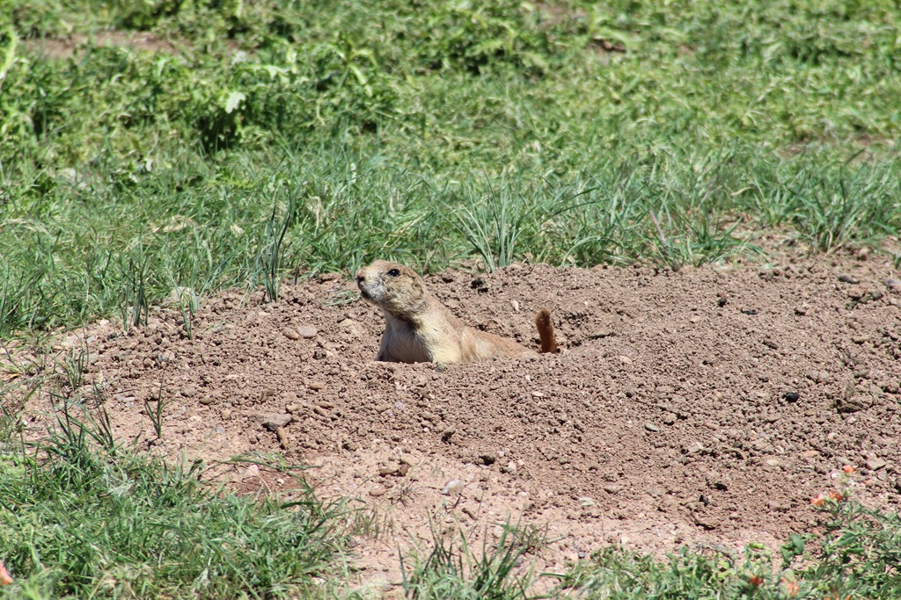
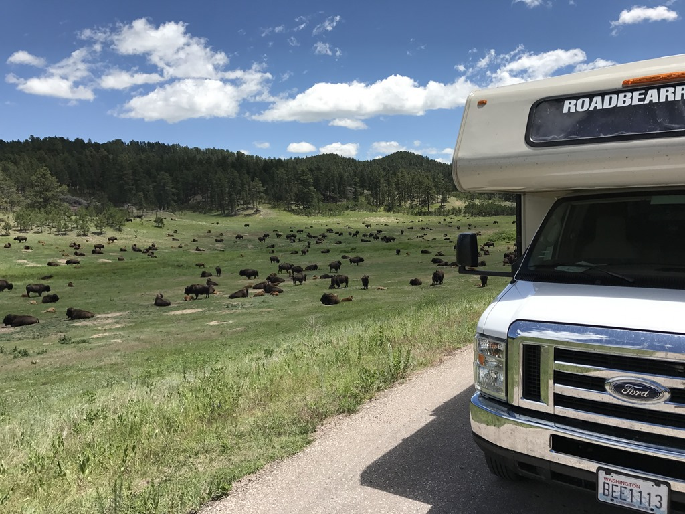
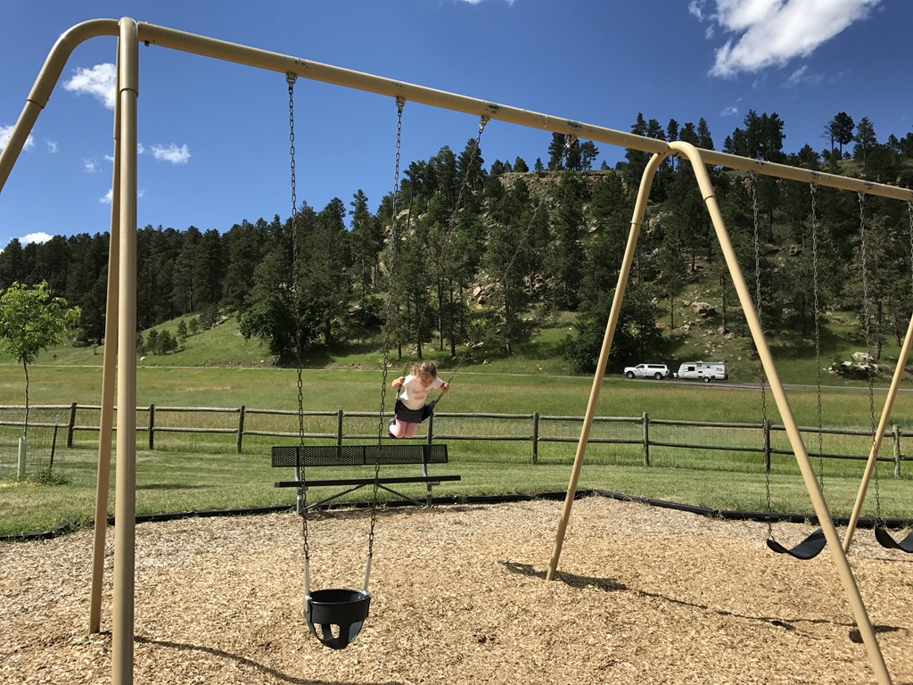

De rit van onze camping in Hot Springs naar Wind Cave National Park is maar kort, enkele kilometers, dus we waren er al vroeg. En maar goed ook, het was nog lekker koel en nog helemaal niet druk. Basis van Wind Cave is een grot, die je samen met een ranger kunt bezoeken. We konden vrijwel direct aansluiten bij de eerste tour. Je gaat maximaal een meter of 80 onder de grond. Het padje bestaat uit zo'n 250 traptreden, waarvan er 249 naar beneden gaan. Op de meeste plekken kun je gewoon rechtop lopen, maar soms moest je behoorlijk bukken.

De hele tour duurt zo’n anderhalf uur, en het was erg leuk om met de ranger mee te gaan.

Terug boven de grond hebben we samen met een kudde prairiedogs geluncht en van het prachtige uitzicht genoten. Het zal onwaarschijnlijk de nerd in ons zijn, maar we waanden ons in een Windows XP landschap.

Net voor de uitgang van het park zagen we een enorme kudde bizons langs de weg. Het blijven imposante beesten om te zien, zeker wanneer het zo'n grote groep betreft.

Na deze redelijk relaxte dag, kwamen we halverwege de middag aan op onze volgende camping in Custer State Park: de Game Lodge Campground, pal tegenover het visitor center. De camping is erg mooi, met ruime plekken, en Sofie heeft lekker in de speeltuin kunnen spelen.

## 1 opmerking

### Gerard 5 juli 2017 om 01:01

Zo te zien vindt Sofie een donkere grot helmaal niet eng
