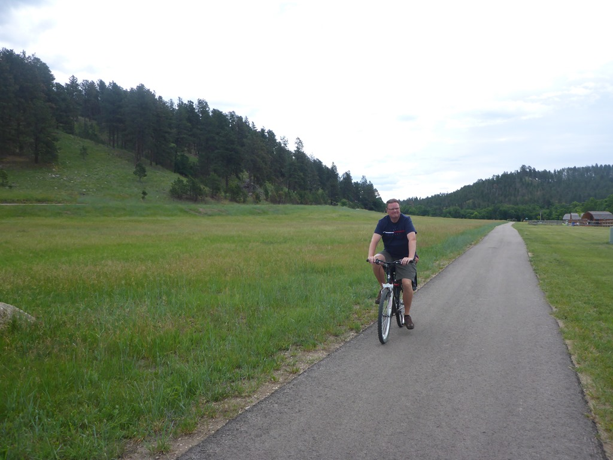
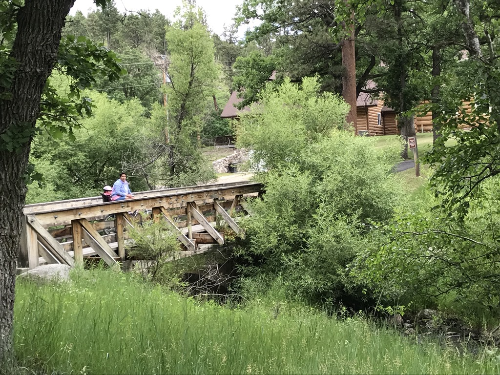
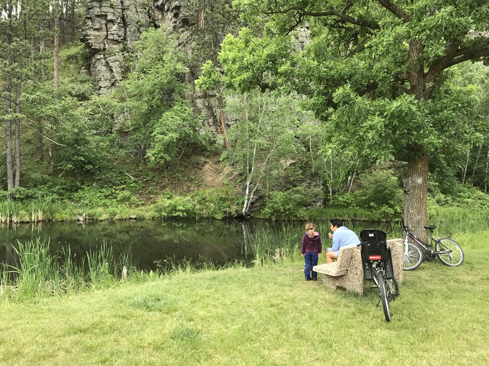

Wow, wat een mooi park is dit zeg. We hebben ‘s morgens de fietsen gepakt en een stukje langs het riviertje gefietst.

We waren net op tijd voor checkout terug op de camping, waarna we het visitor center hebben bezocht. Je kunt hier van alles bekijken, onder andere een zeer mooi gemaakte film in een volwaardige bioscoop. Na de lunch zijn we weer een stukje verder gereden naar Hill City, nog steeds in South Dakota, waar onze camping voor de komende twee nachten ligt: Rafter J Bar Ranch Campground. De dames zijn nog even gaan zwemmen, terwijl papa even mocht chillen bij de camper.
