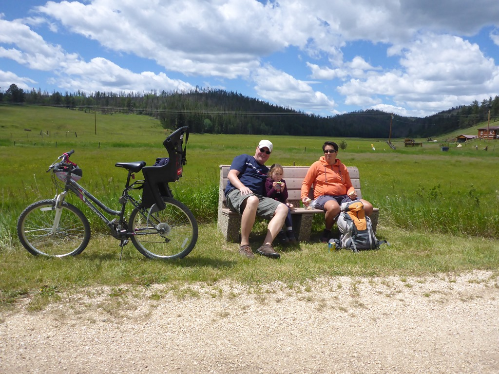
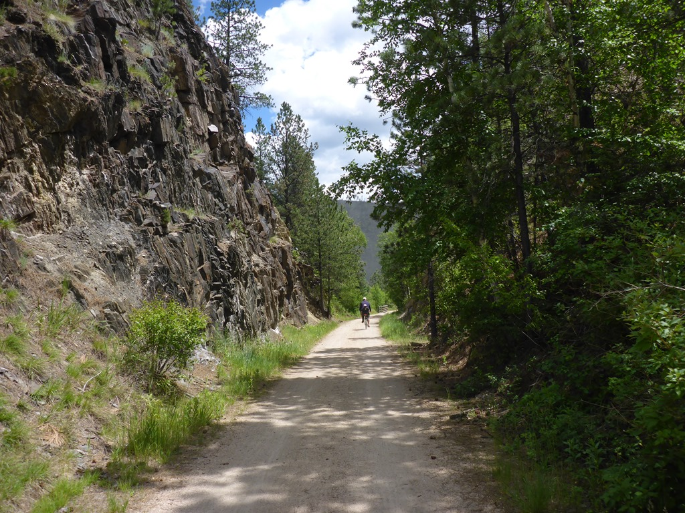
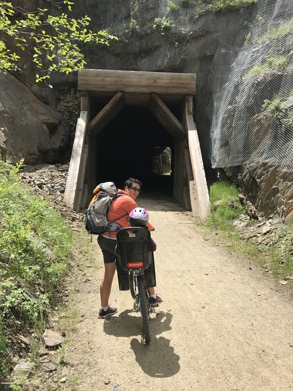
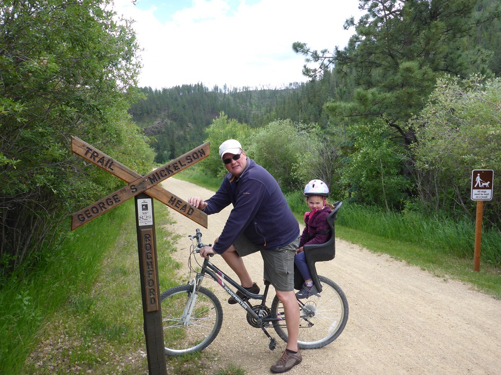

Genoemde trail is een fietspad van in totaal zo'n 175 kilometer in de Black Hills van South Dakota. Het volgt grotendeels een oude spoorlijn, en gaat over een aantal bruggen en door tunnels. We worden bij onze camper om 10 uur in de ochtend opgehaald door een shuttle, die ons naar ons beginpunt Dumont brengt. Van daar fietsen we via Rochford naar Mystic, in totaal 33 fijne kilometers door weilanden, bossen, tunnels en over talloze bruggen. Het was erg aangenaam weer, en onderweg hebben we regelmatig gestopt voor een snack, lunch of gewoon wat lummelen.

Op de laatste twee/drie kilometer na ging alles bergaf, dus het was erg ontspannen fietsen. Bij het eindpunt stond onze shuttle al op ons te wachten, en hij heeft ons netjes naar de camping terug gebracht.

## 2 opmerkingen

### Anoniem 29 juni 2017 om 20:21

Leuk zo'n fietstocht, zeker als je lekker kunt genieten, omdat het niet super zwaar is! Groetjes BHV

### opa 2 juli 2017 om 19:02

Wat een luxe!. Wij moeten altijd zelf heen en terug fietsen.
Zijn trouwens ook nooit bisons tegen gekomen.
Blog blijft boeien,heel goed.
Groeten van ons beide.
