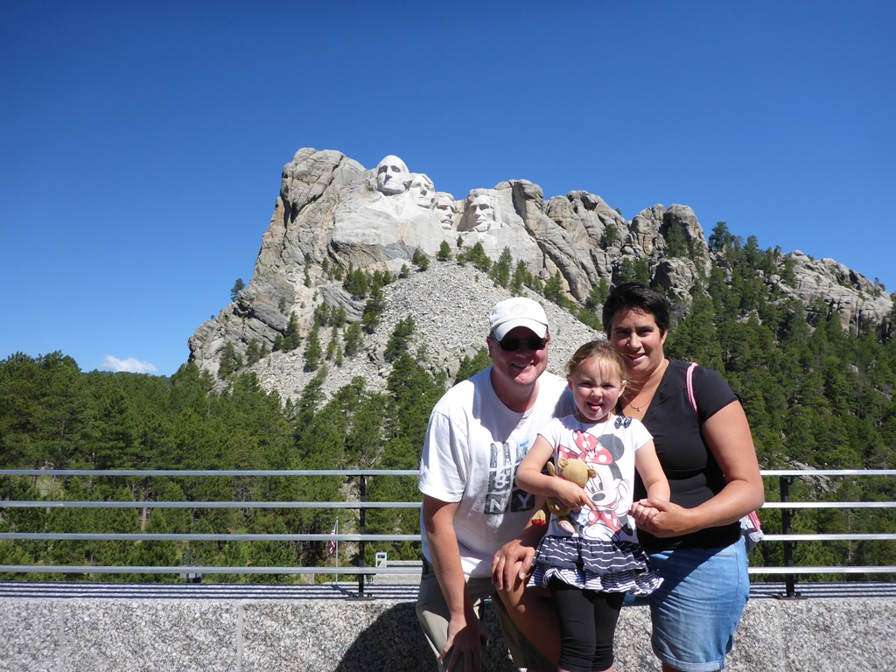
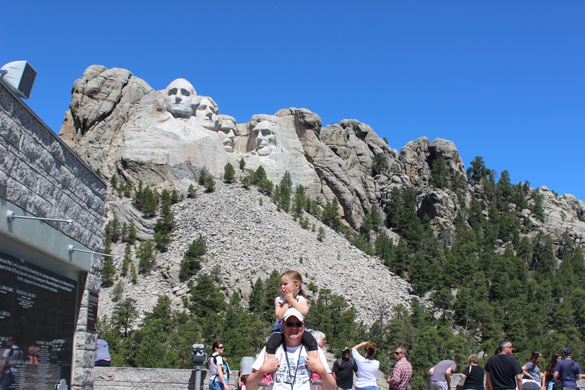
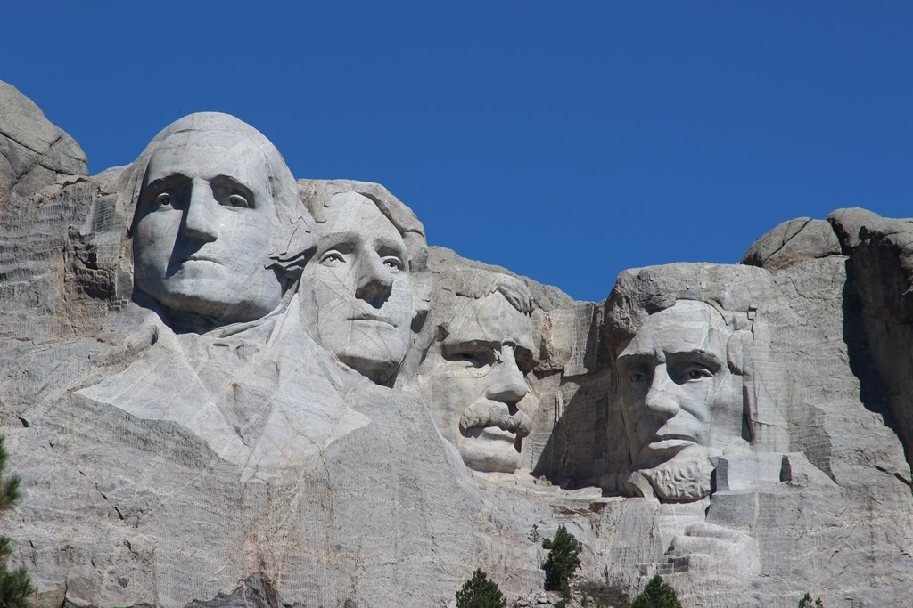
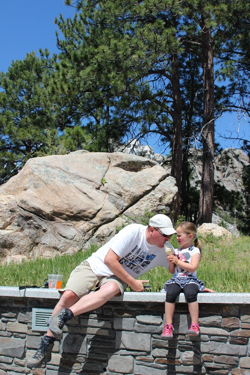

We waren gelukkig vroeg bij Mount Rushmore, voor alle drukte. Toen we vertrokken stond er een behoorlijke file om het park in te kunnen.

Het Disney-gevoel begon al bij de ingang van de parkeergarage. Rijen dik staan de auto's om de toegangsprijs te kunnen betalen. Het was erg bijzonder om de vier presidentshoofden in het echt te kunnen zien. Vergelijk het met de eerste keer de Eiffel-toren in Parijs zien, of het Vrijheidsbeeld in New York. Je hebt het beeld zo vaak op tv of tijdschriften gezien, zodat het in het echt eigenlijk alleen maar kan tegenvallen. Gelukkig was dat niet zo. Het was erg indrukwekkend.

Ik hoorde meerdere bezoekers zichzelf hardop afvragen waar (en wanneer) Trump zijn tronie erij zou laten plaatsen...

We hebben geluncht in het restaurant bij het Memorial, en dat afgesloten met een mini-ijs voor de kleine meid.

Na dit alles hebben we een uurtje gereden naar onze volgende camping, de KOA bij Badlands National Park. Dat park gaan we morgen met een bezoek vereren.

## 1 opmerking

### Gerard 5 juli 2017 om 00:56

Leuke plaatjes, zeker die van de drie voor de stenen kolossen. Roger waarom zit jij aan het mini-ijsje van Sofie. Zij mag ook niet aan jouw biertje komen..... of redeneer ik nou verkeerd.
