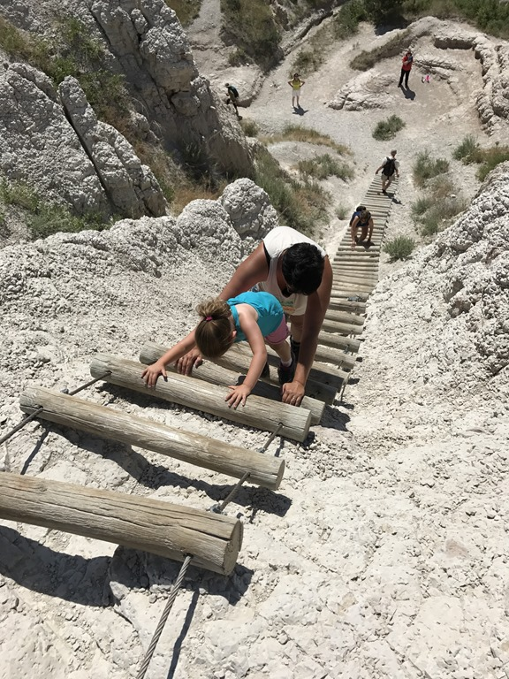
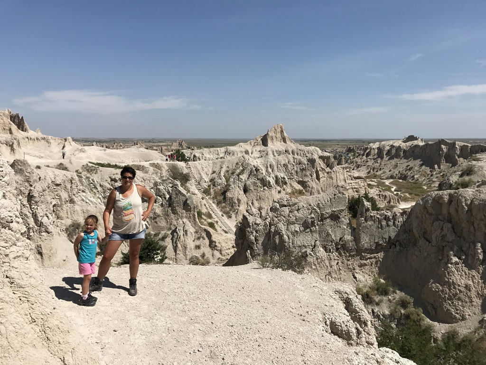
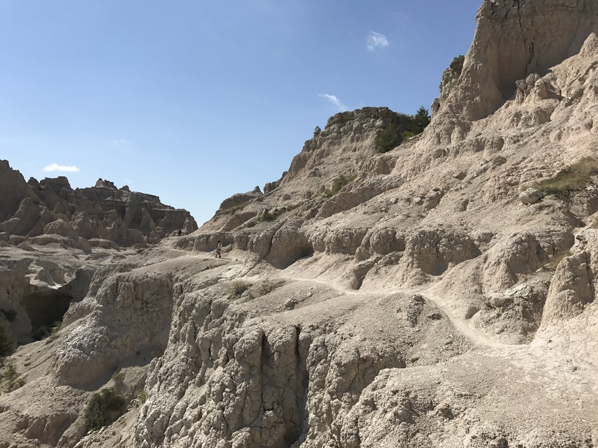
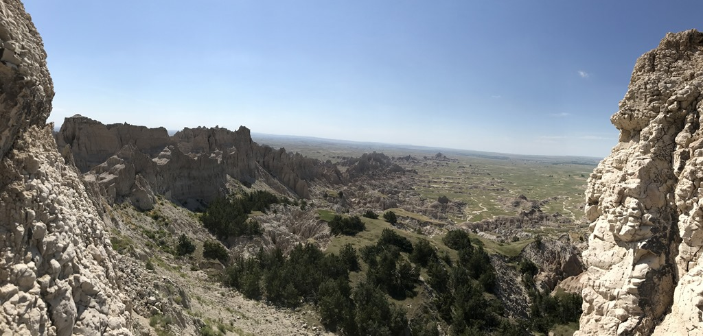
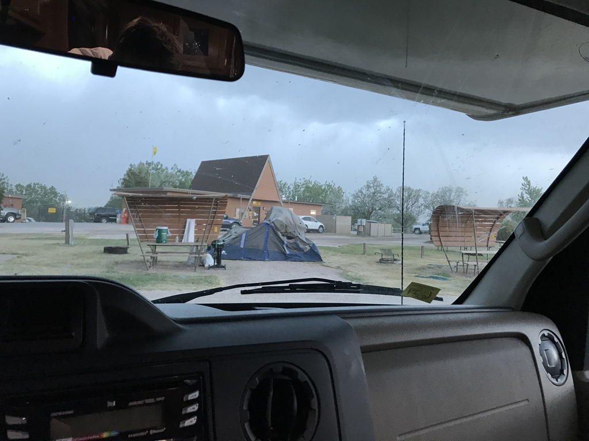
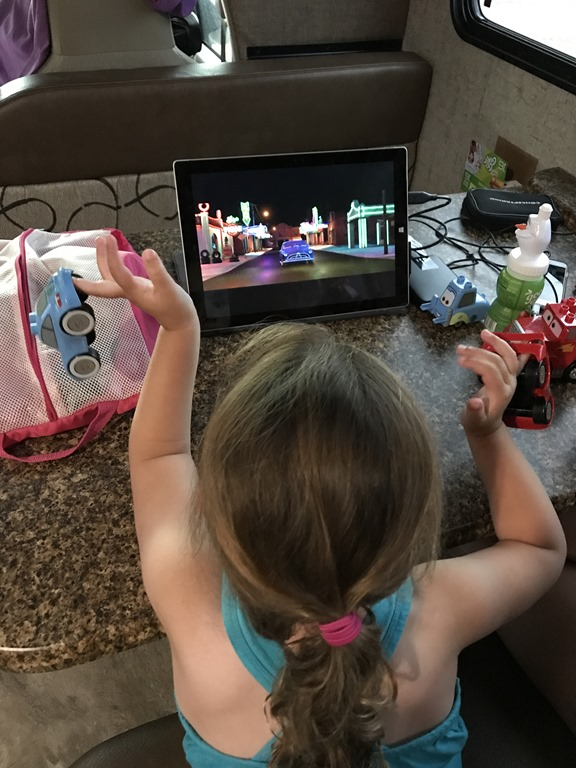

Er was 38 graden en zwaar onweer voorspeld, dus we waren weer eens vroeg op pad. We wilden namelijk een wandelingetje gaan doen, en Sofie wilde weer eens een Junior Ranger badge verdienen. We kozen voor de wandeling The Notch, die slechts anderhalve mijl lang is. Maar het is een spectaculair tripje met halverwege een ladder, en een stuk langs de afgrond (van een meter of 20).

De wandeling begint eenvoudig, maar na een meter of 500 komt het eerste obstakel: De Ladder. Achteraf las ik op internet dat sommige mensen spontaan een ladderfobie ontwikkeld hebben. Zo ernstig vonden wij het niet, maar het was toch even kruipen op handen en voeten.

Daarna moesten we een heel stuk langs de afgrond.

Aan het einde van het padje konden we van een erg mooi uitzicht genieten. Het was alle ontberingen meer dan waard.

Hierna konden we weer terug naar de visitor center, zodat Sofie haar badge kon ophalen. Na de lunch was het tijd om Badlands te verlaten via de Badlands Loop Road en weer richting het westen te rijden, naar de KOA in Rapid City. Eenmaal aangekomen zijn we direct het stof van ons gaan afspoelen in het zwembad, maar de voorspelde onweersbuien zagen we letterlijk aan komen vliegen, dus na een kort bad moesten we vluchten naar de camper. Enorme windhozen staken de kop op, waardoor enkele tenten het leven lieten, en takken en stof langs de camper vlogen. We hebben dus maar een filmpje opgezet Cars, de favoriet van Sofie en alle duplo-cars mochten meekijken. Eigenlijk was het heel gezellig.

## 1 opmerking

### Gerard 5 juli 2017 om 00:49

De laddertjes worden voor Sofie steeds langer en de richeltjes steeds smaller, ze wordt een echte berggeit.
