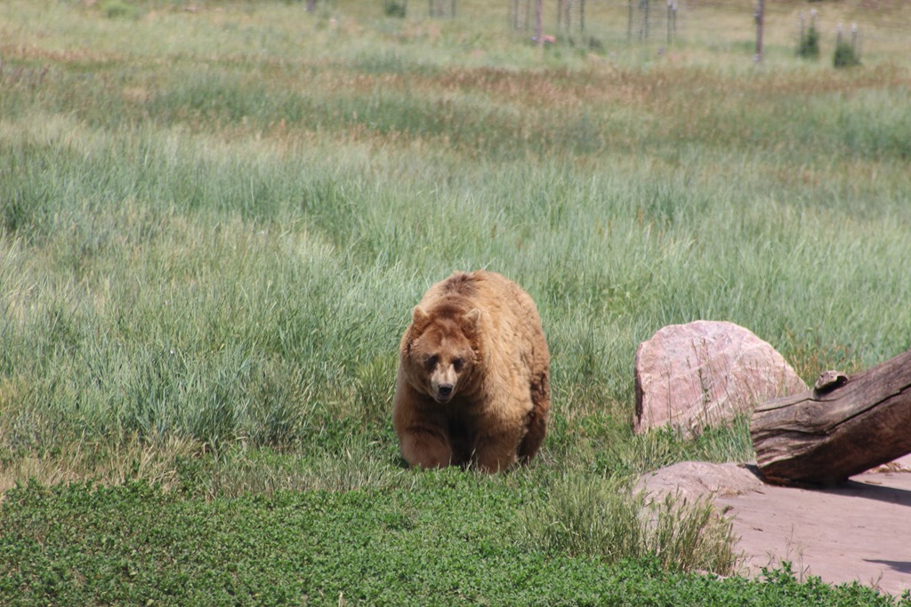
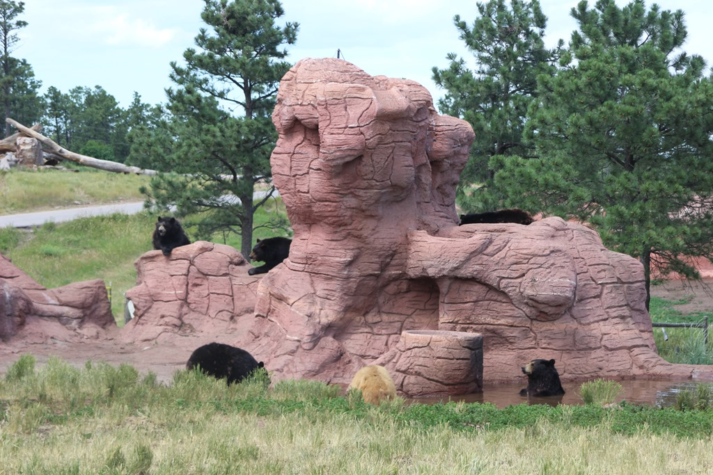
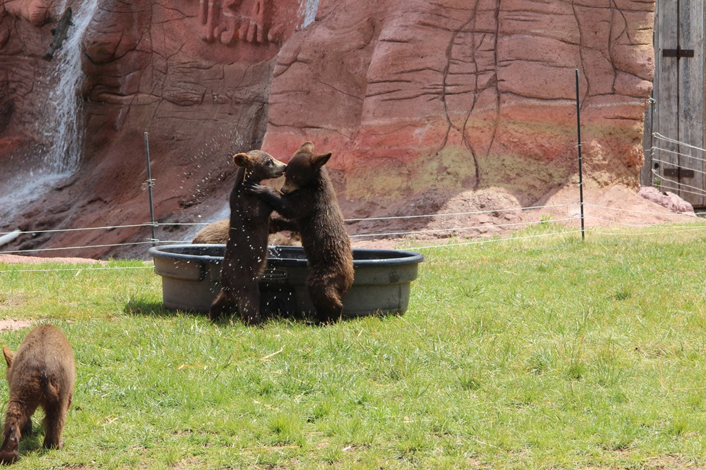
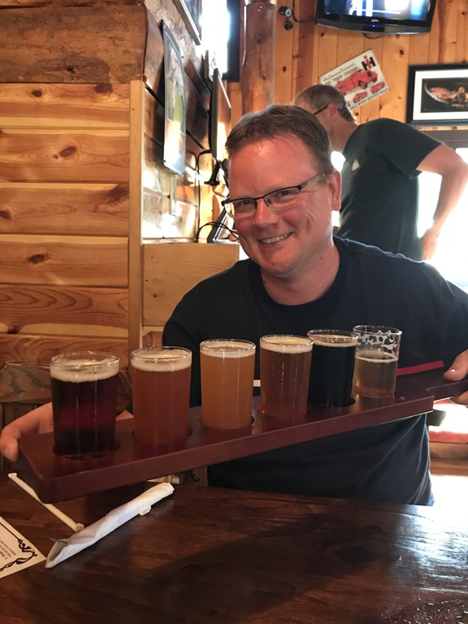

Vanmorgen zijn we eerst een huurauto gaan ophalen op het vliegveld in Rapid City. De komende dagen willen we de Black Hills wat meer gaan verkennen, en het weggetje wat we willen gaan rijden bevat een aantal tunnels die te smal en/of te laag zijn voor onze camper.

Nadat we de auto opgehaald hebben, zijn we in colonne naar Bear Country USA gereden. Dit is een soort Beekse Bergen, dus met je eigen (of gehuurde) auto rijd je tussen verschillende dieren door. We hadden twee kippen, een geit en twee beren verwacht, dus we waren blij verrast toen bleek dat het een erg mooi opgezet park betreft. Met heel veel beren, die gewoon tussen de auto's door aan de wandel zijn.

Aan het einde van het rij-gedeelte was nog aantal dieren te voet te bezichtigen, onder andere pasgeboren beertjes. Dat was erg leuk om te zien.

Daarna zijn we naar onze volgende camping gereden, de KOA bij Mount Rushmore. Dit is een enorm grote camping (560 plekken), met speciaal voor Sofie een Fun Zone, met spingkussens, zwembad, glijbanen, etc. Bovendien hebben ze een restaurant waar we 's avonds prima hebben gegeten. Ik heb een lokaal bier proeverijtje besteld. Laat ik zo zeggen, de kwantiteit was goed, de kwaliteit wisselend.

## 2 opmerkingen

### opa 3 juli 2017 om 09:33

Dat heb je toch niet allemaal opgedronken?
Drankorgel!

### Gerard 5 juli 2017 om 00:47

Dat is ongeveer een meter bier....en je kijkt er zo verkikkerd bij. En wat hebben de meisjes gedronken......
