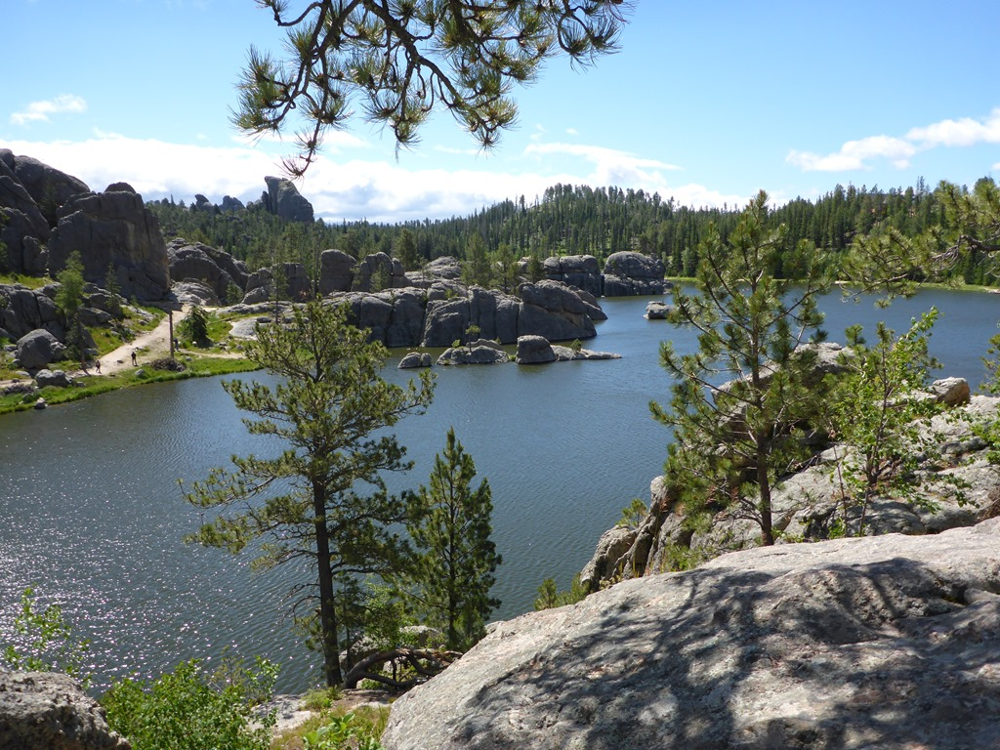
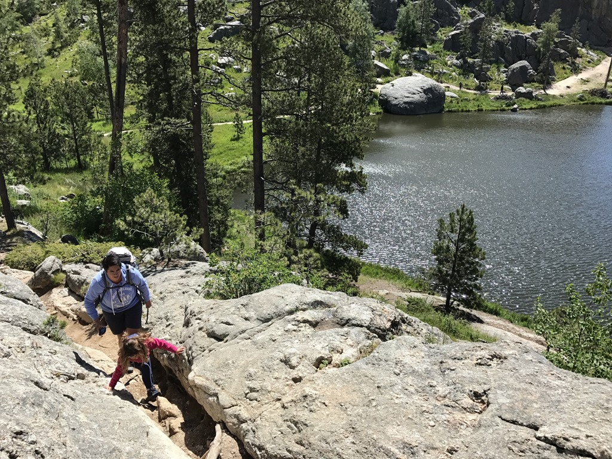
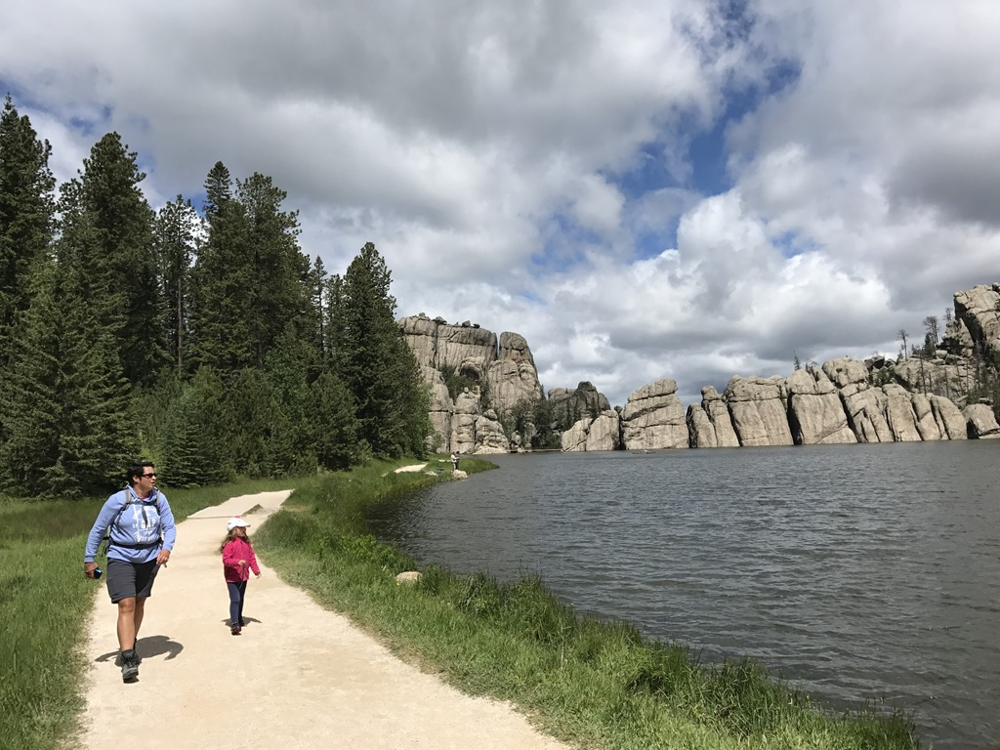
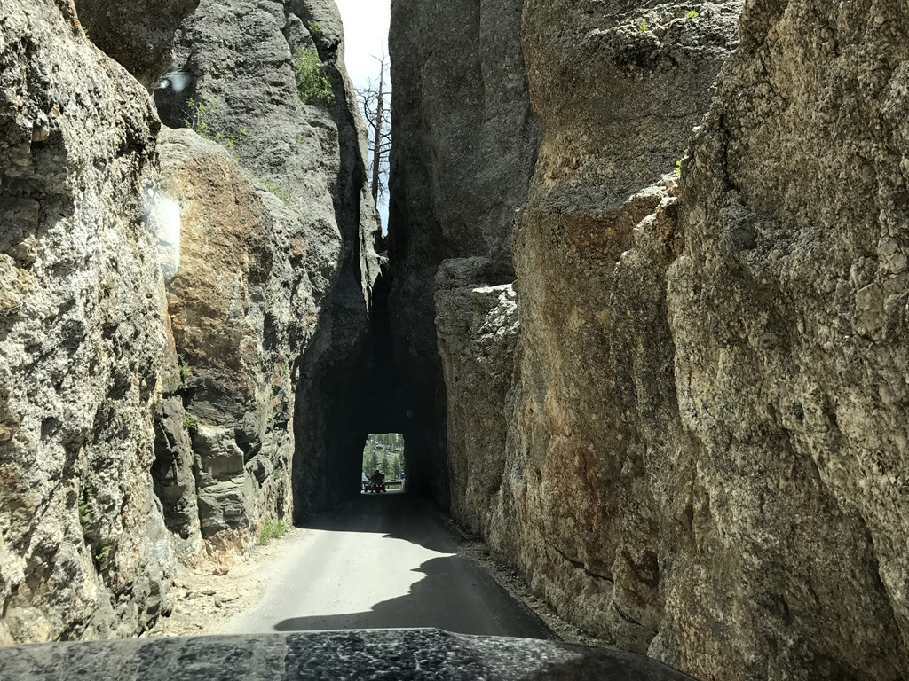
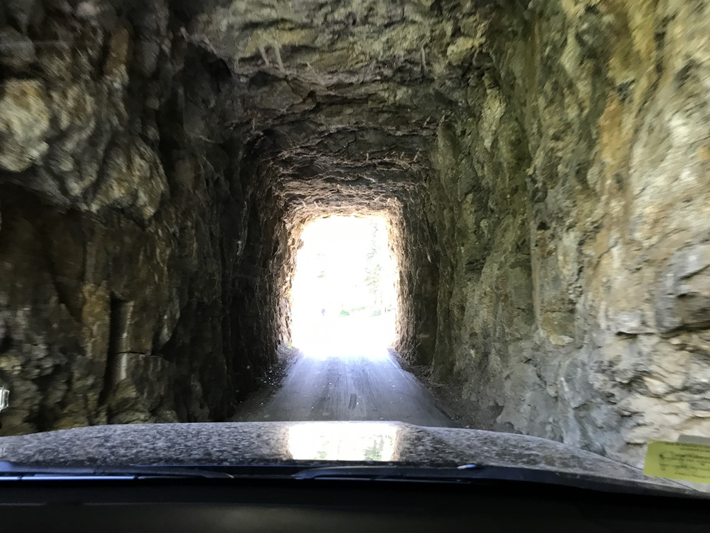
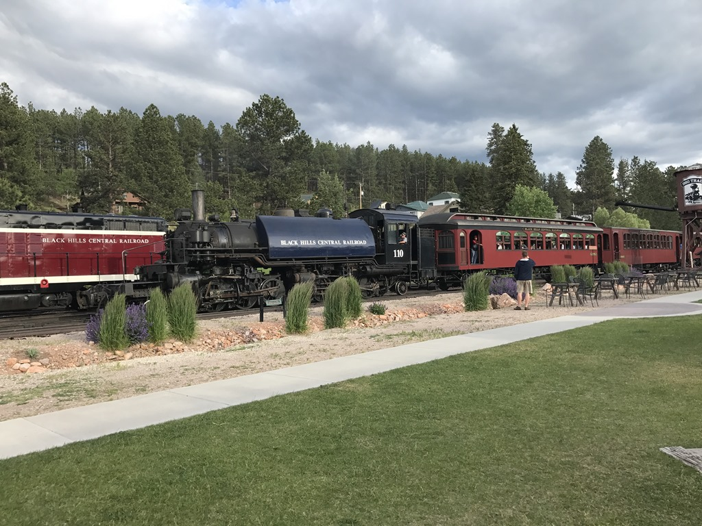

In de Black Hills heb je de zogenaamde Needles Highway, met een aantal (zeer) smalle en lage tunnels, waar we met onze camper niet doorheen kunnen. Omdat we het toch wilden zien, hebben we een auto gehuurd en zijn op pad gegaan. Eerste stop was Sylvan Lake, waar we een erg leuk wandelingetje hebben gemaakt. Het was redelijk fris, dus we moesten de vestjes aan vandaag.

We waren wat vergeten mee te nemen dus ik moest even terug rennen naar de auto, en daar stappen net onze Texaanse vrienden uit die we ontmoet hebben op Scotts Bluff. Wat een toeval zeg. Aan het einde van de wandeling kwamen we ze weer tegen en het blijkt dat ze morgen op dezelfde camping staan als wij in Spearfish.

We hebben samen met de Texanen (Rod, Marilyn en kleindochter Marina) geluncht en zijn toen verder gereden. Al snel kwamen we bij de smalste tunnel op onze route. En hoe smal is smal? 10 voet lijkt veel, maar links en rechts van je Amerikaanse auto hou je dan toch niet echt heel veel ruimte over.

Twee tunnels waren echt bijzonder, je kunt in de verte namelijk Mount Rushmore zien.

's Avonds zijn we gaan eten bij Desperado in Hill City en hebben we nog even naar de lokale stoomtrein gekeken.

## 2 opmerkingen

### Anoniem 1 juli 2017 om 22:28

Tof hè, die Needles Highway! Ook wat voor Oom Roger op de motor... Leuke wandeling, die in The Badlands. See you! BHV

### Gerard 5 juli 2017 om 01:04

Je kunt van al die mooie landschappen een prachtige kalender maken, die zou goed verkopen....
