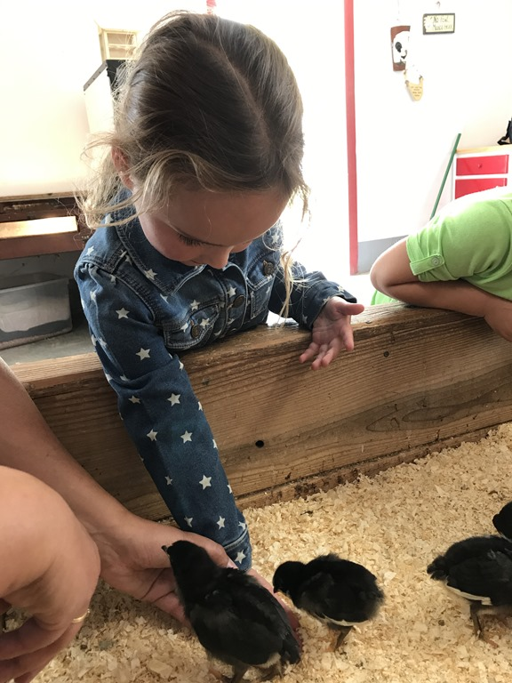
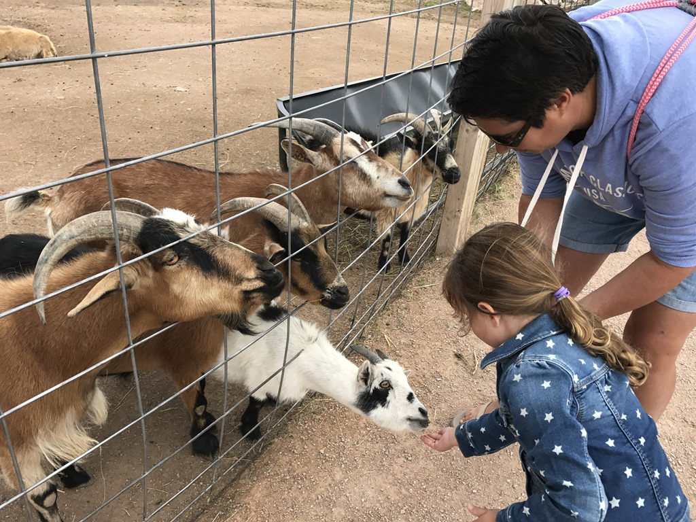
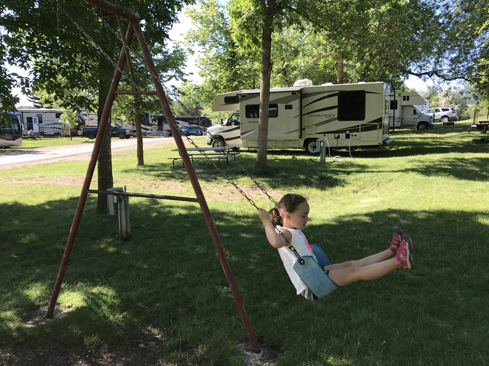
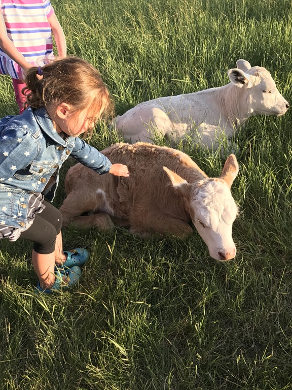

Vanmorgen hebben we eerst de huurauto weer terug gebracht en zijn daarna voor Sofie naar de Old MacDonald's Farm kinderboerderij gegaan. We hebben een paar uurtjes hier doorgebracht en Sofie heeft geitjes en schaapjes kunnen voeren, kuikentjes vastgehouden ("Niet knijpen!") en paardje gereden.

Na de lunch zijn we doorgereden naar Chris' Campground in Spearfish en zijn we het zwembad ingedoken. Het is een mooie camping en we hebben een speeltuin-en-suite.

En verdorie, we hebben 50 dollar betaald om de geiten te knuffelen bij Old MacDonald, terwijl ze hier op de camping ook een GRATIS boerderijtje hebben...

Nadien hebben we nog even met de Texanen gesproken, en we mochten nog even in hun fifth-wheeler kijken. Van buiten zijn die dingen al indrukwekkend, maar van binnen zijn ze echt groot! Ik schat dat het leefgedeelte zeker drie keer zo groot is als van ons tijdelijk huis.

## 1 opmerking

### Gerard 10 juli 2017 om 15:24

Sofie wordt al wat vrijer met de dieren. Leuk hoor.
