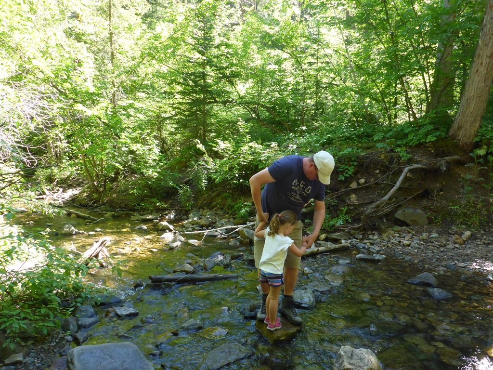
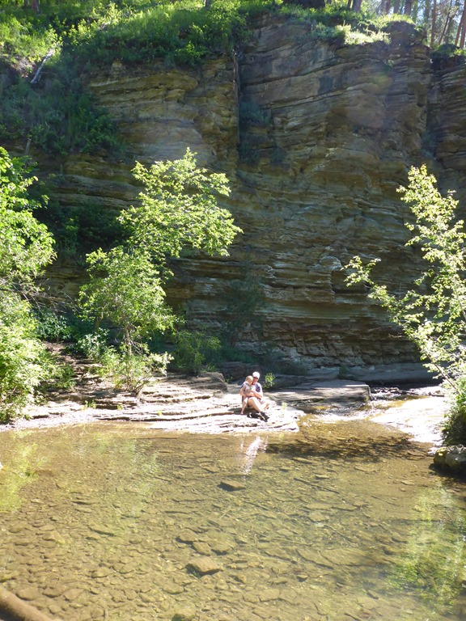
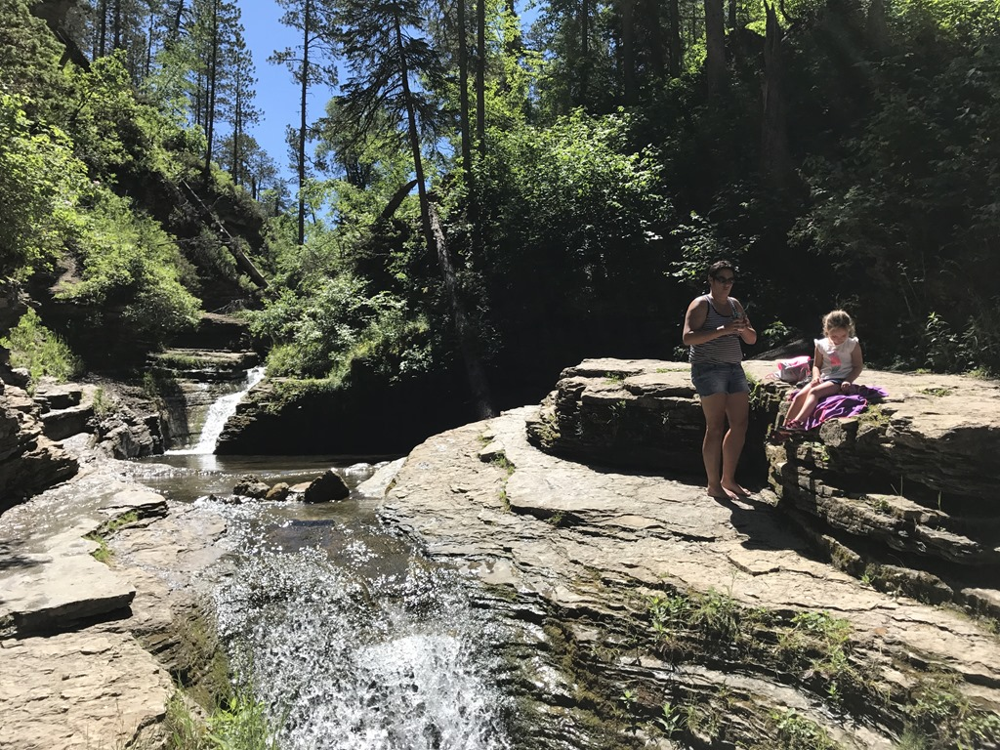
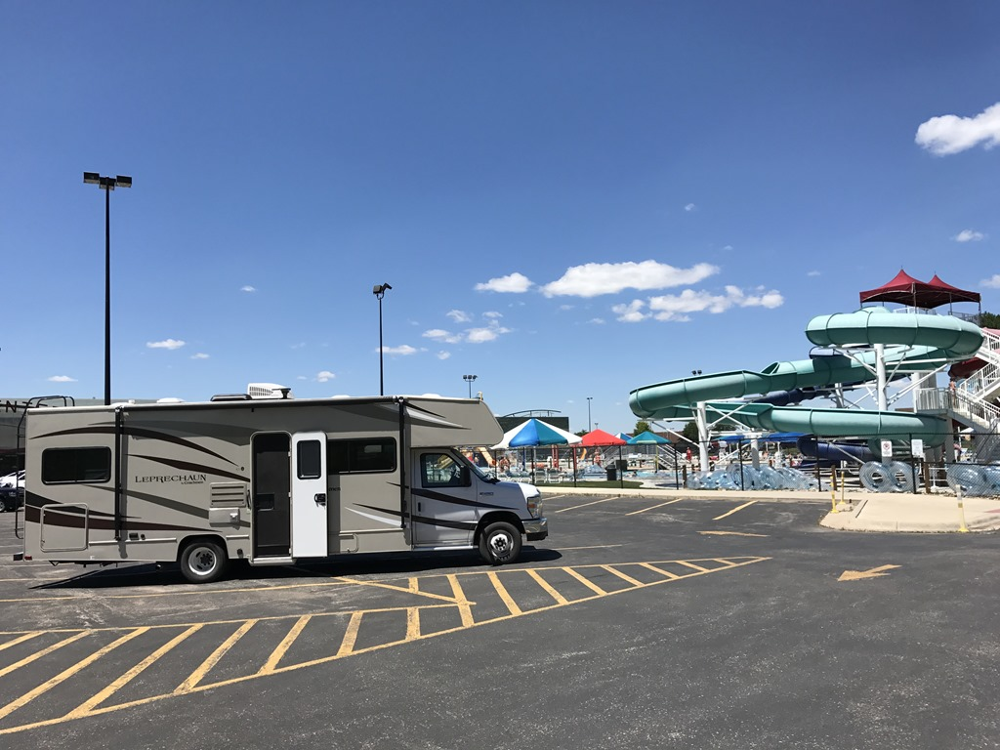
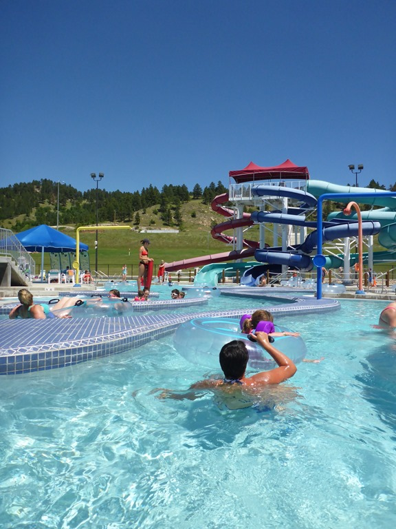
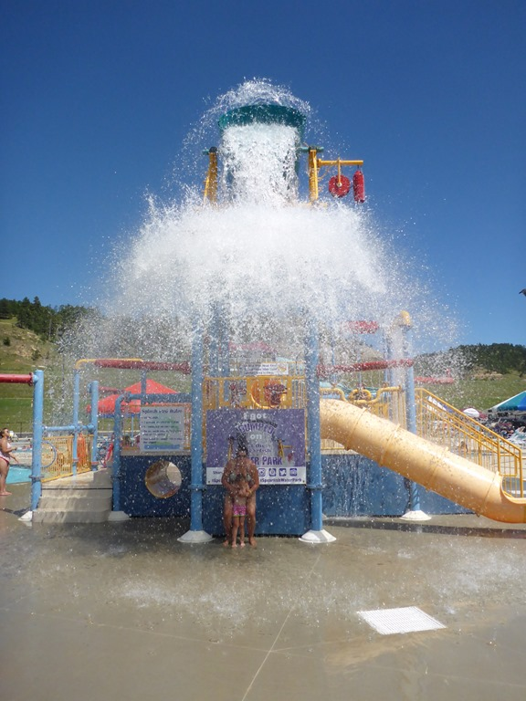
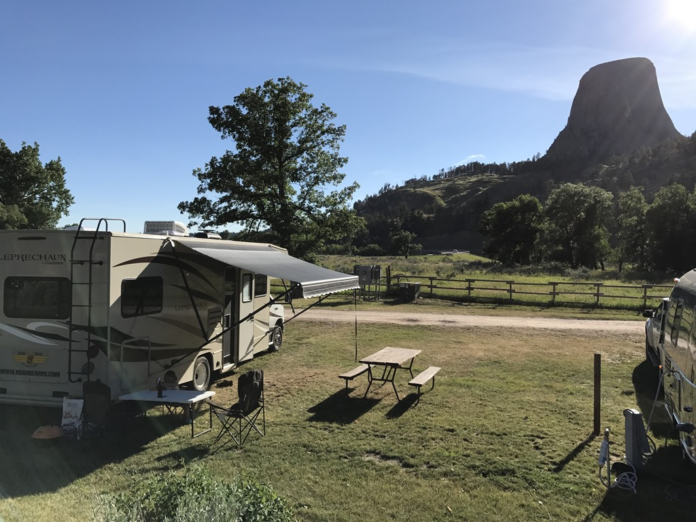
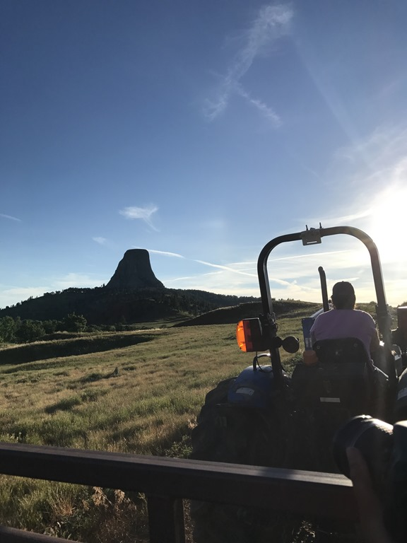

De Spearfish Canyon is erg mooi met een aantal watervalletjes. Aangezien hier geen hoge bergen zijn, eerder heuvels, zijn de watervallen niet al te hoog, maar wel leuk om te bekijken. We hebben het wandelingetje naar de Devils Bathtub gedaan. De trailhead is op particulier grondgebied, en er is maar parkeerplek voor een auto of zes. Op het zijweggetje kunnen auto's aan beide zijden staan, en daar hadden wij onze mini RV geparkeerd. Toen we vertrokken was er nagenoeg niemand te zien.

Het padje volgt het riviertje stroomopwaarts en je moet vaak het water over. Gelukkig is het niet diep, maar de keien zijn glad, dus het was wel degelijk uitkijken geblazen.

Na ongeveer een kilometer klimmen, klauteren en spetteren kom je bij een mini waterval uit en de bewuste badkuip van de duivel. Met al het groen, rotsen en gebrek aan mede bewonderaars om ons heen was het een erg mooi plekje om even wat te snacken en drinken voordat we weer richting de camper gaan.

Op de terugweg kwamen we de ene na de andere familie tegen met veel kinderen en honden en we vroegen ons al af waar al deze gasten hun SUV's geparkeerd hebben. Bij aankomst bij de camper bleek het hele straatje vol te staan met auto's. Mijn timmermans-oog dacht dat we onze camper er wel tussendoor konden laveren, maar dat bleek de benodigde stuurmanskunsten te vereisen. Links en rechts hadden we enkele centimeters ruimte, en we hadden mazzel dat we er recht uit konden rijden. Op een haar na, stonden we na een paar minuten weer op de doorgaande weg, met het zweet tussen de bilnaad kan ik zeggen.

Na dit avontuur hadden we behoefte aan een frisse duik, en die vonden we gelukkig in Spearfish zelf. Ze hebben een mooi buitenbad, met een aantal glijbanen (waar Sofie helaas nog niet vanaf mag), en een lazy river waar je op een bandje lekker kan dobberen.

||||
|---|---|---|
|  |  |  |

Na het zwembad hebben nog vlug wat boodschappen gedaan en zijn toen vertrokken naar de KOA bij Devils Tower. We kregen een top site aangewezen, met uitzicht op de Tower.

We moesten snel eten want we wilden mee met de hayride: met een tractor bezochten we de omliggende weides en hebben veel herten gezien, maar ook een paar bizons en longhorns.

