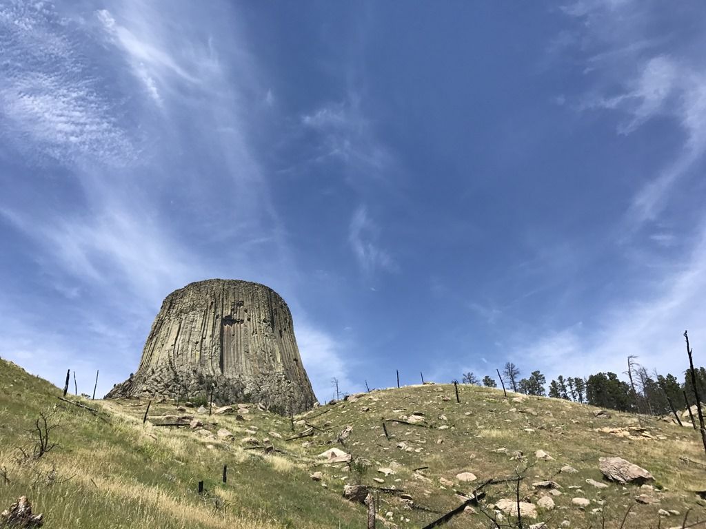
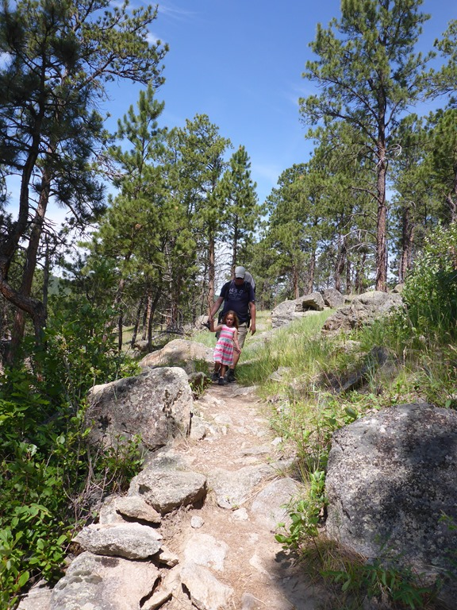
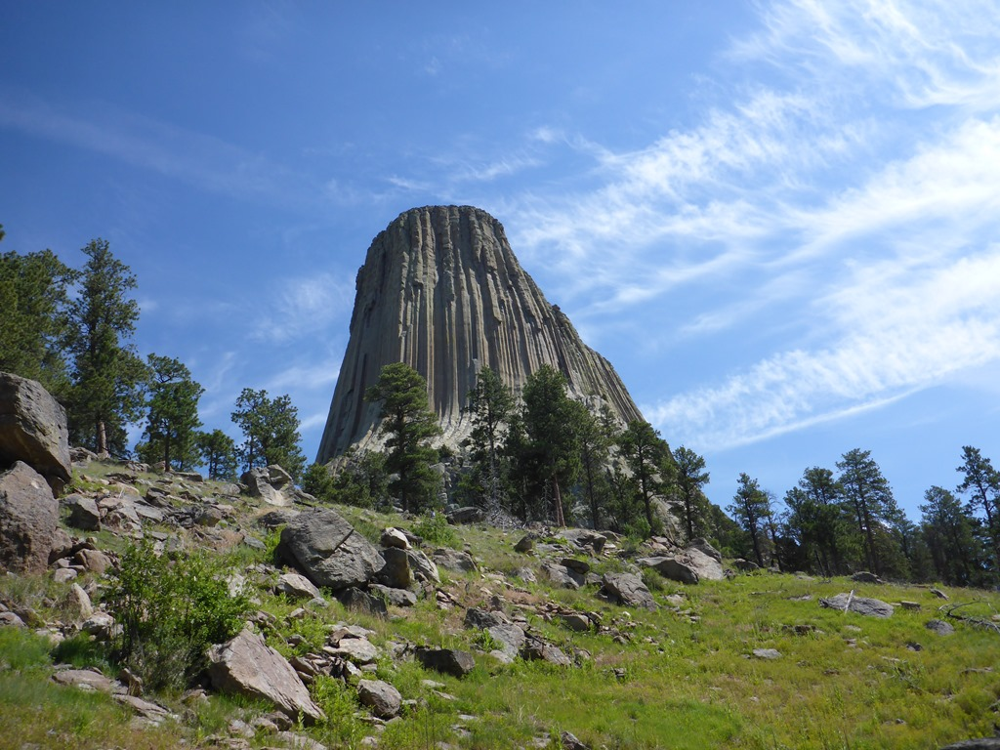
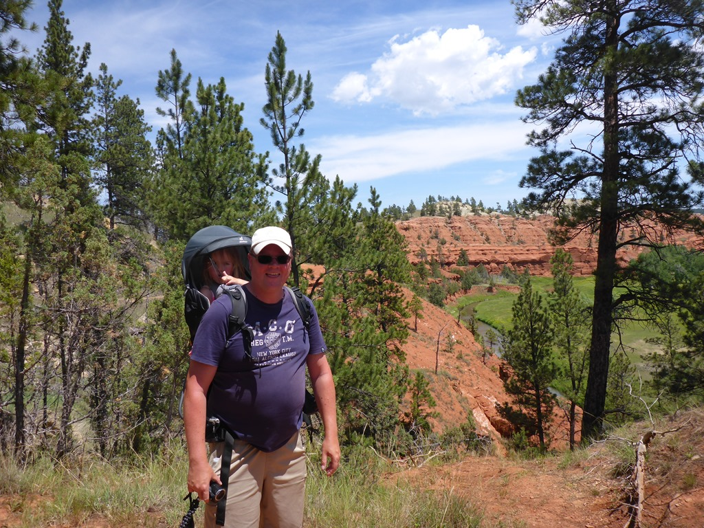
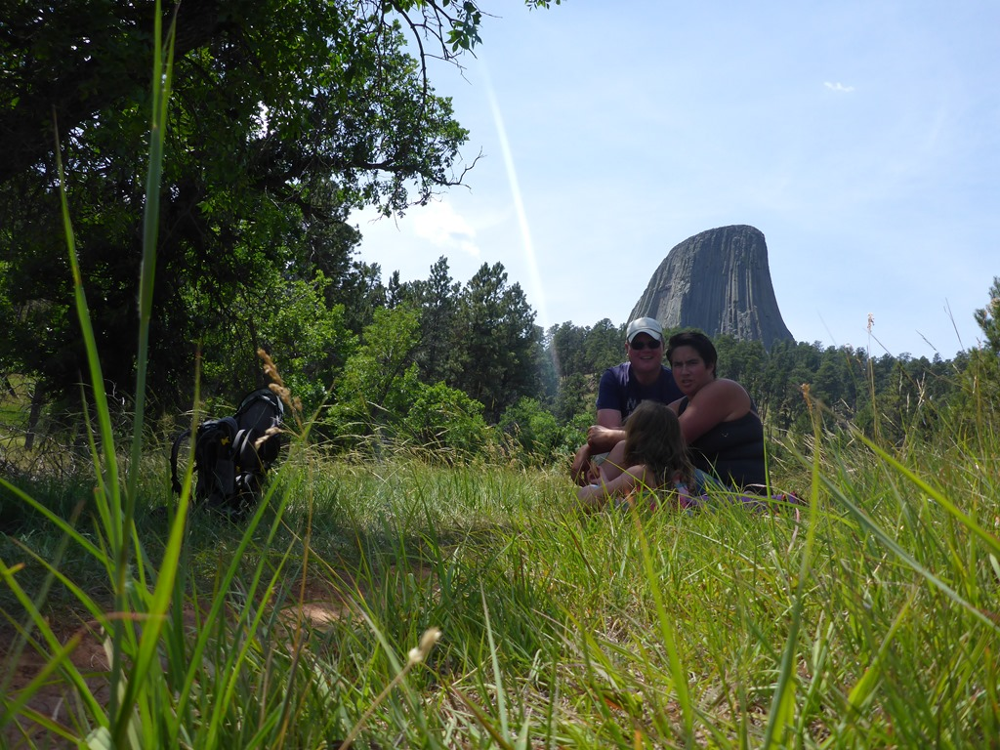
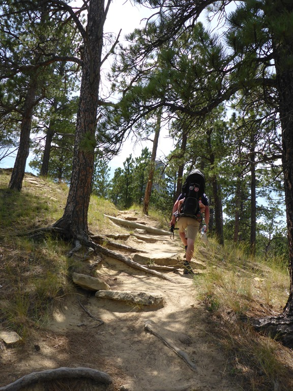

Vanmorgen waren we weer redelijk vroeg uit de veren, want parkeren bij de Tower wordt waarschijnlijk een uitdaging en we willen heel graag rond de toren wandelen. De ingang van het Monument ligt pal naast de camping, dus we konden mooi bij de file voor de ingang de camper ergens tussen duwen zodat we vlot het park in konden. En we hadden geluk: de laatste voor RV's gereserveerde plek was voor ons. We kregen nog hulp van een agent bij het achteruit inparkeren (hoewel we dat natuurlijk helemaal niet nodig hebben).

Rond de toren lopen twee paadjes, en wij kiezen voor de langere Red Beds Trail (6 kilometer) omdat je dan beter zicht heb op de Tower. Het padje wisselt tussen bomen en prairie en we komen ook door een stuk waar de grond rood gekleurd is. Het pad is voor het grootste gedeelte bergaf en dat is maar goed ook, want het is onaangenaam heet. We maken dankbaar gebruik van alle schaduwrijke plekken.

Sofie heeft iets meer dan de helft zelf gelopen, en dat vonden we gezien de hitte heel knap.

Het laatste stuk van de wandeling gaat behoorlijk omhoog, dus dat was even afzien.

Nadat we de junior ranger badge hadden opgehaald, zijn we in de auto gestapt want we hebben een lange rit voor de boeg. We hebben een overnachtingscamping geboekt halverwege de Devils Tower en Fort Collins, namelijk in Douglas. De weg naar Douglas is waanzinnig saai (250 kilometer alleen maar gras en voornamelijk rechtdoor).

## 2 opmerkingen

### Anoniem 9 juli 2017 om 20:01

Die Sofie is toch een super jr. ranger, zijn de Amerikaanse kids vast jaloers op, zoveel badges! Komen jullie nog ooit terug of worden jullie U.S. Citizens? Groetjes BHV

### Gerard 10 juli 2017 om 15:44

Die Sofie, onze S.J.R., is wel heel actief geweest deze vakantie. Haar kamer zal uitgebreid met badges worden versierd.
