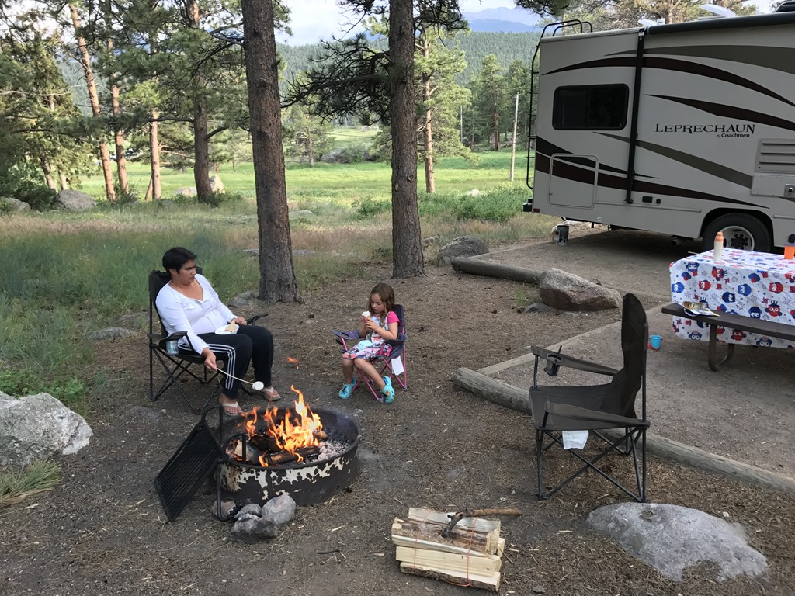
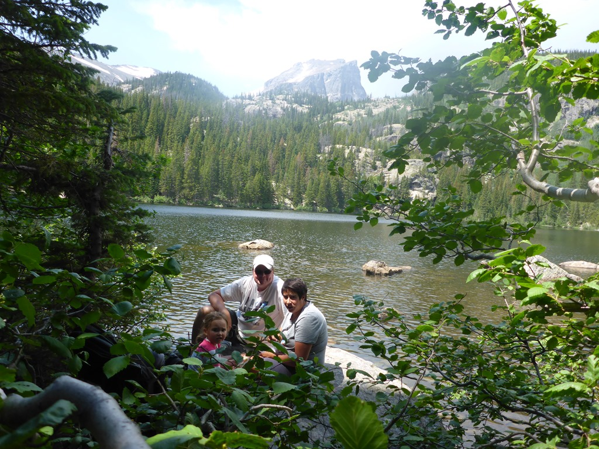
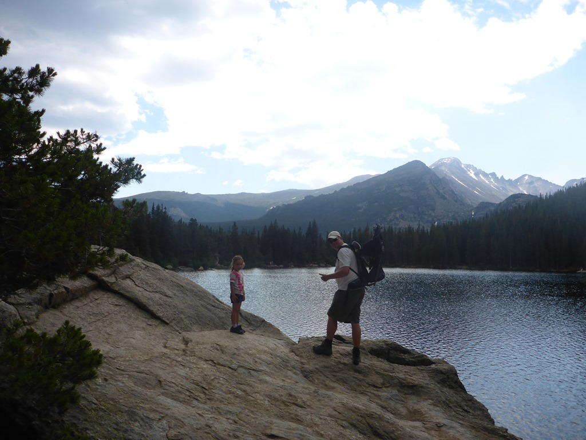
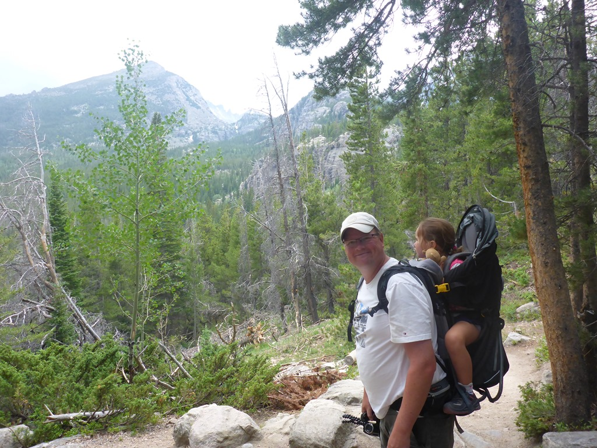
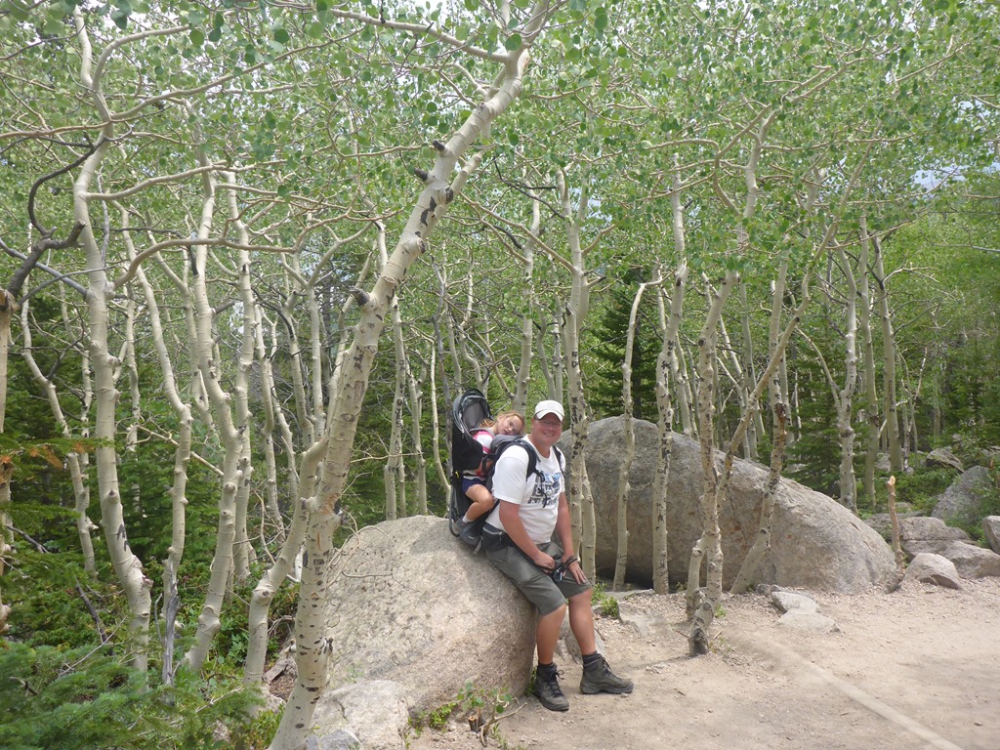
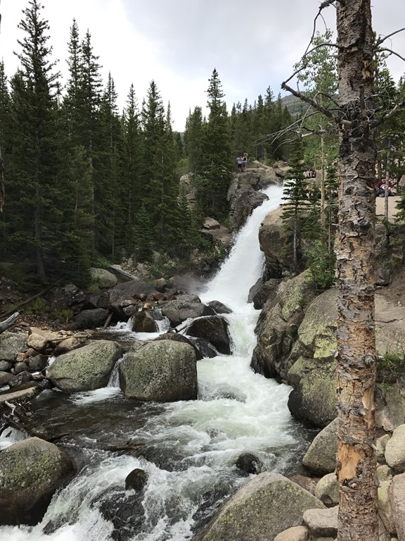

Alleen de naam Rocky Mountain National Park spreekt tot de verbeelding. Het park is groot (1075 km2) en met meer dan 4.5 miljoen bezoekers per jaar is het ook druk. Zeker als je bedenkt dat 80% van de bezoekers gedurende de zomermaanden komen, kun je je voorstellen dat de wegen en parkeerplaatsen goed gevuld zijn met auto's.

Op de Moraine Campground hebben we een erg mooie plek aan de rand van de meadow gekregen.

De eerste ochtend zijn we met het shuttlebusje van de camping naar Bear Lake gereden. We hebben het wandelingetje rond het meer onderbroken met een lunch aan het water. Het is een erg makkelijk padje, wat meteen de populariteit (en gemiddelde leeftijd van de wandelaars) verklaart.

Er hangen de hele tijd donkere wolken boven de omringende bergen en het rommelt af en toe behoorlijk maar we houden het het hele rondje droog. Toen we weer terug bij het begin van het padje waren, was het helemaal opgeklaard en hadden we weer een stralend blauwe lucht.

En dus besloten we maar om de wandeling naar de Alberta Falls eraan vast te plakken. Ook dit is een druk begaand pad, maar de falls zijn best de moeite waard.

Na deze wandeling zijn we weer met de bus teruggereden naar de camping en hebben lekker van de BBQ genoten.

## 1 opmerking

Anoniem 12 juli 2017 om 10:23

De foto bij de camper met het kampvuur is camperen zoals camperen bedoeld is....
Fantastisch! Groetjes BHV
