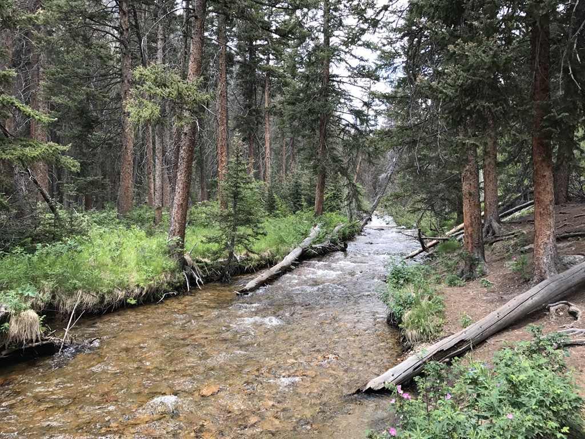
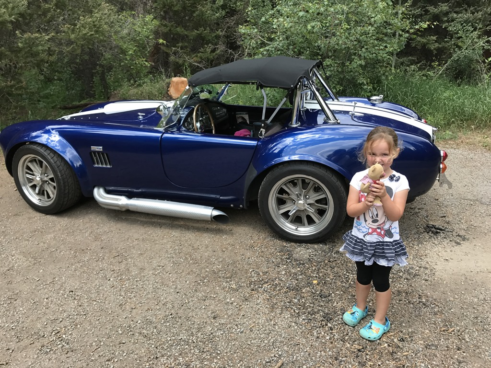
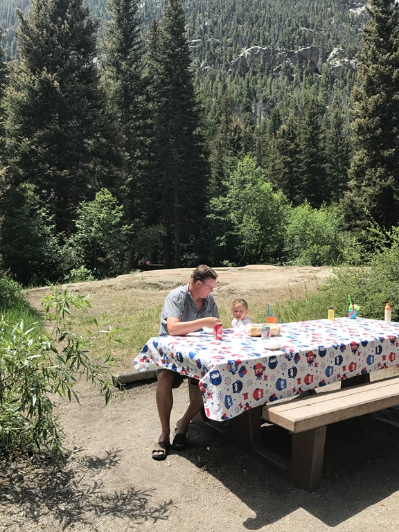
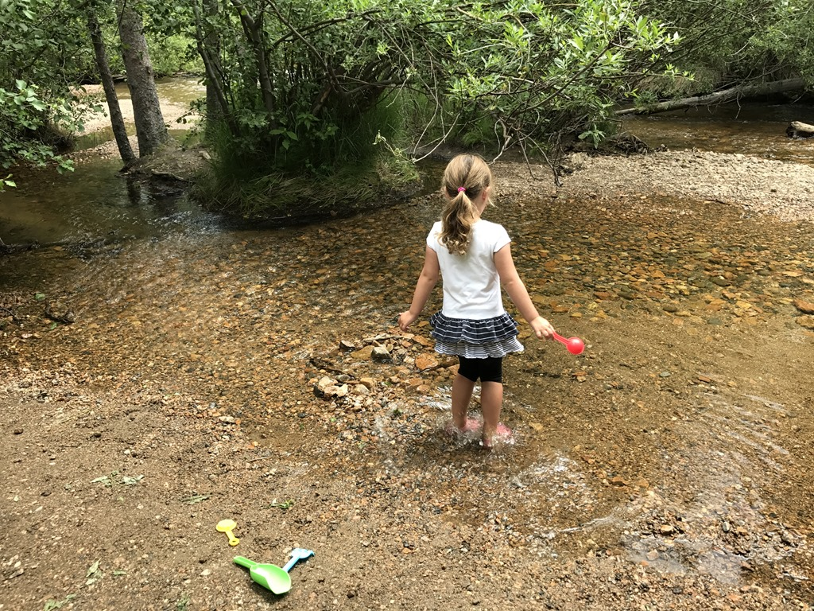
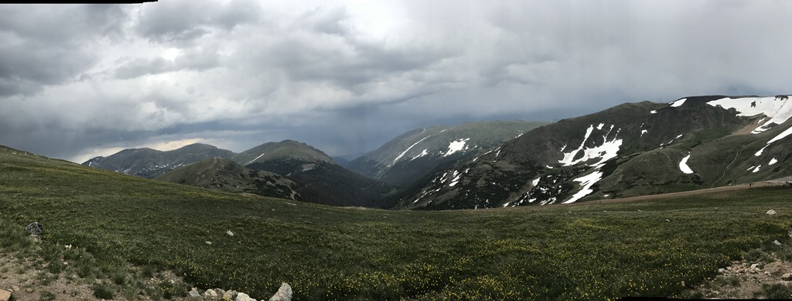
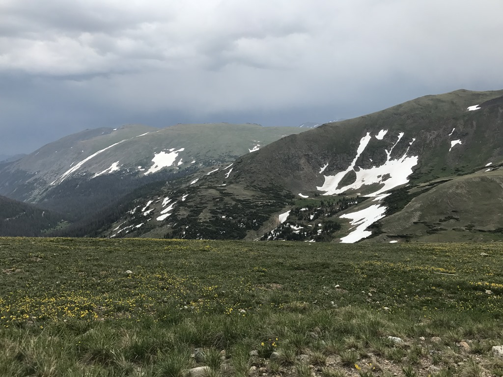

De Trail Ridge Road gaat dwars door het park heen en komt tot een maximale hoogte van 3173 meter. De uitzichten onderweg zijn fantastisch. We hebben geluncht bij de Endovalley picnic area, een voormalige camping en we snappen niet echt waarom het geen camping meer is. De locatie is echt prachtig, langs een riviertje.

Na de lunch mocht Sofie nog even in de rivier springen en daarna zijn we de helemaal naar de westkant van het park gereden.

Bij het Alpine Visitor Center wilden we "even" naar boven lopen om van het uitzicht te genieten, maar halverwege brak een onweer los. Enorme donderklappen en al snel viel de regen en hagel naar beneden, dus zijn we snel terug gerend naar de camper.

Na een werkelijk prachtige rit kwamen we aan bij het Winding River Resort, onze camping voor de komende twee nachten.

## 1 opmerking

### Gerard 14 juli 2017 om 11:25

Ook deze vakantie hebben wij met veel plezier weer kunnen mee genieten van alle mooie uitzichten en alle belefenissen van jullie. Ook is de blog een leuke vakantie herinnering.
