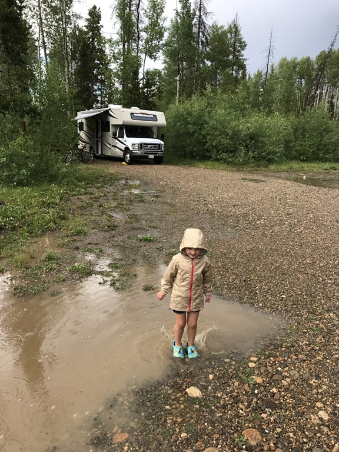

Helemaal aan de westkant van het park ligt Adams Falls mooi te wezen. We waren van plan om met de fiets er naar toe te rijden, maar gezien het wisselvallige weer zijn we uiteindelijk toch maar met de camper gegaan. Het is slechts een kort ritje (paar mijl), en ook het wandelingetje was qua lengte totaal niet spannend. Maar de omgeving is wel erg mooi, dus we hebben we erg van genoten.

Iets voorbij de waterval hebben we even van een welverdiende snack genoten, en zijn nog heel even bij de meadow gaan kijken. Er hangen donkere wolken aan de hemel, en in de verte begint het al te donderen.

We zijn in marstempo teruggelopen naar de camper. We wilden een beetje op tijd terug zijn (zowiezo vanwege de bui), want we willen vandaag onze fietsen proberen te verkopen. Dus bij terugkomst een mooi bordje gemaakt en deze aan de fiets gehangen. Helaas, helaas, na een half uurtje barstte het onweer los. Het kwam met bakken tegelijk uit de hemel, niet goed voor onze business natuurlijk.

Na anderhalf uur was de regen weer voorbij, en kon Sofie in de plassen gaan stampen. Wat een feest!

's Avonds na het eten zijn we nog naar de icecream social gegaan. Heel tactisch waren we met de fiets gegaan, want je weet maar nooit natuurlijk... En ja hoor, we hadden geluk: de ijscoboer heeft onze fietsen overgenomen. Daar zijn we dus ook weer mooi vanaf gekomen.

We hebben al heel veel spullen in de koffers gedaan, want over twee dagen moet de camper ingeleverd worden bij Roadbear. Het einde nadert nu toch echt.
