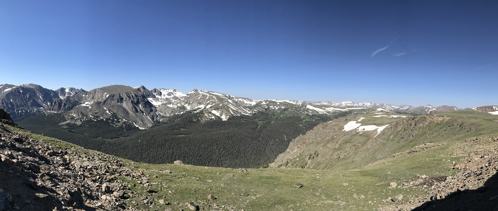
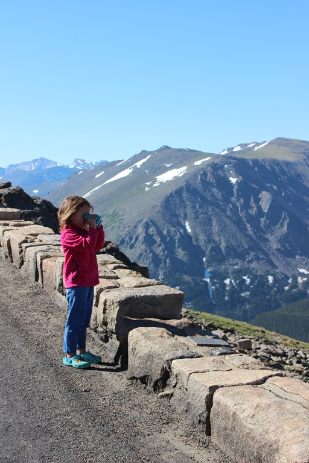
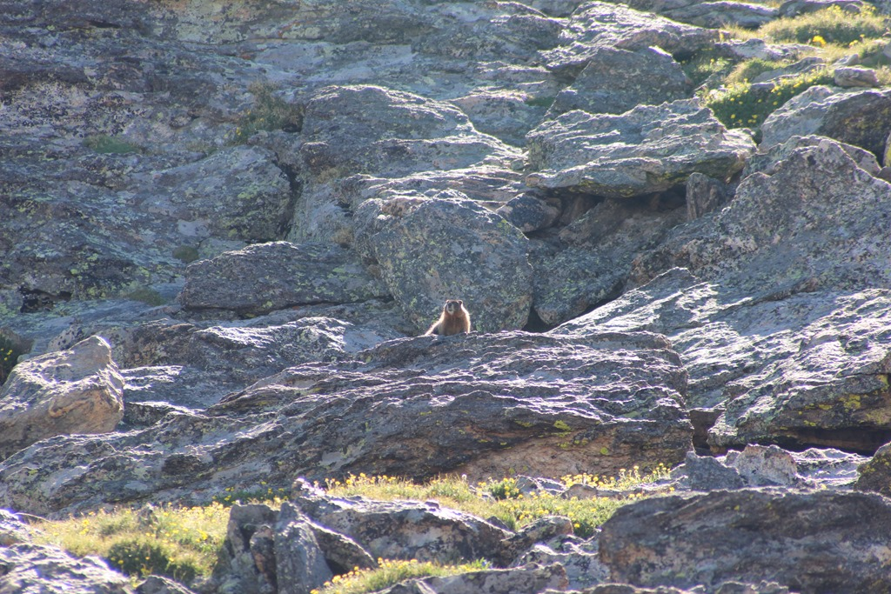
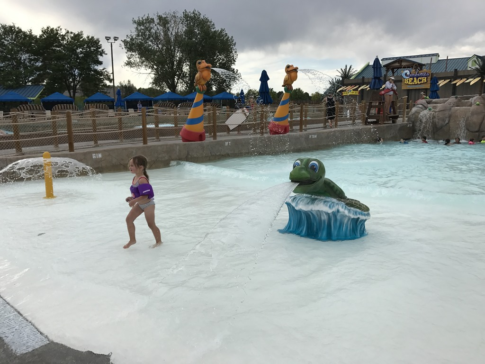

Vanmorgen zijn we in alle vroegte weer dwars door de Rocky Mountains gereden. We wilden nog wat bekijken langs de Trail Ridge Road, en Sofie moest ook nog haar laatste junior ranger badge ophalen.

Zo met het zonnetje erbij ziet het er allemaal een stuk vriendelijker uit dan een paar dagen geleden. We hebben nog naar marmotten en pika's (lijken grote muizen, maar zijn eigenlijk familie van het konijn). Erg leuk om die beestjes een tijdje in de gaten te houden.

Bij het visitor center hebben we de badge opgehaald en daarna zijn we naar het vliegveld van Denver gereden. Daar staat onze SUV voor de laatste paar dagen Denver op ons te wachten (een witte Chevy Tahoe deze keer). Toen vlug naar onze aller aller aller laatste camping gegaan (Denver East KOA) om daar de camper te stallen, en daarna met de SUV naar Water World; een supersonisch zwemparadijs met een hele berg aan glijbanen, al dan niet te bedwingen met een band. Dat was allemaal iets te spectaculair, ze hadden gelukkig ook een lazy river en een goed golfslagbad. We hebben er een paar uurtjes doorgebracht.

's Avonds hebben we alles ingepakt en de camper schoon gemaakt. Morgen moeten we op tijd de camper inleveren.

Pffff, wat een drukke dag...
