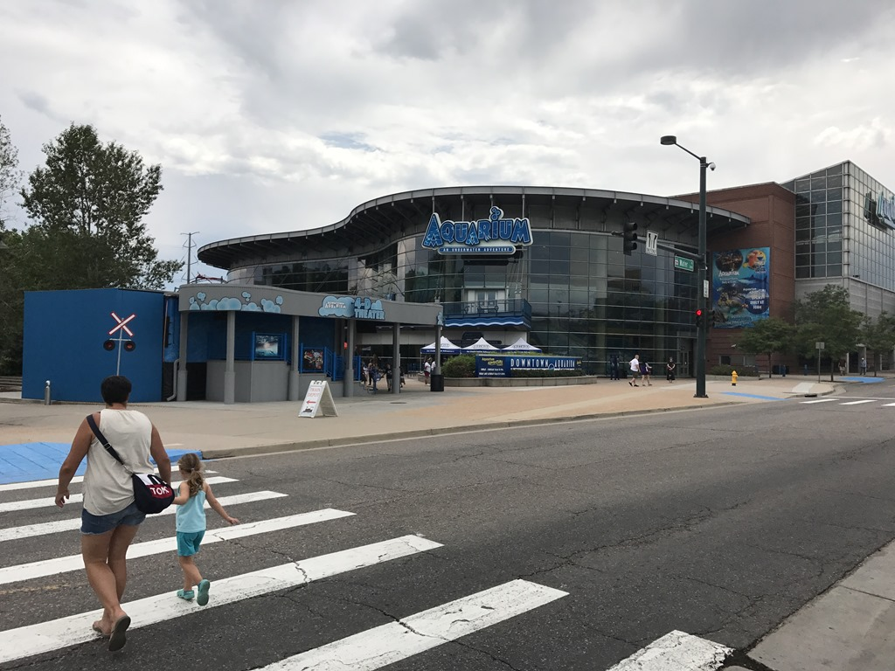
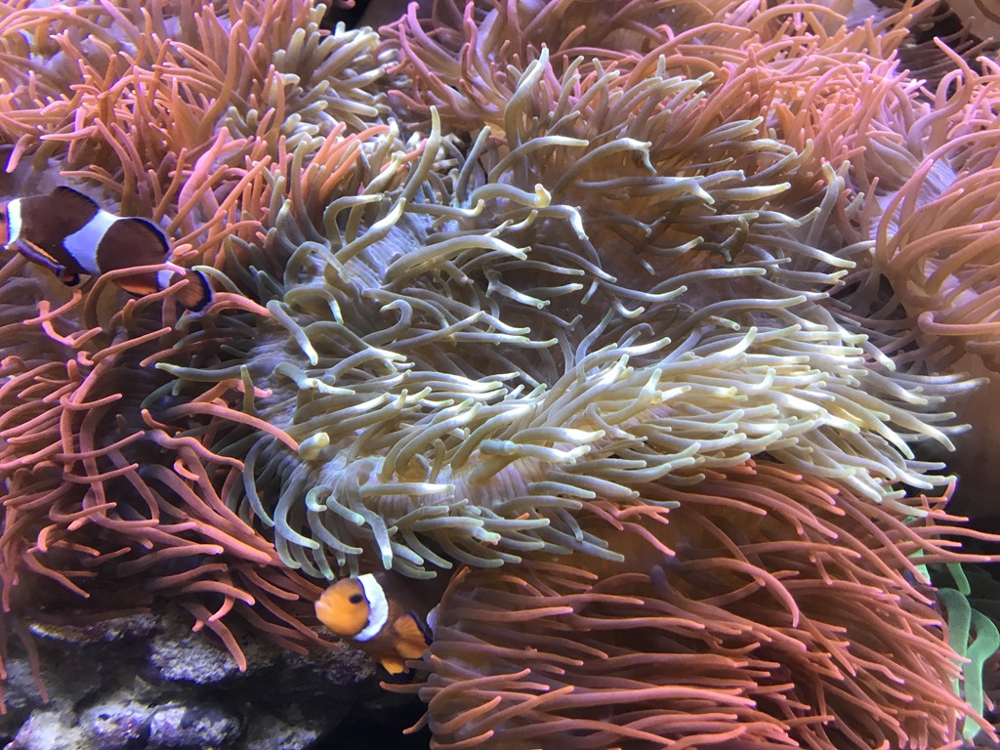
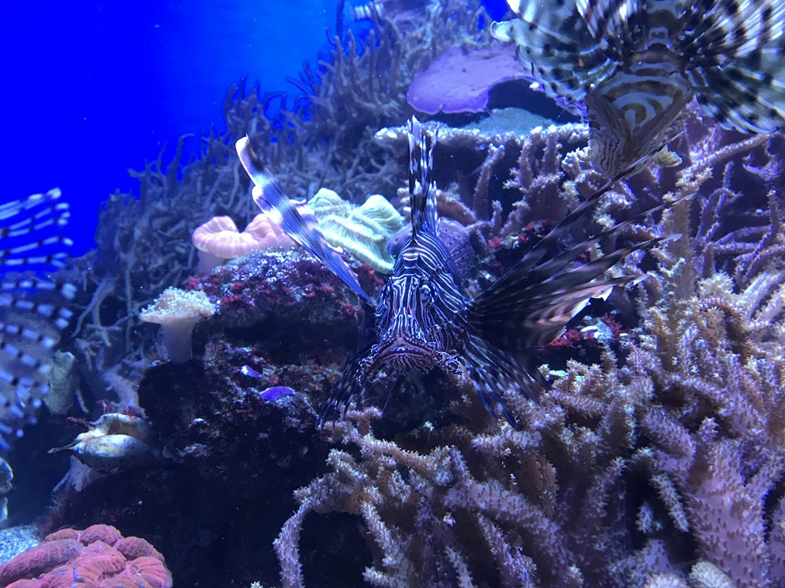

Het inleveren van de camper ging erg voorspoedig, dus hebben we maar meteen ons hotel Hyatt House bij het vliegveld gebeld of onze kamer al klaar is. En ja hoor, we konden er direct in. Dat is toch een stuk prettiger, dan de stad in met alle bagage in de achterbak. We hebben een mooie ruime suite. We hebben in onze kamer geluncht en daarna zijn we naar het aquarium gegaan. Het is zeer mooi gemaakt allemaal, en gelukkig niet al te druk, dus we konden alle vissen goed bekijken.

's Avonds hebben we (erg lekker!) gegeten bij BJ Brewery.
