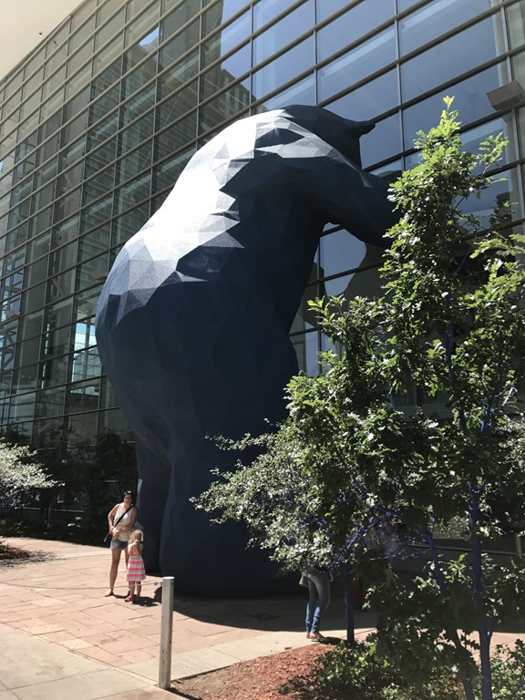
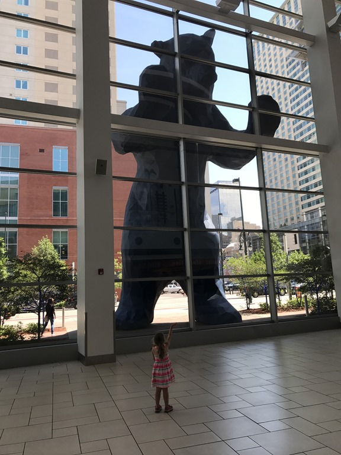
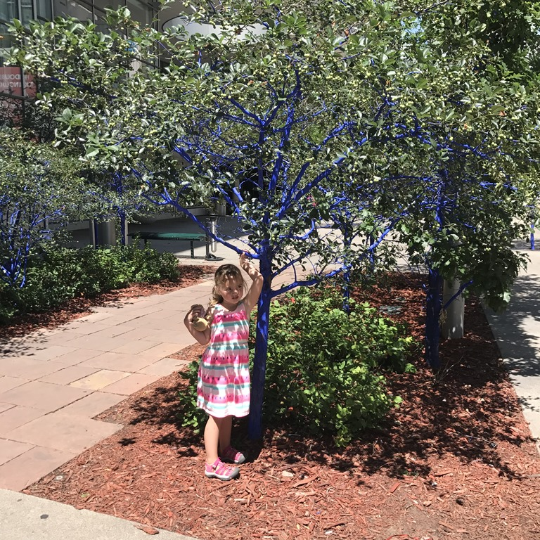
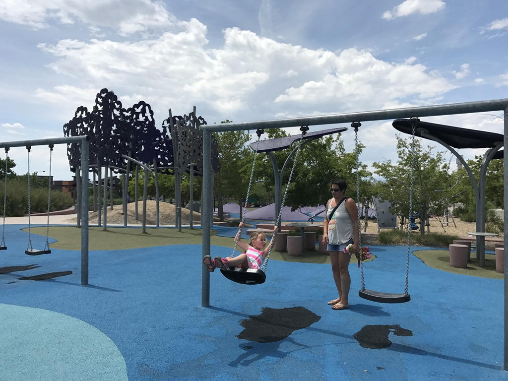
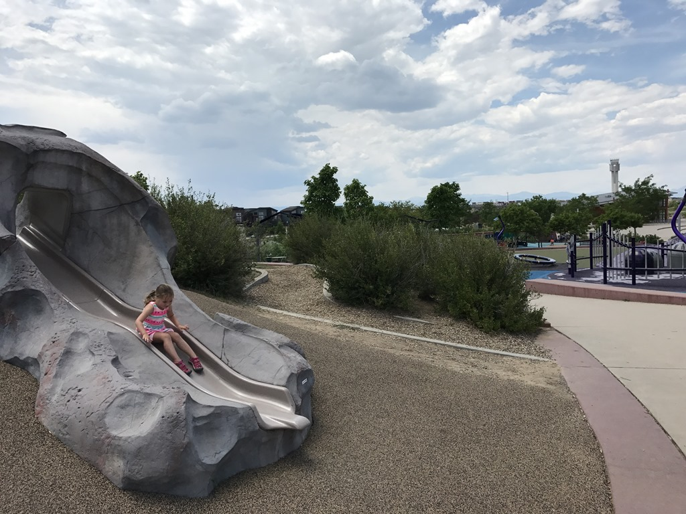

Vanmorgen zijn we even naar downtown Denver gereden. Wellicht waren we niet helemaal in de goede buurt, maar de stad maakte niet echt een gezellige indruk. We hebben nog naar een of andere blauwe beer gekeken en even geluncht bij Wich Wich, en toen maar naar het niet echt centraal gelegen Central Park gereden en daar in de speeltuin gehangen. Sofie heeft er nog even met een ander kindje gespeeld.

Het was erg warm, dus de dames hebben dankbaar gebruik gemaakt van het zwembad van het hotel. Na de plons zijn we op chic gaan dineren bij de Applebee's. Met een volle buik hebben we alle koffers en handbagage ingepakt. Heel knap: drie koffers akelig dicht op de maximaal toegestane 23 kilogrammen. Je sjouwt wat mee voor die paar dagen vakantie...
