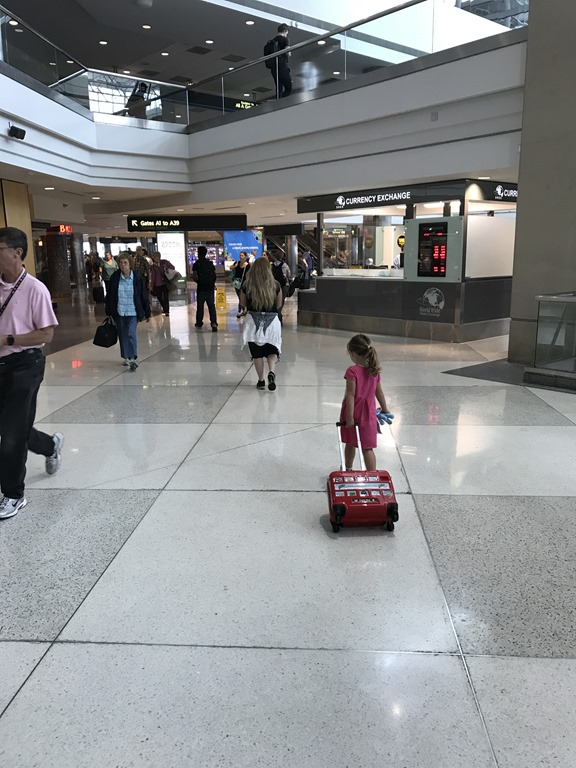

En zo komt er dan eindelijk een einde aan deze lange trip. We hebben het erg leuk gehad, mooi weer, mooie en interessante dingen gezien en gedaan, leuke mensen ontmoet. Kortom, we willen eigenlijk niet naar huis, hoewel van de andere kant... het is nu ook wel mooi geweest. Terug naar Nederland betekent ook weer je eigen dingetjes (en normaal brood!) binnen handbereik.

De securitychecks gingen erg vlot, dus we hadden alle tijd om een beetje rond te neuzen op het vliegveld. Eerst vliegen we naar Minneapolis, dan drie uur overstaptijd, en dan nog 7 uur en 24 minuten naar Amsterdam. De laatste vlucht vertrekt iets na 19.30, dus Sofie (en papa stiekem ook) heeft goed geslapen, en dan gaat zo'n vlucht eigenlijk best snel voorbij.

En wonder boven wonder ging het op Schiphol ook weer snel bij de douane, en lagen de koffers al op ons te wachten toen we bij de bagageband aankwamen.

## 2 opmerkingen

### opa 16 juli 2017 om 09:17

Jammer dat het boek uit is!
Wij hebben het met veel plezier gelezen en van de plaatjes genoten.
Zijn blij als we jullie weer in levenden lijve zien.

### Gerard 16 juli 2017 om 12:19

hoe mooi het ook is, hoe fijn het ook was.... uiteindelijk gaat de weg weer naar het eigen huisje. Jullie kunnen wel lang nagenieten van al het moois dat is gezien en beleefd.
