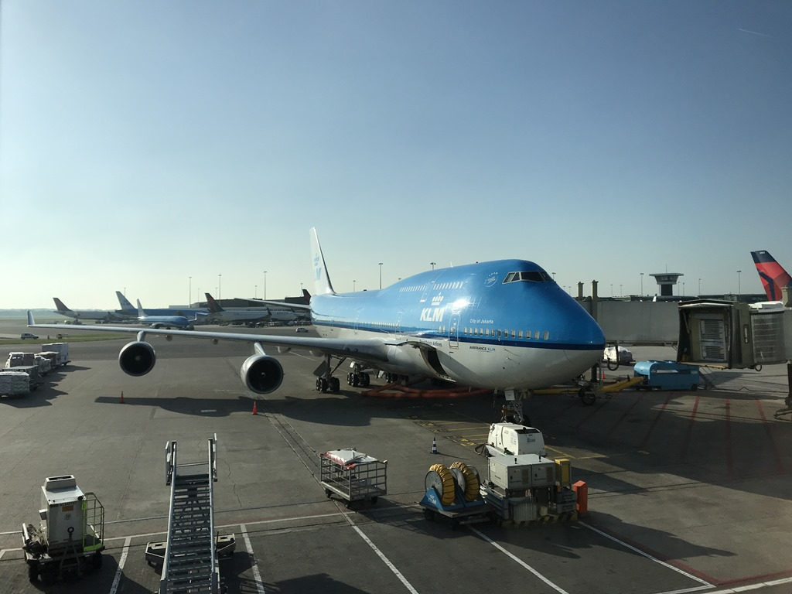
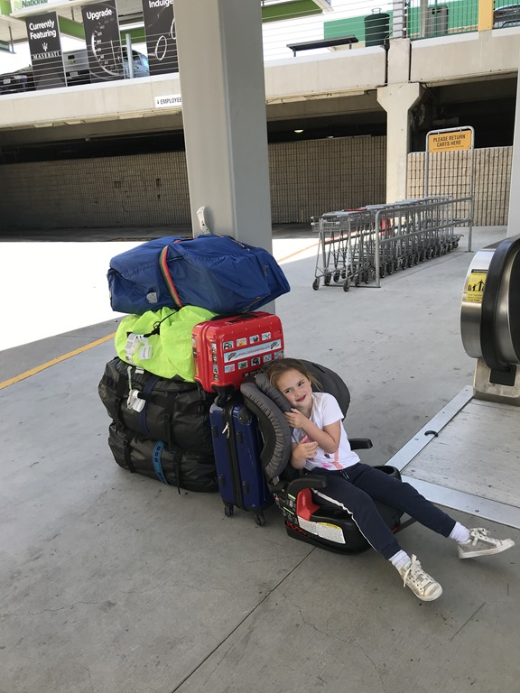

Sinds we met Sofie op vakantie gaan, boeken we altijd een hotel op Schiphol waar we de nacht voor vertrek doorbrengen. Na een aantal keren de Citizen M bezocht te hebben, kozen we deze keer voor de Sheraton, pal tegenover Schiphol Plaza. De kamer is in ieder geval een heel stuk ruimer dan die bij de concurrent.

Na het bezoek aan het Panoramadek zijn we wat gaan eten, en toen op tijd slapen, want morgen is een drukke dag. De wandeling vanuit de hotelkamer naar de incheckbalies duurt nog geen 10 minuten, dus we waren er al vroeg bij. Security en douane ging supersnel, dus we hadden alle tijd om met Sofie bij NEMO Science Museum te kunnen spelen. De rechtstreekse vlucht van Amsterdam naar Los Angeles verliep vlekkeloos, Sofie was keurig en braaf en heeft zelfs nog een paar uurtjes geslapen.

We hadden ons verheugd op enorme wachttijden bij de Amerikaanse douane, maar dat viel gelukkig allemaal reuze mee. Na iets meer dan een half uur stonden we met z'n allen buiten bij de shuttlebus naar Alamo's om daar de huurauto op te halen voor de rit richting Anaheim.

Ook hier ging de afhandeling allemaal erg snel, en dus konden we al snel op pad richting ons hotel Hilton te Anaheim. Dit enorme hotel (1600 kamers) is van alle gemakken voorzien, maar het grootste pluspunt is wel onze view over het Disneyland park, met uitzicht over het dagelijkse vuurwerk. De ingang tot het park ligt op ongeveer 15 minuten wandelen. Maar dat bewaren we allemaal voor morgen. Eerst gaan we de jetlag wegzwemmen in het heerlijk verwamde buitenbad van de Hilton. 's Avonds zijn we gaan eten bij BJ Brewing. Om 20:00 lag de hele familie Baten op een oor, het was een lange, lange, lange dag geweest voor ons allen.
