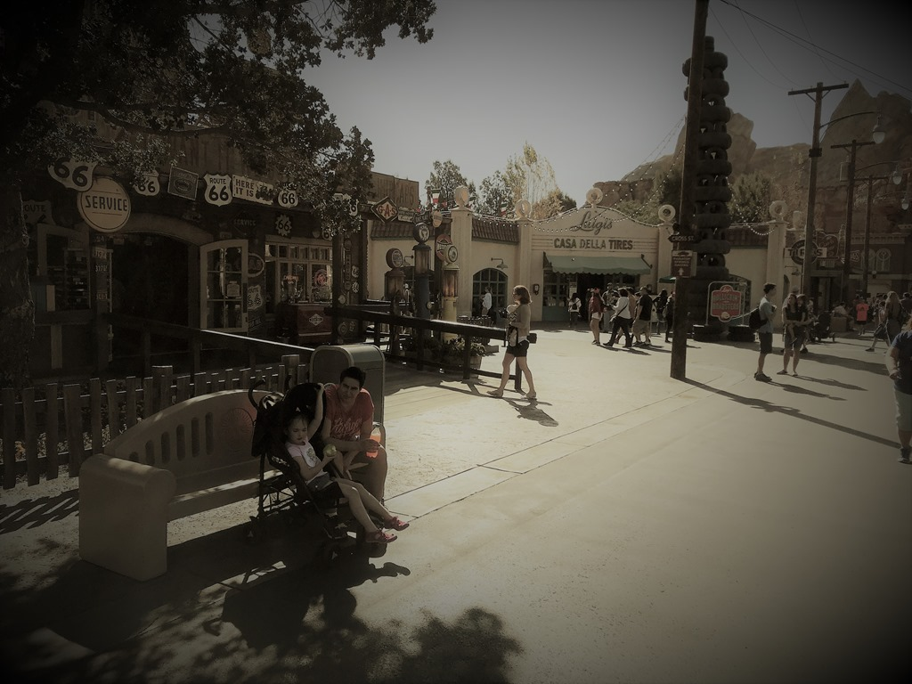
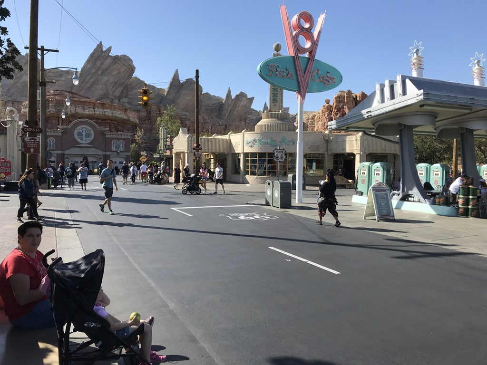
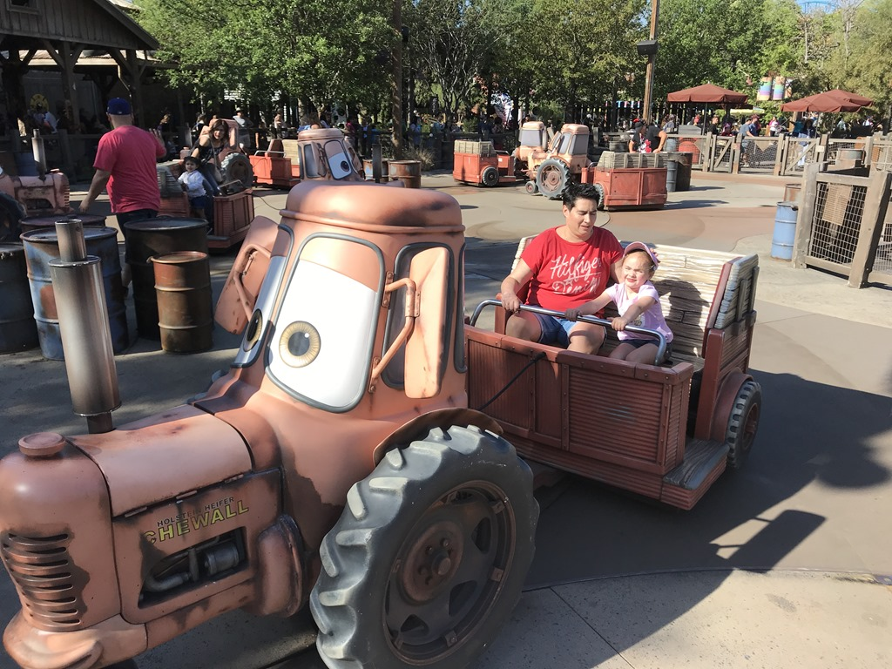
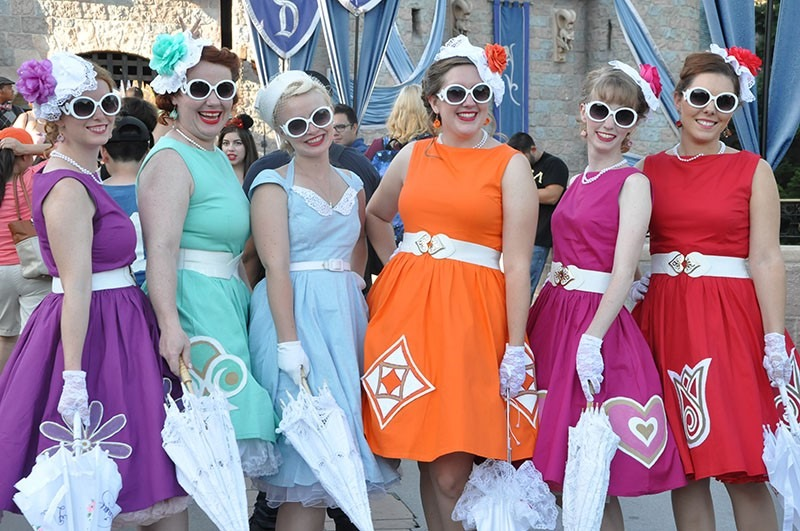
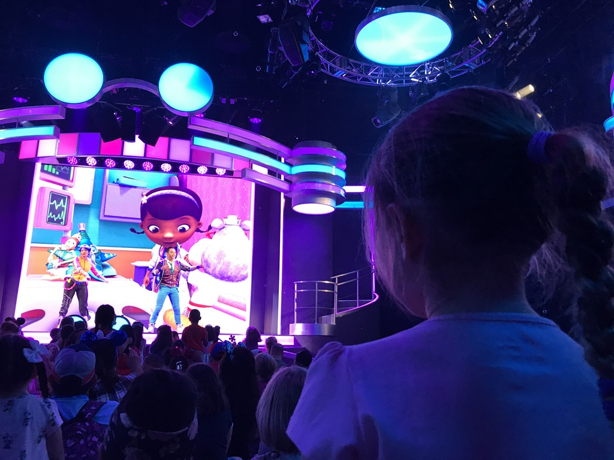
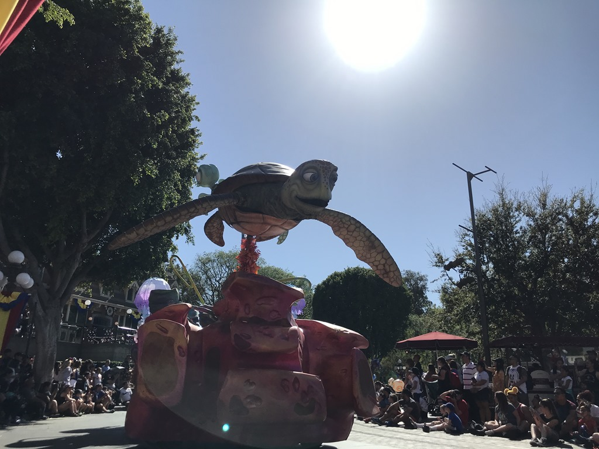
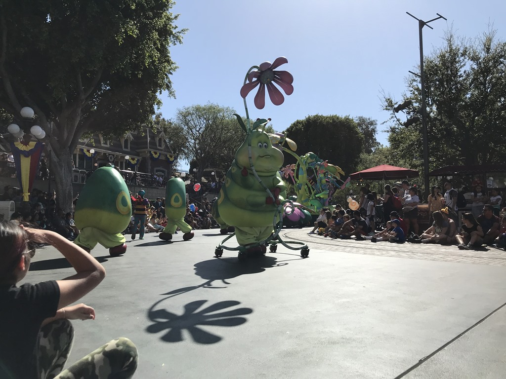
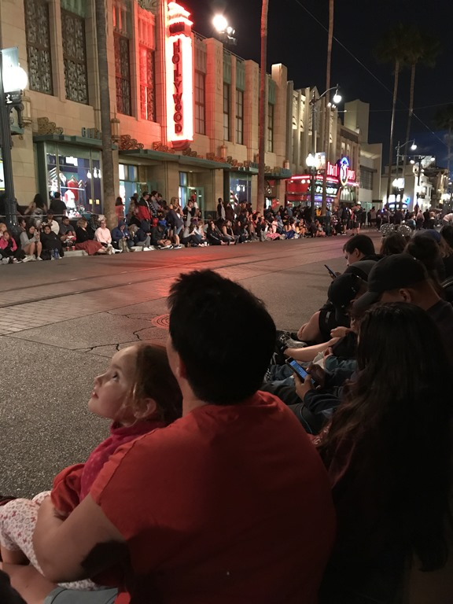
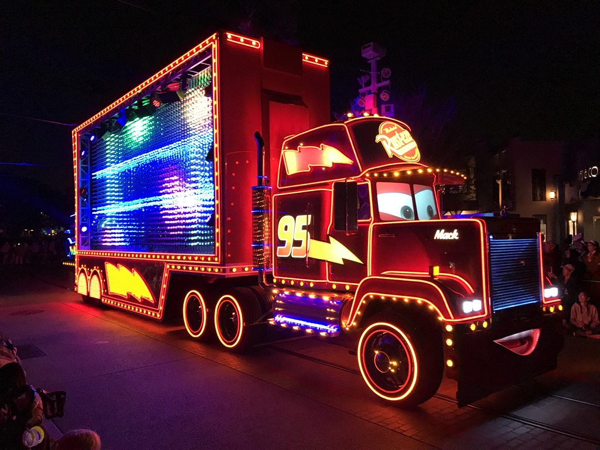

Het park is vandaag al om 8:00 uur open, en aangezien we dankzij de jetlag al ruim voor die tijd wakker waren (om 3 uur namelijk), stonden we keurig op tijd voor de poorten. Het is dan nog helemaal niet druk, en ook de temperatuur was heerlijk. Als eerste zijn we in California Adventure Land de attractie The Little Mermaid met Ariel gaan bezoeken. Sofie vindt dit een erg leuke attractie. Daarna zijn we het perfect nagemaakte dorpje Radiator Springs uit de Cars films gaan bekijken. En dat hebben ze werkelijk fantastisch gedaan, ieder detail uit de films vind je hier terug. De attracties hebben allemaal een Cars thema: we zijn gaan slingeren achter traktoren bij Takel, en daarna natuurlijk de Racers.

Vandaag is het "Dapperday", waarbij heel veel gasten in vintage kledij toeristische attracties bezoeken (zoals Disney dus). Het zag er heel leuk uit, en past in het typische Disney sfeertje.

Na de Disney Junior Dance Party was het tijd voor lunch (en een enorme middag-dut voor de jongste van het stel). We moesten Sofie wakker maken voor de middag parade: Pixarfest.

Na de middagparade zijn we terug gewandeld naar ons hotel om even te rusten en te eten. Na het diner zijn we naar de avondparade gegaan. Spektakel!

We waren om tien uur weer in de kamer, en vielen allemaal direct als een blok in slaap.

## 1 opmerking

### Gerard 27 april 2018 om 22:30

Wat een geweldig begin van de vakantie. Geniet er maar lekker van
