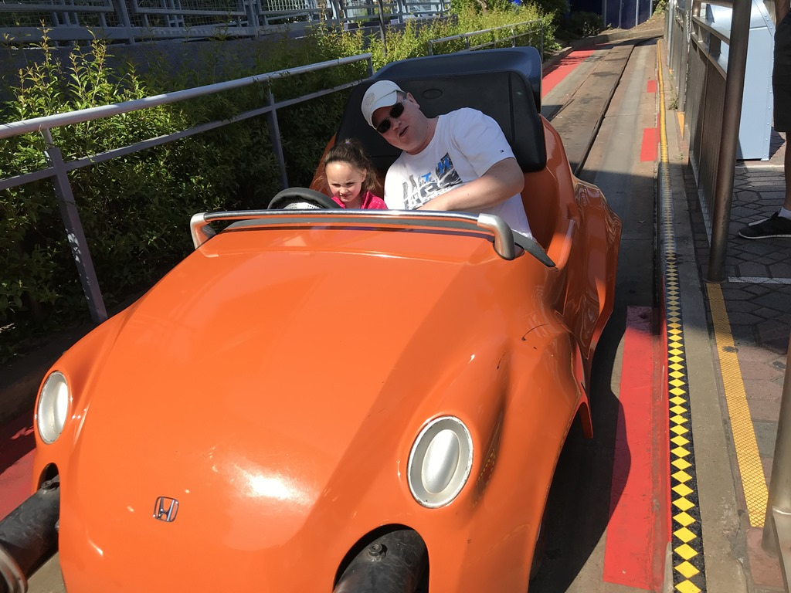
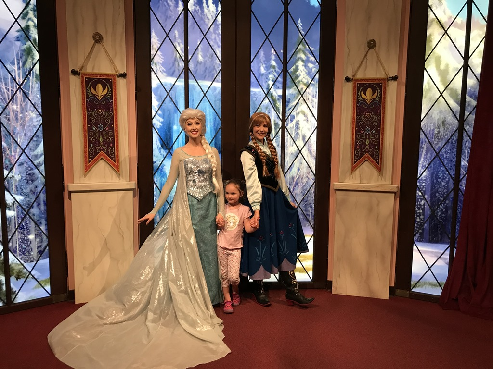
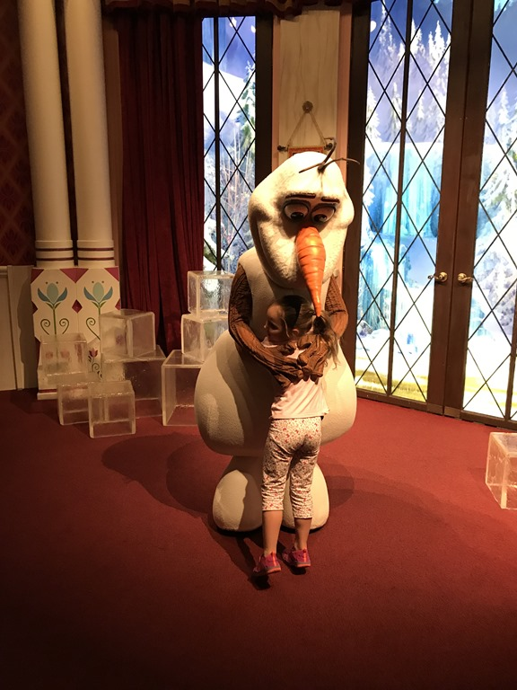
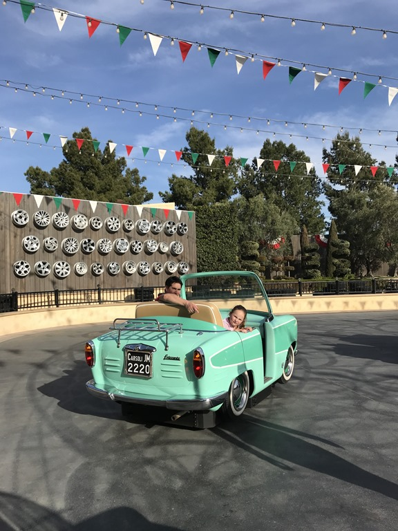
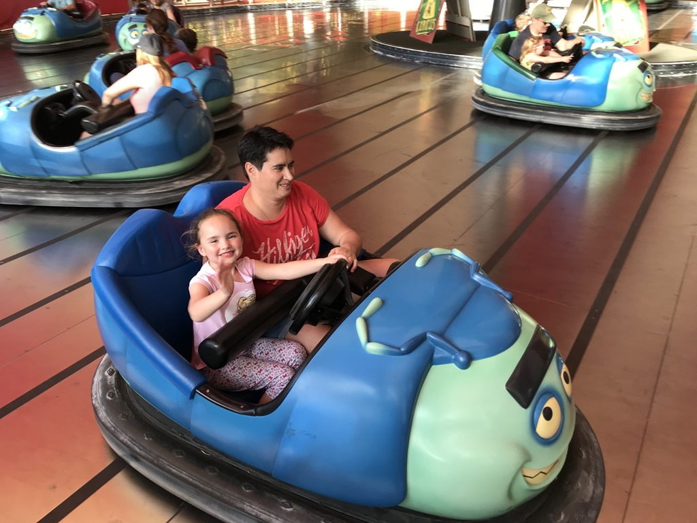
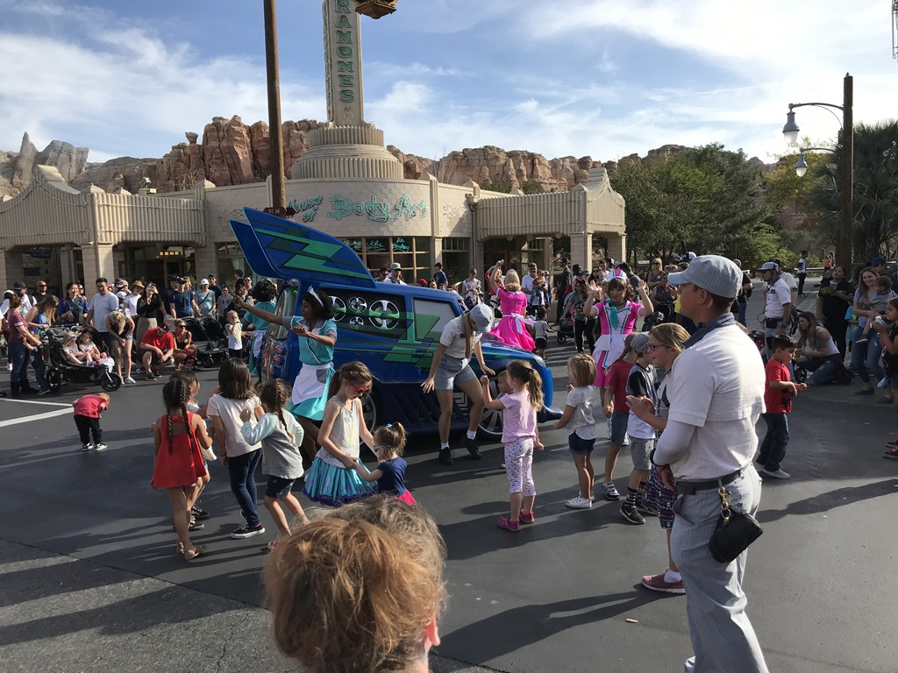
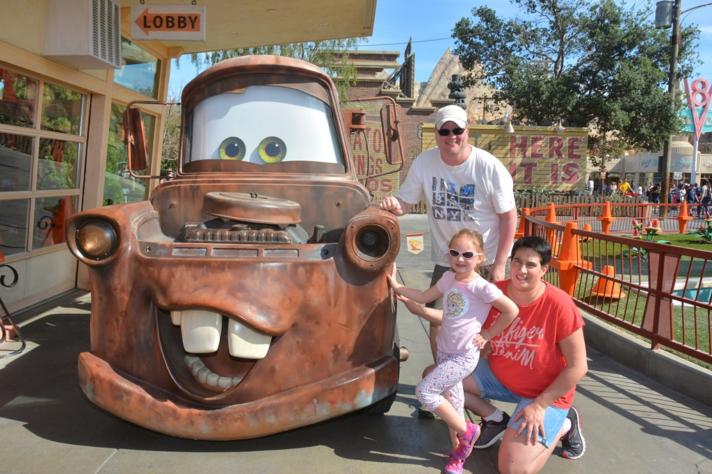
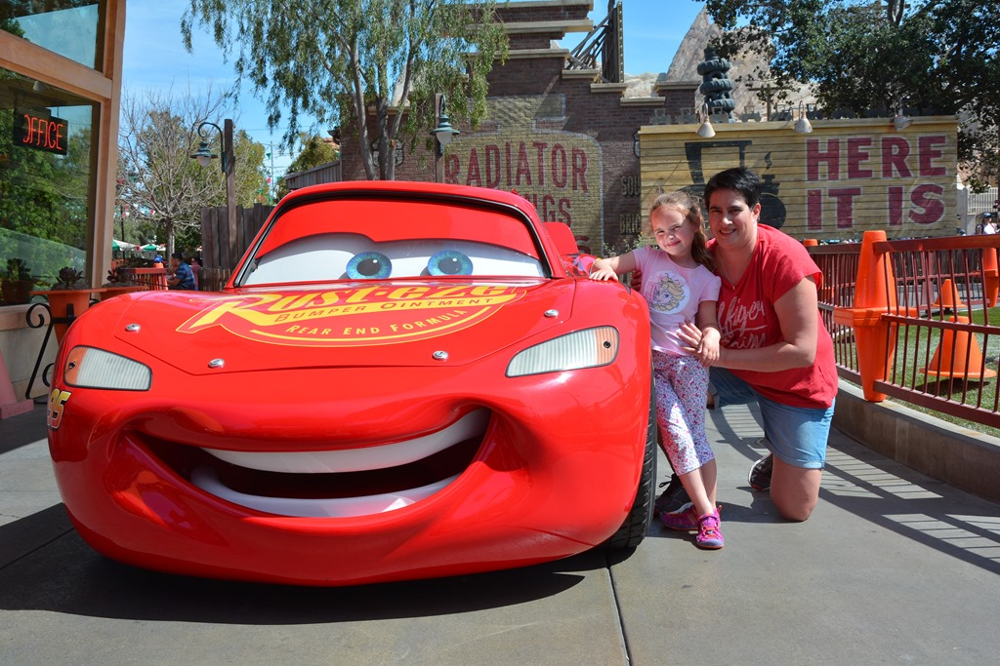
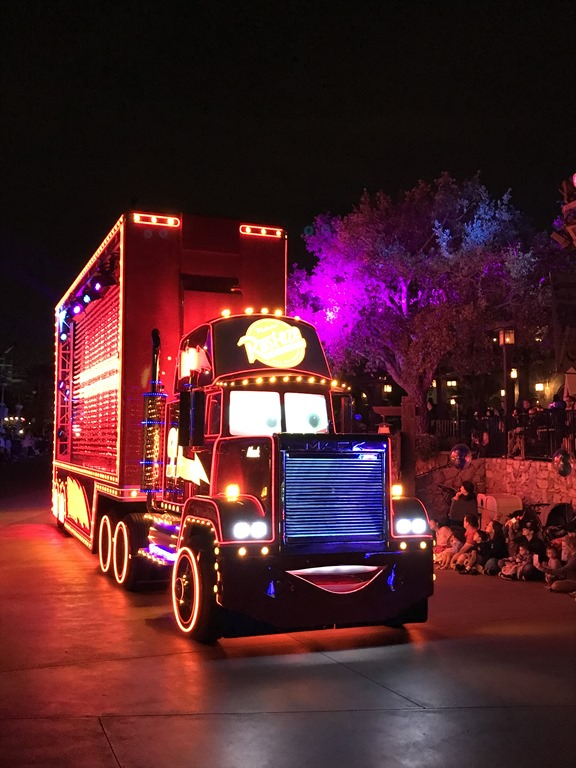

Vanmorgen hebben we tot 7 uur geslapen, dus het einde van de jetlag lijkt in zicht. Na een verkwikkend ontbijt bij de inhouse Starbucks zijn we weer op pad gegaan richting Disney. We beginnen het bezoek aan Disneyland, en gaan onder andere met een onderzeeboot de wereld van Nemo en Dory bekijken. Daarna zijn we een stukje gaan rijden in de Autopia automobielen.

Voor de lunch volgden nog menig attractie. De lunch hebben we genoten in Toontown. Terwijl papa de nieuwe huurauto ging ophalen, zijn de dames nog op bezoek geweest bij Elsa, Anna en Olaf van Frozen.

We troffen elkaar weer in California Adventure park, waar we al snel een dansje mochten wagen bij Luigi.

De botsauto's waren een groot succes bij Sofie, we zijn er wel vijf keer achter elkaar in geweest.

Sofie vond de avondparade gisteren zo mooi, dat we vandaag nog maar een keer zijn gaan kijken.

