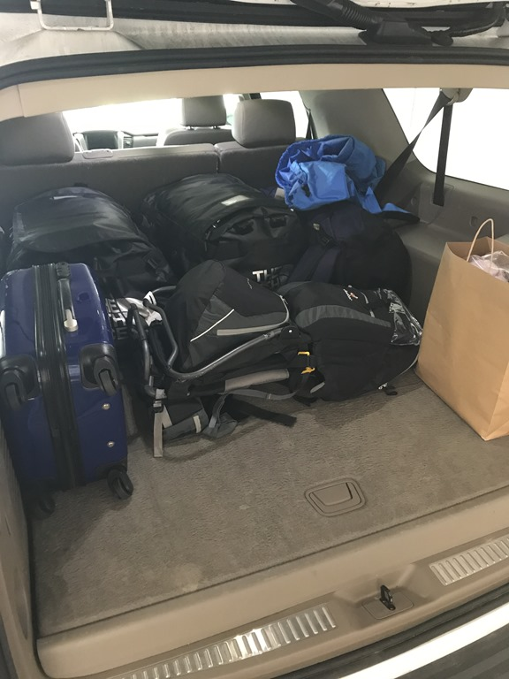
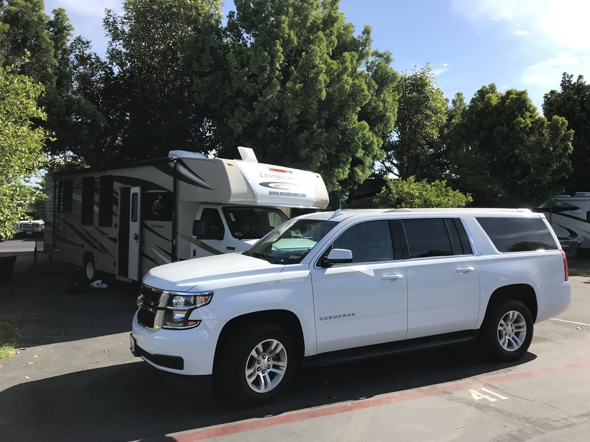
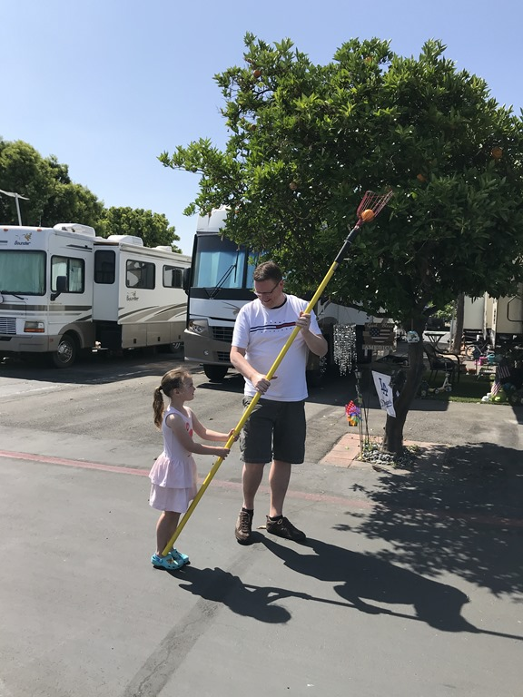
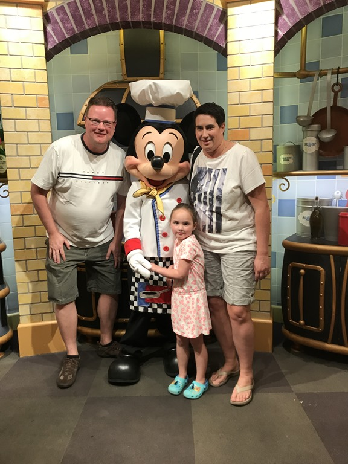
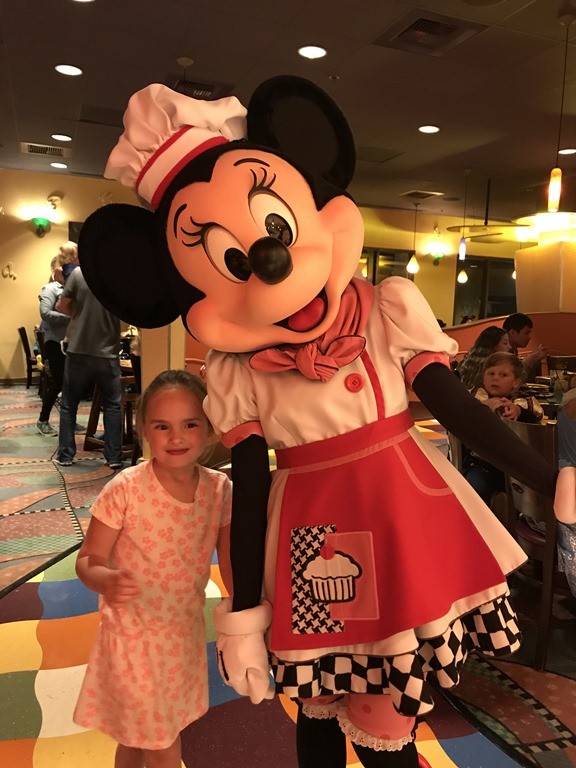

Vandaag moeten we helaas de Hilton verlaten. Ondank de enorme omvang hebben we het toch als een prettig hotel ervaren. Het ritje vanuit Anaheim naar Roadbear is iets van 100 kilometer, en aangezien het verkeer in en rond Los Angeles berucht is, besluiten we pas na de spits te vertrekken. Dus samen met een porter hebben we alle bagage in de nieuwe huurauto gemikt (we kregen een upgrade naar een Chevrolet Suburban, een maatje groter dan onze favoriete Tahoe). We hadden best veel meer bagage mee kunnen nemen, want we hadden schandelijk veel ruimte over ;-).

We doen uiteindelijk bijna twee uur over het ritje. De papierhandel bij Roadbear ging erg snel, en dus waren we al snel weer onderweg terug richting Anaheim, naar onze eerste camping deze trip: Orangeland RV Park. Dit is uw typische Amerikaanse commerciele camping, dus veel 40+ footers die allemaal gebroederlijk naast elkaar staan. Pluspuntje voor deze camping is, naast de locatie ten opzichte van Disney, dat er allemaal sinaasappel-, citroen en grapefruitbomen staan waar je de vruchten van kunt plukken.

's Avonds zijn we bij Goofy's Kitchen gaan eten. We werden welkom geheten door chef Mickey.

Onder het genot van het prima buffet komen Katrien, Knabbel en Babbel, Goofy, Minnie en Pluto bij je aan tafel. En dat is natuurlijk voor de kleinste van het stel erg leuk. Stiekem genieten de twee oudsten ook uiteraard.

## 1 opmerking

### Gerard 28 april 2018 om 09:14

Roger, is dat autootje niet iets ter vervanging van de Volvo.....
