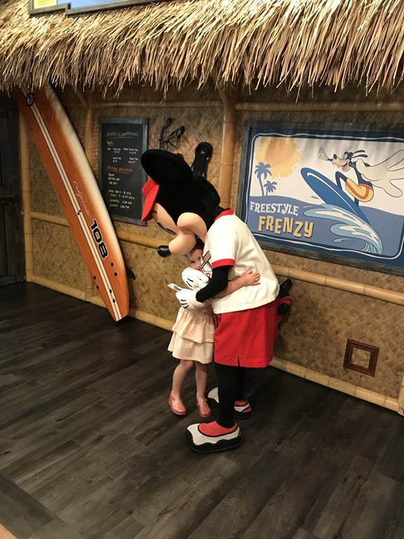
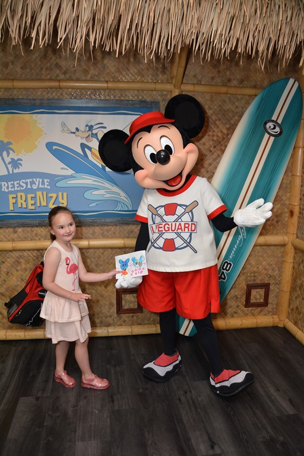
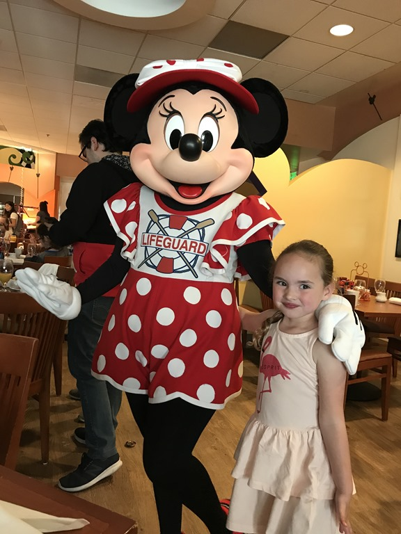
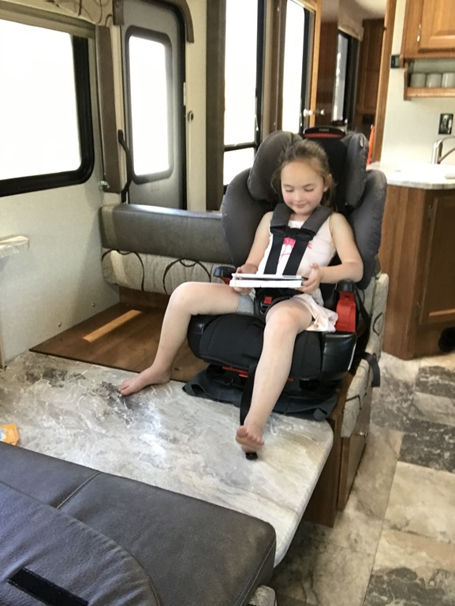
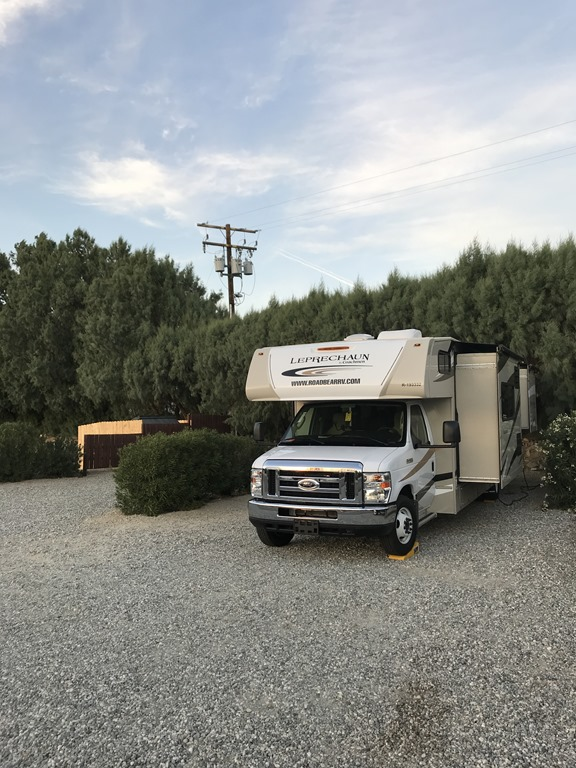
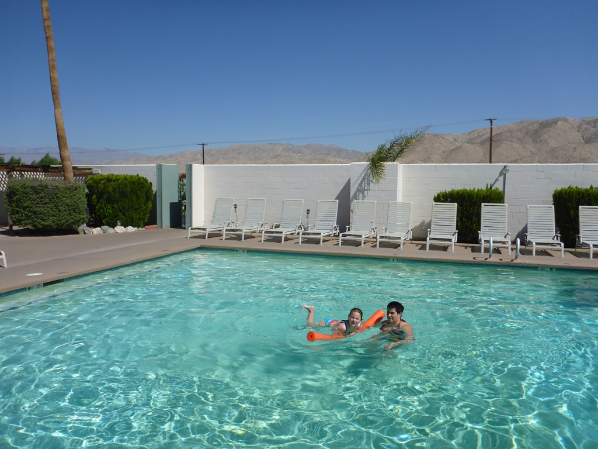

Deze ochtend gaan we voor de laatste keer iets bij Disney doen: we gaan ontbijten in het Paradise Pier hotel waar ook weer Disney karakters bij je aan tafel komen. Sofie had speciaal voor de gelegenheid een mooie tekening gemaakt die ze aan Mickey mocht geven. Hij was er erg blij mee zo te zien.

Na het ontbijt hebben we de Suburban weer afgeleverd bij Alamo, en voor ons gevoel begon de vakantie toen pas voor het echt: met z'n drietjes in de camper op pad!

Eerste stop is de KOA in Desert Hot Springs. We krijgen een mooi plekje toegewezen, en zijn gaan zwemmen tot het helemaal donker was. Het water in het zwembad komt uit een natuurlijke warm water bron, en is heerlijk!

De campers van Roadbear zijn dit seizoen allemaal een stukje langer dan voorheen, we hebben nu ook twee slides: een in de woonkamer en een in de slaapkamer. Douche en toilet zijn nu een apart hok. We zijn tevreden over de indeling, hoewel we het nog steeds onbegrijpelijk vinden dat er een dubbele spoelbak in de keuken moet zitten: zo hou je namelijk amper werkruimte over.
