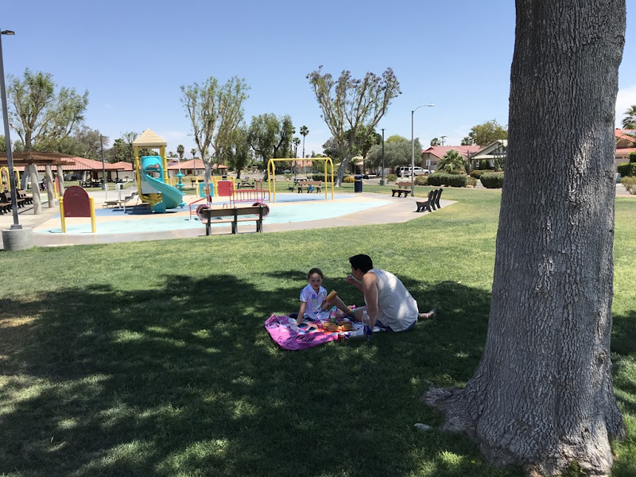
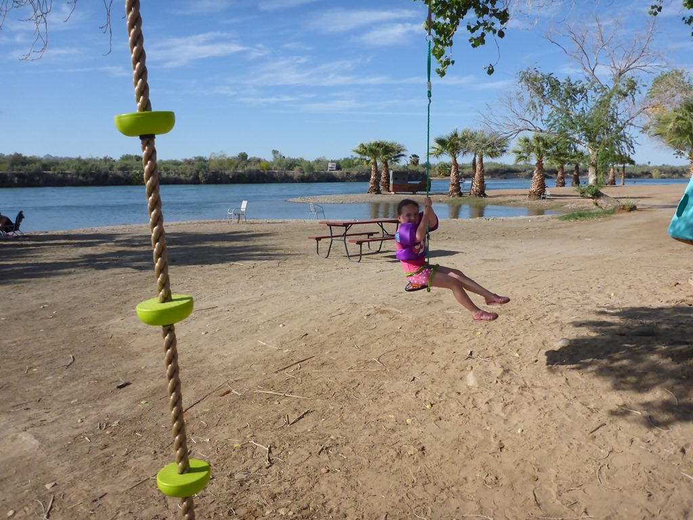
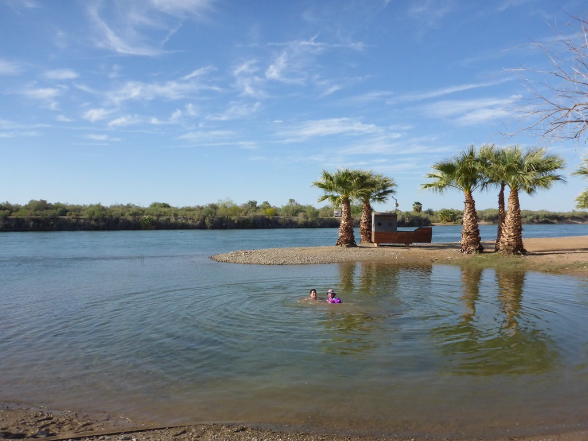
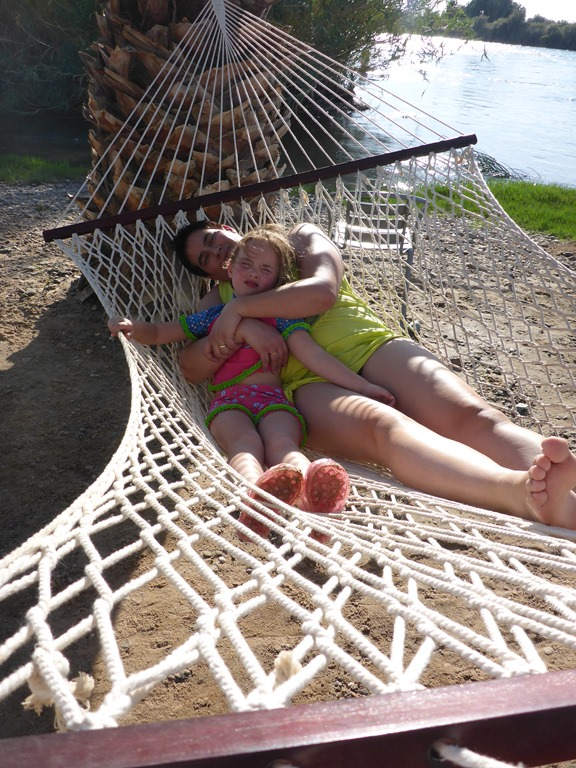
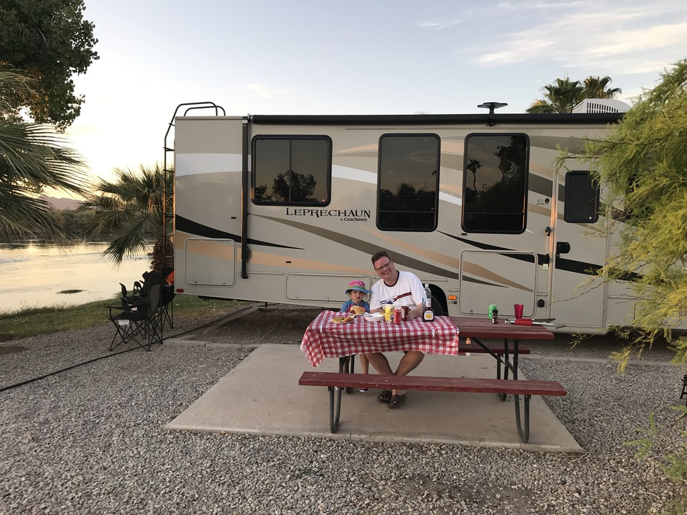
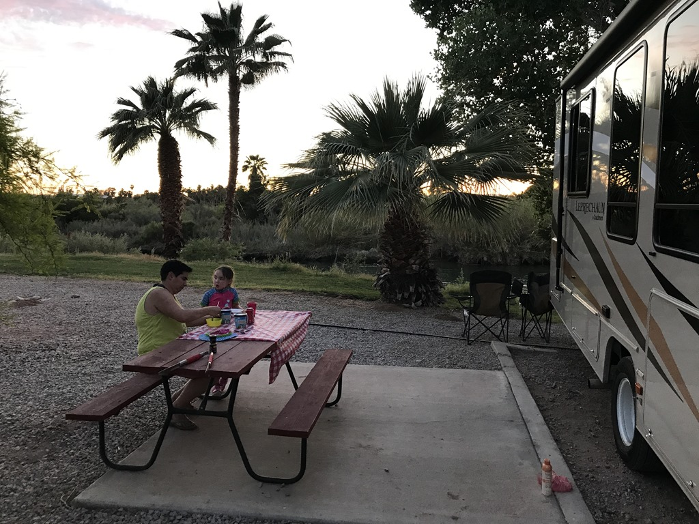

We willen uiteindelijk naar Phoenix, Arizona. Om de rit vanuit Desert Hot Springs enigszins draaglijk te maken, overnachten we op Arizona Oasis RV Resort, aan de Colorado river. Hier waren we twee jaar geleden ook al en dat is ons toen erg goed bevallen. Onderweg hebben we in Palm Springs picnic gehouden in een parkje. Vanwege de hitte waren de glijbanen echter te heet om van af te glijden.

Na aankomst op de camping hebben we heerlijk gezwommen, zowel in de rivier als in het zwembad.

## 1 opmerking

### Gerard 28 april 2018 om 09:19

Na de drukte van disney is dit toch wel een relaxte omgeving. Ik zie dat jullie een ruime camper hebben en Sofie heeft een ruime zit.
