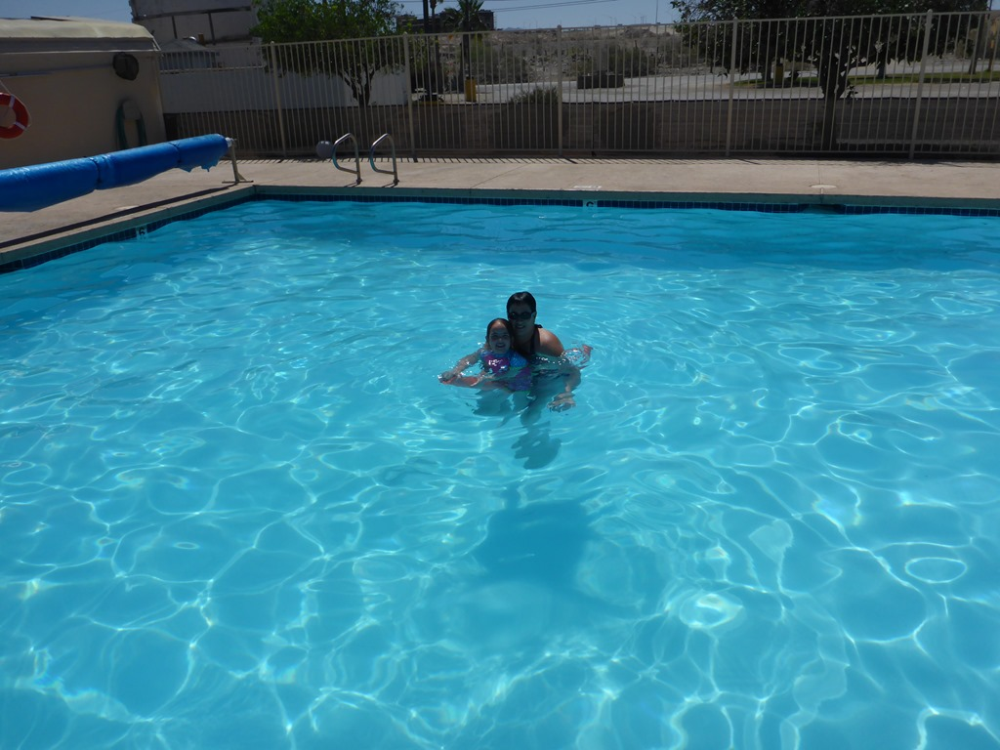
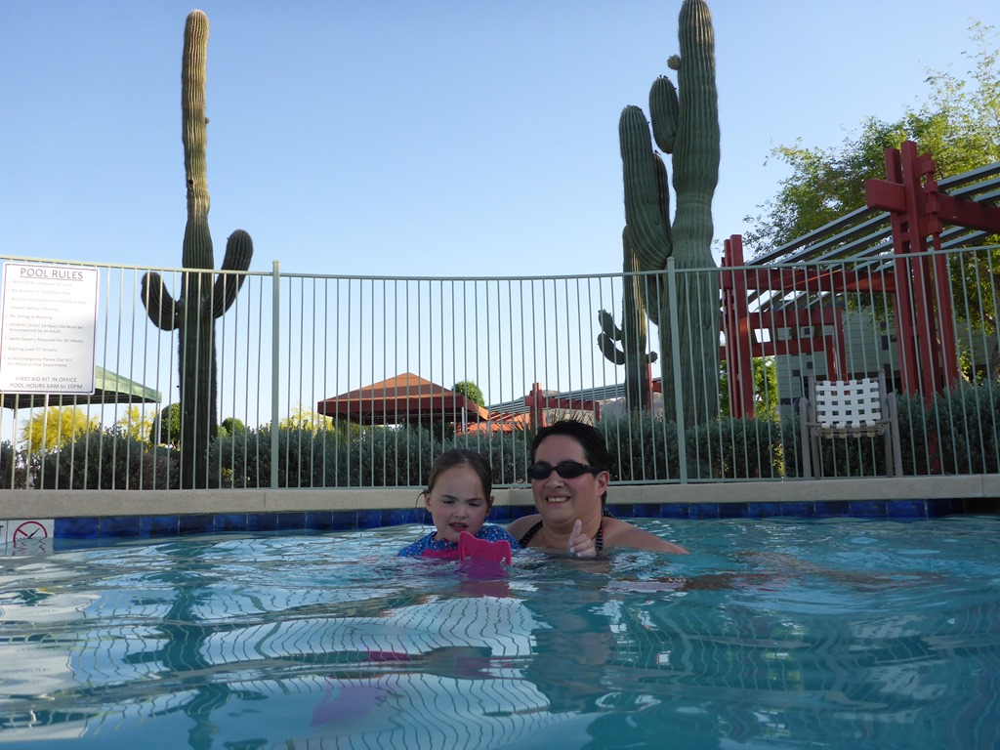
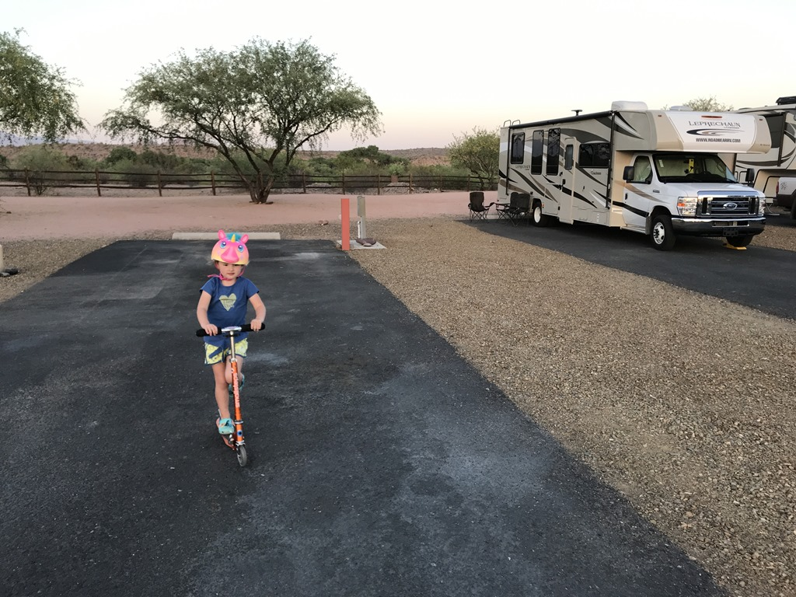

Vanmorgen zijn we op tijd opgestaan want we willen voor de rit richting Phoenix nog even zwemmen.

De Interstate 10 tussen Ehrenberg, waar onze vorige camping was, en Phoenix is niet de meest aantrekkelijke snelweg, en gaat voornamelijk rechtdoor door een dor woestijn landschap. Hoe dichter je bij Phoenix komt, hoe meer van de karakteristieke cactussen je links en rechts in de berm ziet verschijnen. Het is hier gortdroog, en bloedheet. Vandaag zelfs 39 graden, volgens enkele locals is dat voor deze tijd van het jaar vrij uitzonderlijk. Gelukkig is er de eerste 180 kilometer weinig verkeer, maar rond Phoenix komen we toch in wat file-miserie terecht.

Onze camping voor de komende twee nachten is Eagle View RV Resort in Fort McDowell, iets ten noord oosten van Phoenix. De camping scoort erg hoog qua faciliteiten, en de sites zijn voor een commerciele camping behoorlijk ruim. Ons campertje lijkt wel erg mini vergeleken met de enorme RV's die ons omsingelen, maar we hebben een mooi plekje aan de rand van het terrein, met een mooi uitzicht over de Verde rivier. Er is een prima zwembad voorhanden, waar we zeer dankbaar gebruik van hebben gemaakt.

