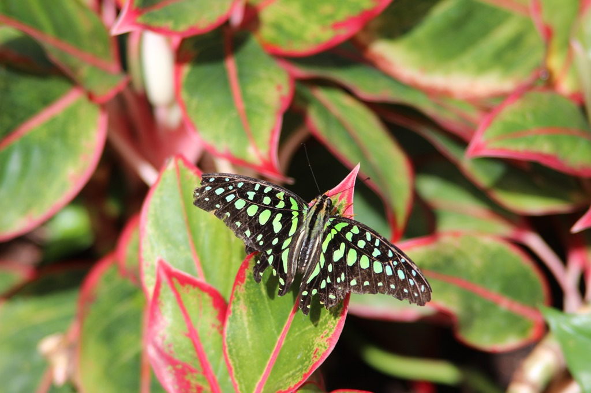
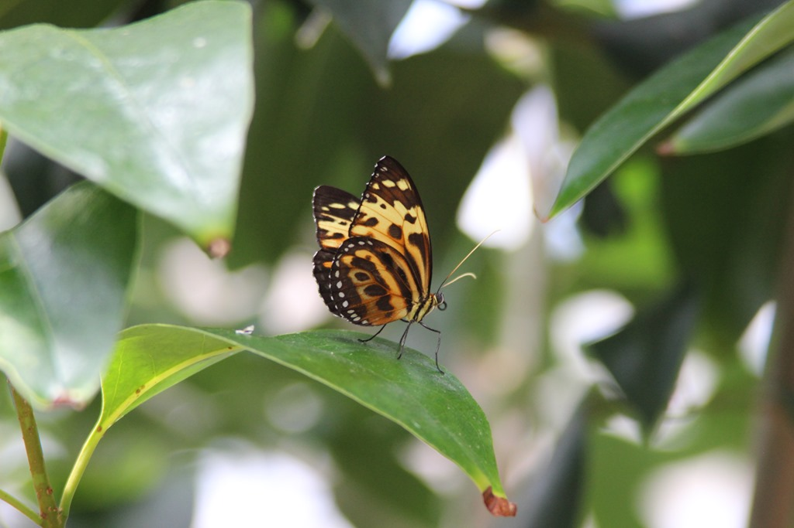
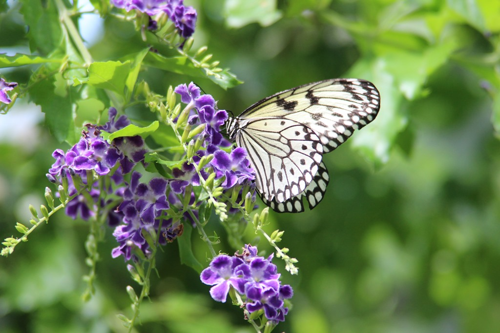
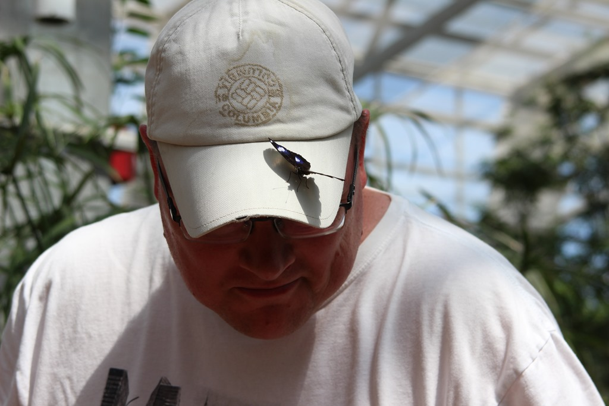
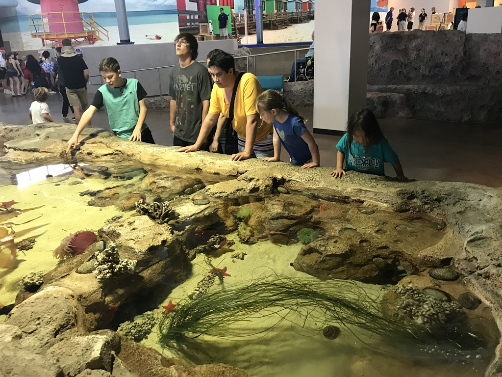
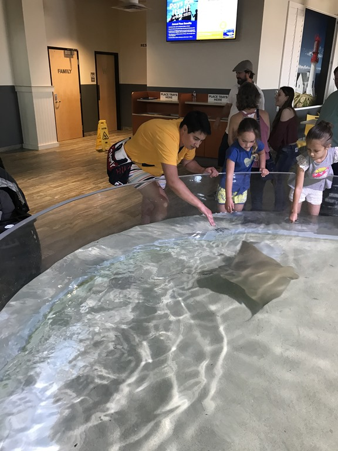
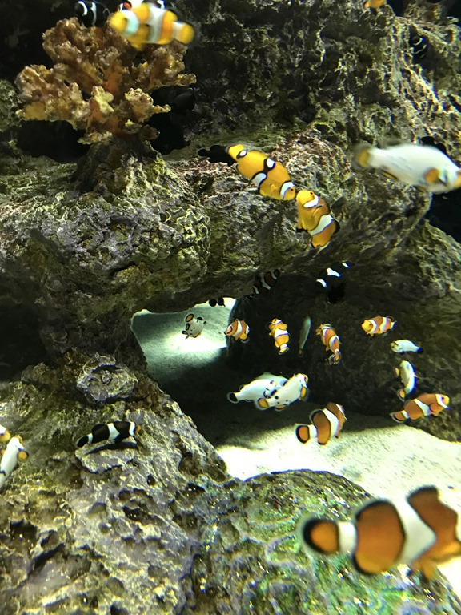
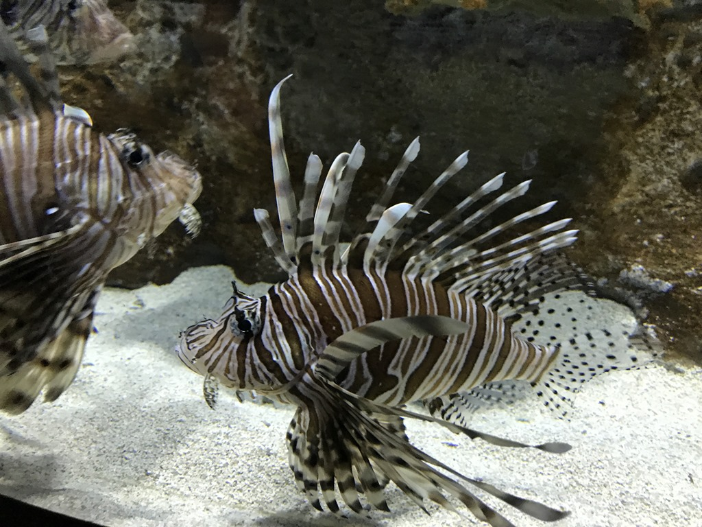
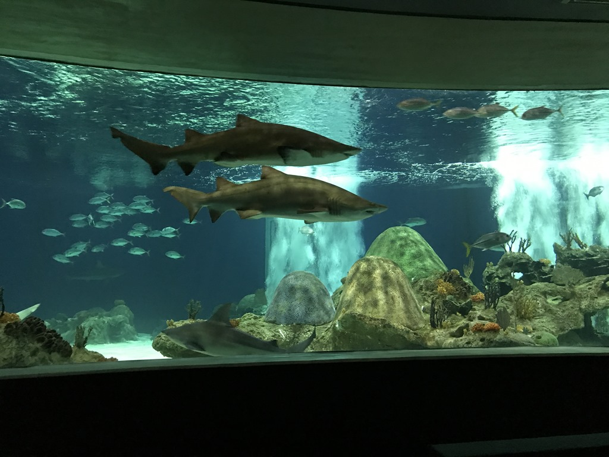

Vandaag hoeven we niet al te vroeg op, want Butterfly Wonderland en OdySea ligt op nog geen half uurtje rijden van onze camping. Als eerst gaan we de vlinders bekijken. Met zo'n 3000 exemplaren is het de grootste verzameling vlinders van de VS. We beginnen onze expeditie met een mooi gemaakte 3D film over het leven van de Monarch vlinder, die vanuit Mexico via Texas helemaal naar Alaska en weer terug vliegt, hetgeen ongeveer een jaar (en drie generaties) kost. Daarna stappen we de vlindertuin in. De meest kleurrijke fladderaars banen zich een weg door het regenwoud. Het is werkelijk prachtig om te zien.

Nadat we de vlinders uitvoerig bestudeerd hadden, hebben we een snelle lunch genoten in het Butterfly Cafe. Daarna zijn we naar het naastgelegen aquarium gegaan. Ook het aquarium is ruim opgezet met aandacht voor detail, en er is enorm veel te zien. We zijn een uur of 3 binnen geweest.

Helemaal aan het einde van de rondgang door het aquarium kom je in een ronddraaiend theater, waarin je zogenaamd een rondvaart maakt met een duikboot. Op die manier bezoeken we de zeeschildpadden, zeeleeuwen en als klapstuk de haaien.

Na al dit avontuur zijn we weer teruggereden naar de camping en zijn snel het zwembad ingedoken.

## 1 opmerking

### Gerard 1 mei 2018 om 11:20

Dit is toch wel een hele belevenis voor Sofie en wat een mooie vlinders
