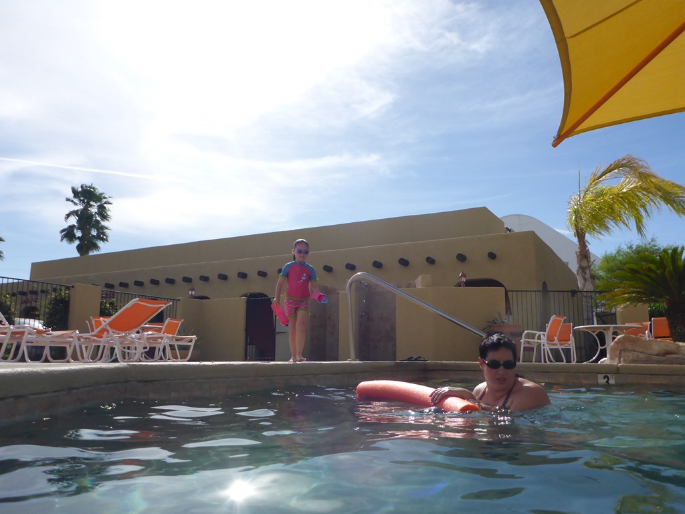
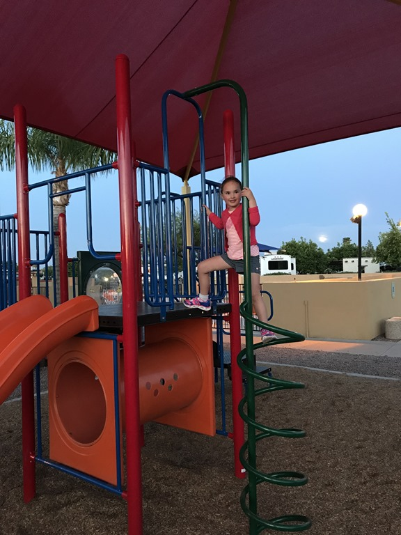
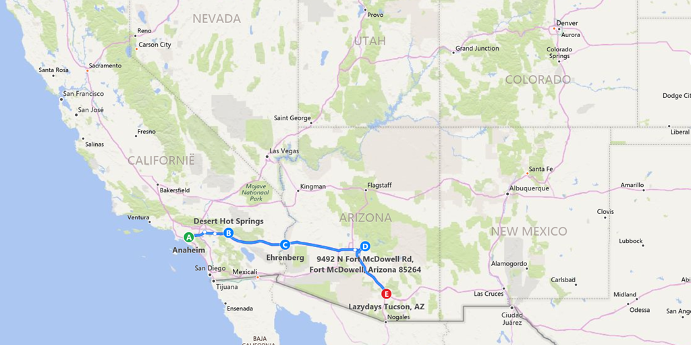

Vanmorgen redelijk rustig aan gedaan, want er staat niet heel veel op het programma: wat boodschappen doen, en dan weer de enerverende Interstate 10 op verder naar het zuid oosten: Lazy Days KOA in Tucson, Arizona (vanuit hier is het iets meer dan 100 km naar de Mexicaanse grens). Het vrouwelijk schoon blijft achter op de camping terwijl ik met een taxi naar Alamo ga om onze huurauto voor de komende vier dagen op te halen.

Na wederom een verfrissende duik in het zwembad, hebben we gegeten in het restaurant op de camping en hebben we de jongste van het stel nog even losgelaten in de speeltuin.

Als afsluiting van de dag ben ik nog even naar de Walmart gereden om een topmatrasje te kopen (12 dollar, hoe is het mogelijk), want het bed is op z'n zachtst gezegd niet al te best, en dat is funest voor de rug.

Hieronder nog een kaartje van de route die we tot nu toe hebben gereden.

## 1 opmerking

### Gerard 1 mei 2018 om 10:59

Jullie zijn dicht bij Mexico. Wij hopen dat de topper voldoende comfort levert. Veel plezier met al het moois.
