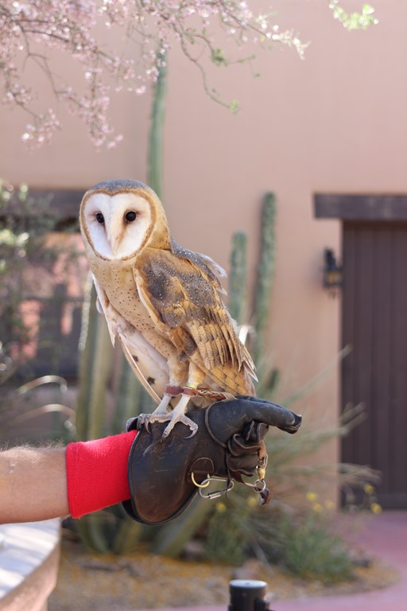
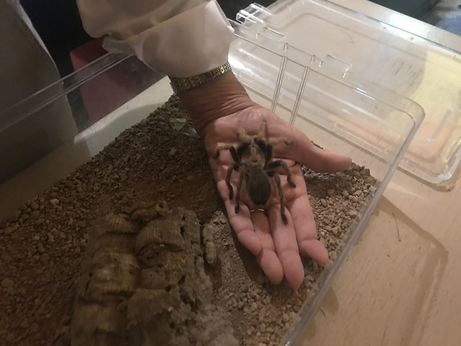
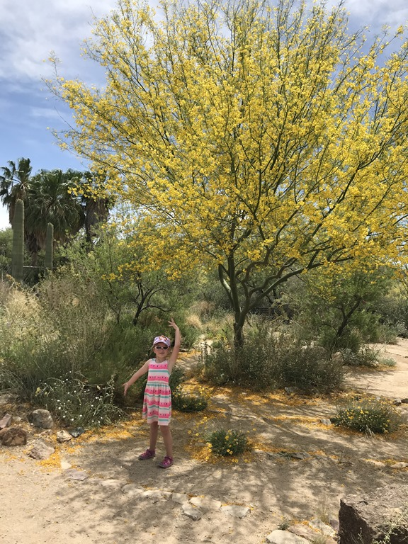
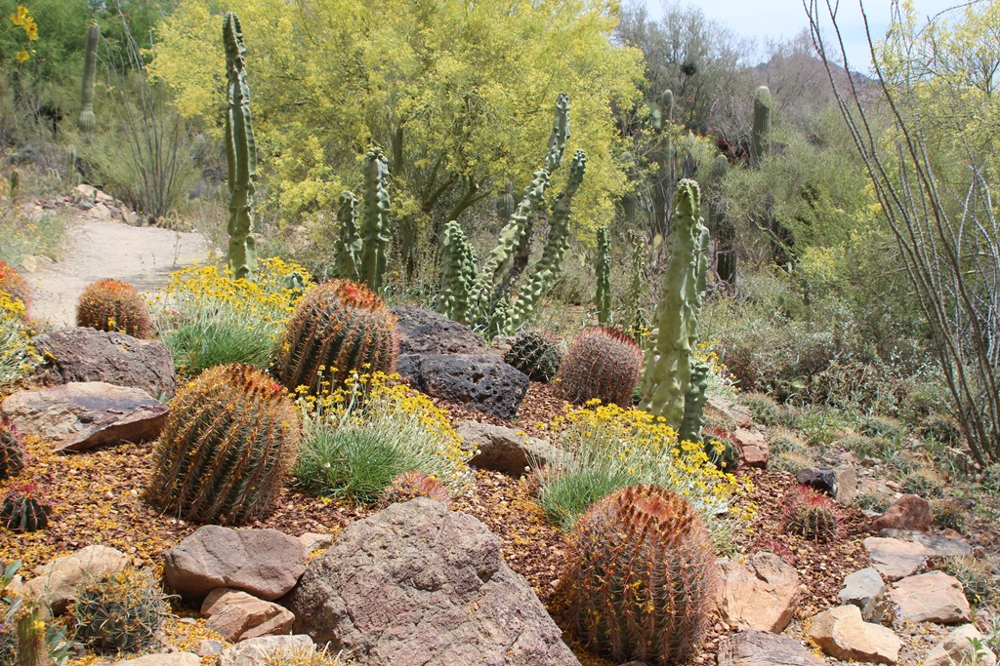
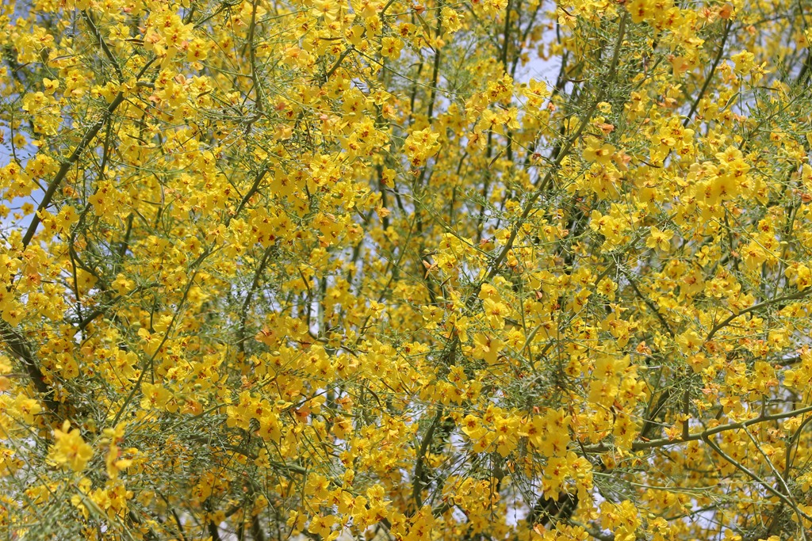
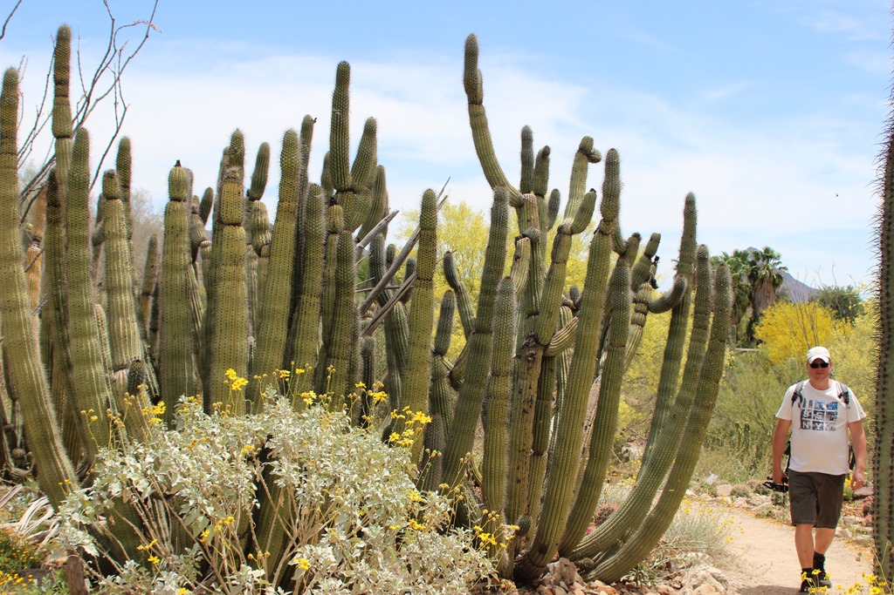
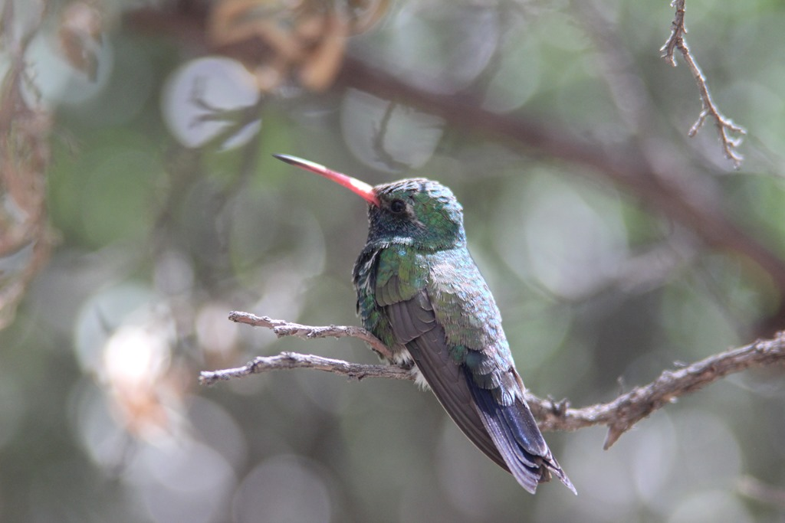
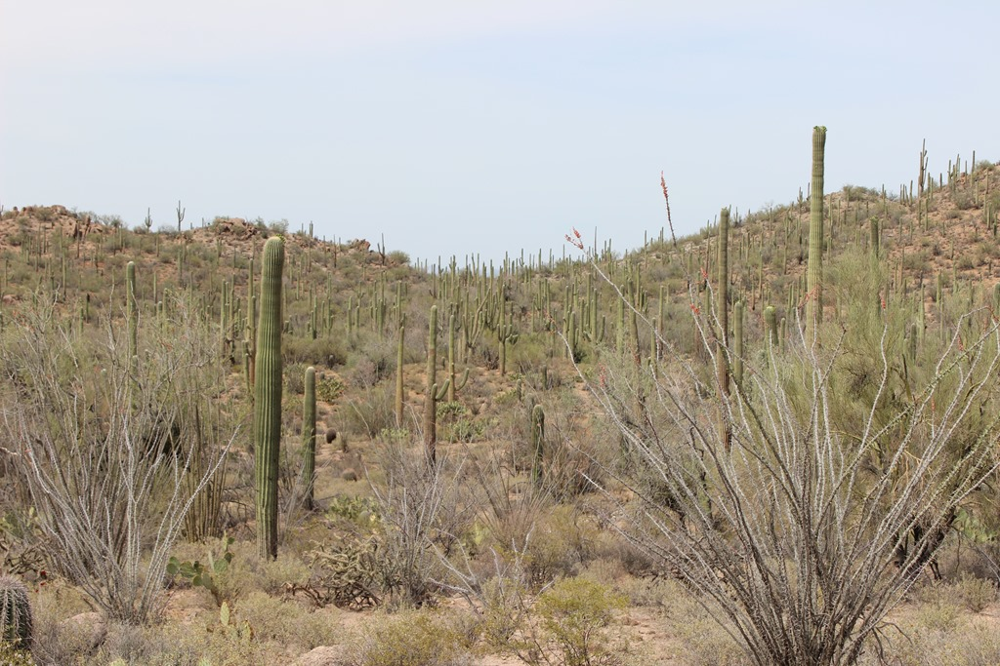

Na een half uurtje rijden, parkeerden we al om kwart voor acht in de ochtend de auto bij het Arizona Sonora Desert Museum. Dit is zowel een botanische tuin, dierentuin als een natuurhistorisch museum en dat allemaal onder een dak (voor zover aanwezig). We werden vriendelijk welkom geheten door een meneer met een uil op z'n hand, die ons de weg naar de ingang wees.

Op diverse plekken op het terrein stonden medewerkers een praatje te houden over de verschillende dieren. Zo kon je een slang en tarantula van dichtbij bekijken en eventueel aaien (NO WAY).

Het is een prachtig park, en met name de cactussen zijn schitterend om te zien. Het is nog redelijk vroeg in het seizoen, dus het spul is allemaal nog in bloei en enigszins groen.

Er is ook een verblijf met allerlei soorten kolibries. Bij ons vorige bezoek van 5 jaar geleden fladderden de beestjes er vrolijk op los, nu moest je echt goed zoeken naar de minuscule vogeltjes.

Na de lunch zijn we een klein stukje verder gereden naar het westelijk gedeelte van Saguaro National Park. Daar hebben we een junior ranger boekje opgehaald voor Sofie, en daarna de scenic route gereden.

## 1 opmerking

### Gerard 2 mei 2018 om 23:33

Roger, is dat jouw hand onder de spin....
Het is toch wel een erg mooie omgeving
