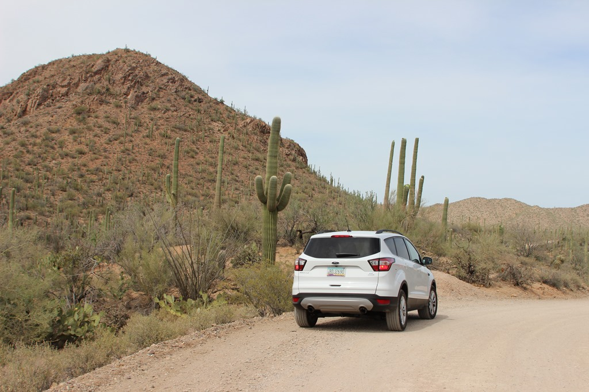
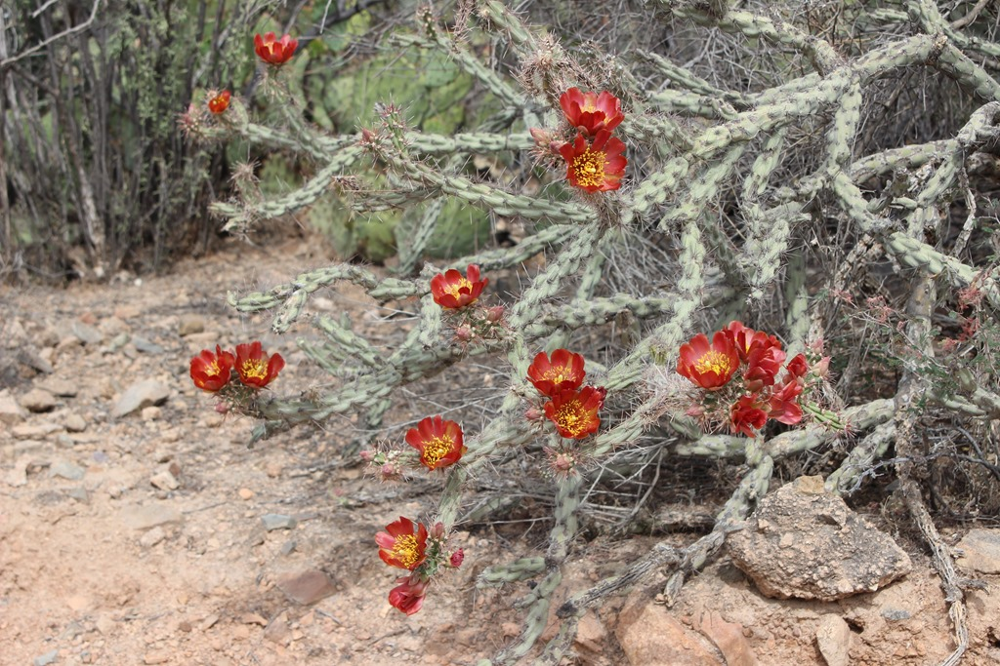
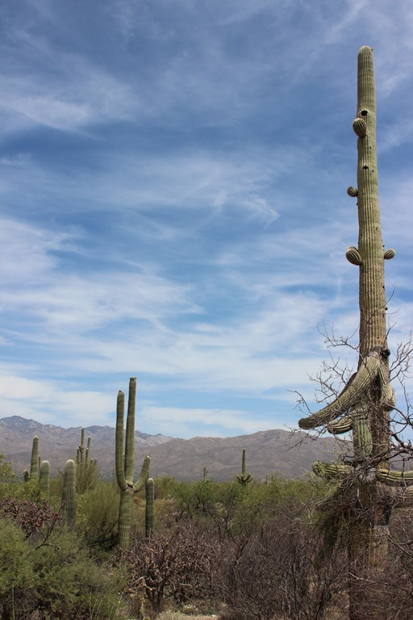
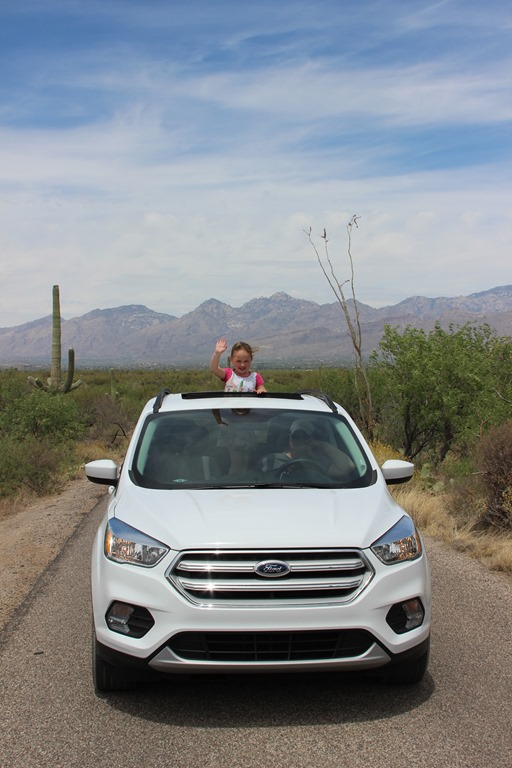
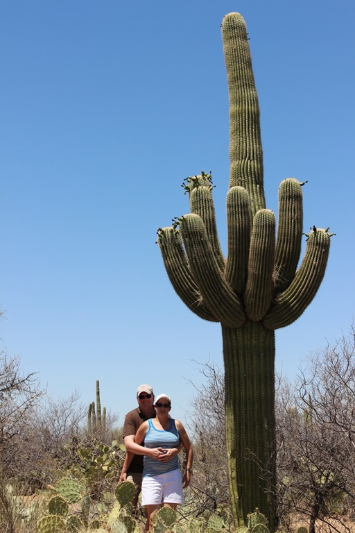
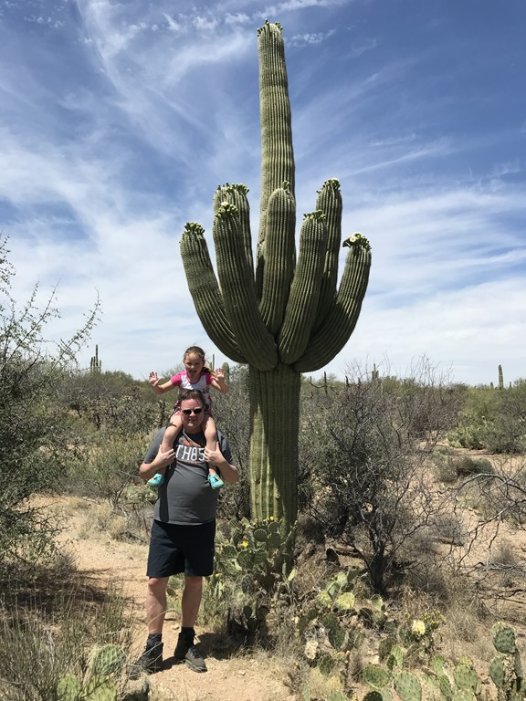
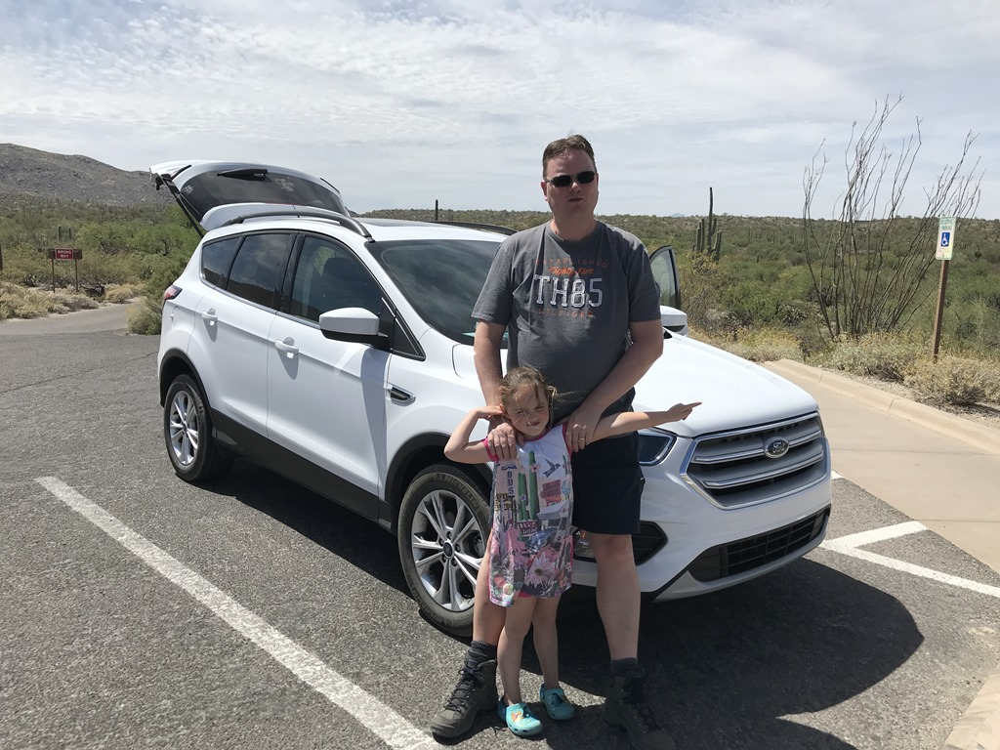
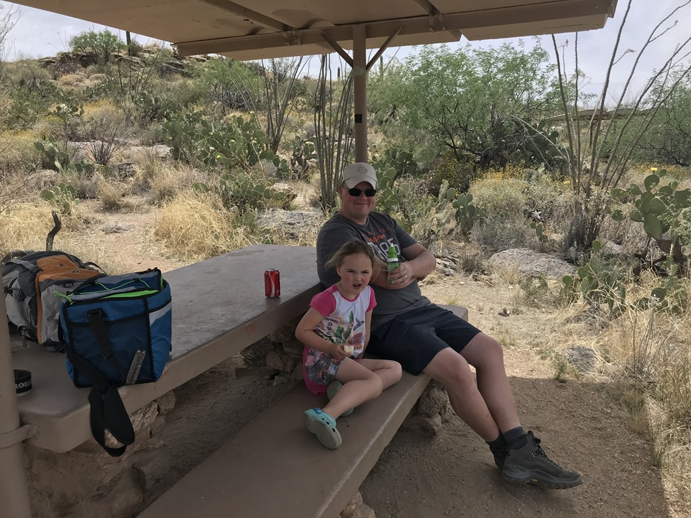
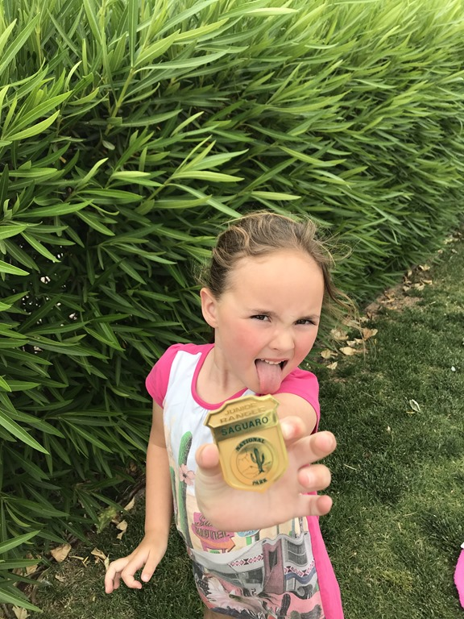

Een kort programma vandaag, dus we hebben rustig aan gedaan vanochtend. We gaan Saguaro National Park (het oostelijke deel ditmaal) bekijken. Op zich is er niet heel veel te doen in het park, buiten dan het rijden van de mooie scenic route.

Saguaro's kunnen trouwens tot 20 meter hoog worden!

Min of meer toevallig hebben we bij precies dezelfde cactus als 5 jaar geleden een foto gemaakt. In 2013 was Sofie er ook al bij, min of meer dan ;-)

|||
|---|---|
|  |  |

Aan het einde van de rondrit hebben we even een snack gegeten en wat gedronken.

Toen was het tijd voor het officiele gedeelte van deze dag: Sofie mocht haar Junior Ranger badge ophalen, en daar is ze heel erg trots op!

## 1 opmerking

### Gerard 2 mei 2018 om 23:36

Mooie cactussen en een jonge ranger op de uitkijk. Gezellig zo samen.
