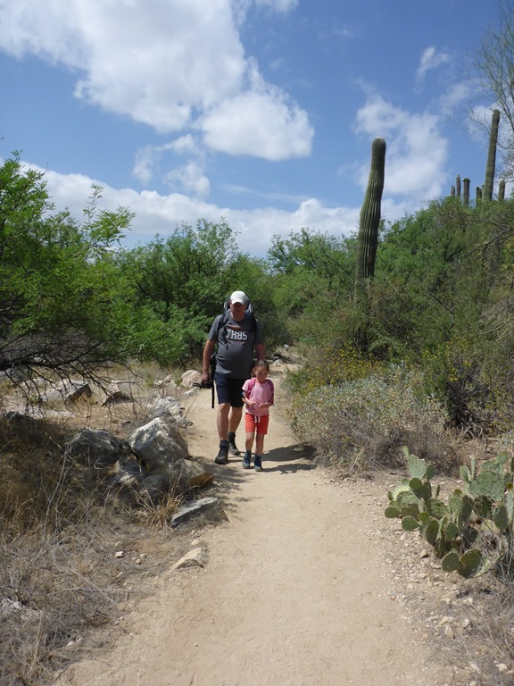
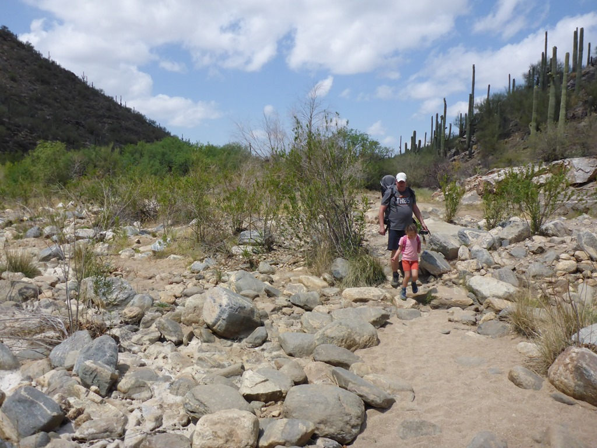
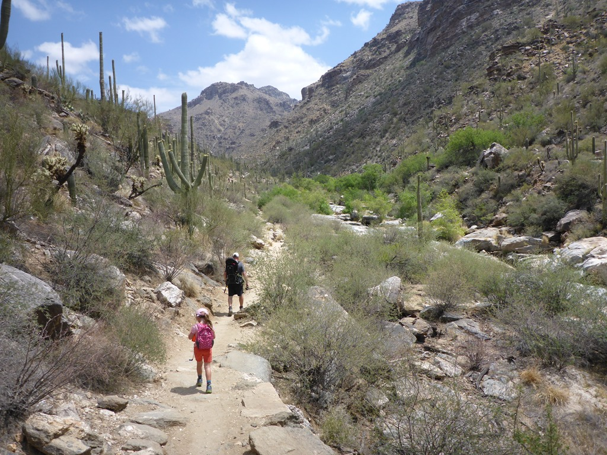
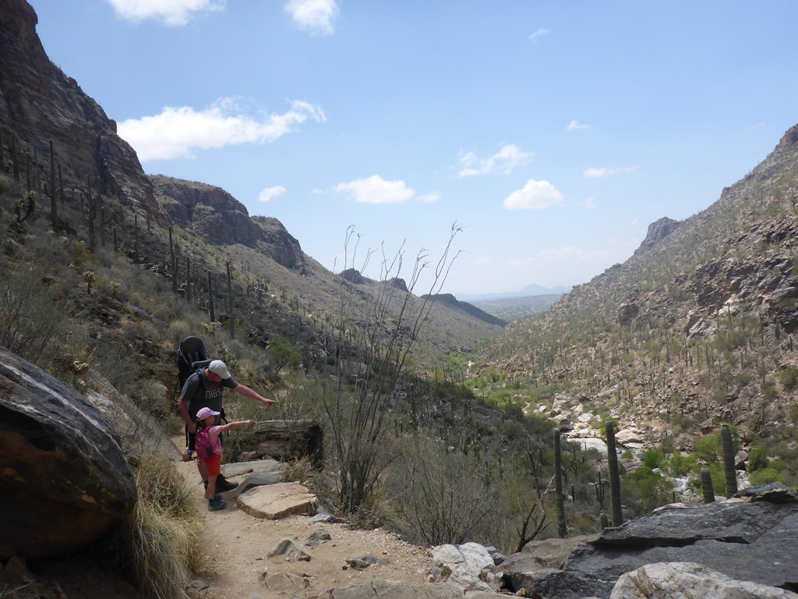
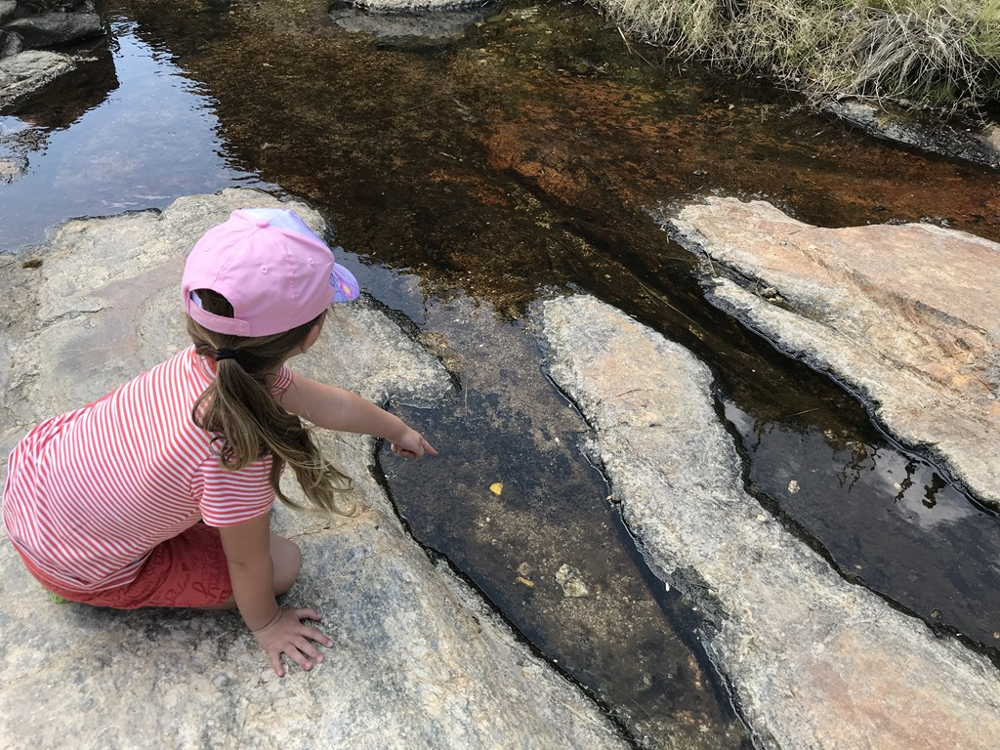
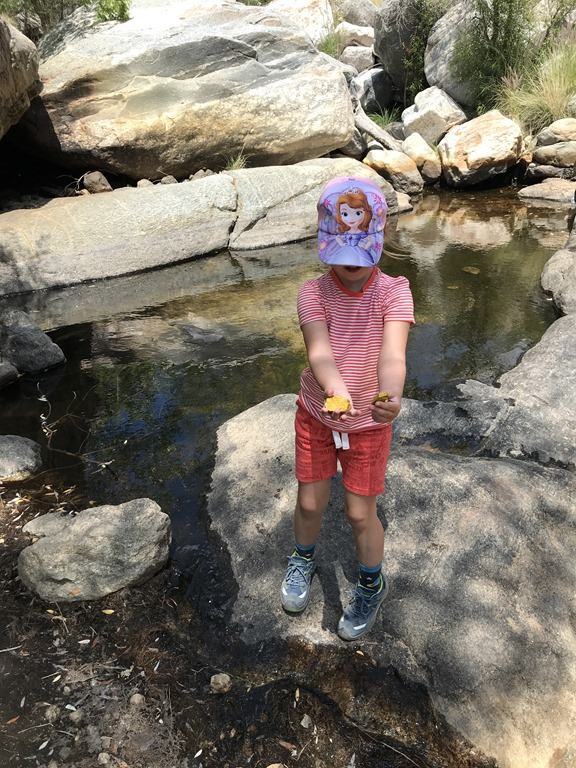

Het trammetje van 10 uur bracht ons naar het begin van het pad naar Seven Falls. Het paadje slingert langzaamaan omhoog tussen de cactussen door. Het begint redelijk eenvoudig, maar gaandeweg moet er meer geklommen en geklauterd worden. Sofie heeft van de acht kilometer er zes zelf gelopen, wat we heel knap vonden. Gelukkig was het lekker weer, en was het niet echt warm.

Vanaf een afstandje konden we zien dat er nagenoeg geen water uit de falls naar beneden kwam, dus het laatste stukje hebben we maar overgeslagen. Op de terugweg heeft Sofie in het stroompje gezocht naar goud, en ook nog gevonden!

Wat een lol, en dat met een paar kiezelstenen en een spuitbusje met goudkleurige verf :-) Heeft het stukje voorbereiding de avond voor de wandeling toch nog nut gehad.

Toen we weer terug waren op de camping, hebben we nog even gezwommen.

## 1 opmerking

### Gerard 4 mei 2018 om 22:20

Wat een mooie omgeving. Gewoon even zitten op een rotsblok en genieten van alles wat je ziet.
