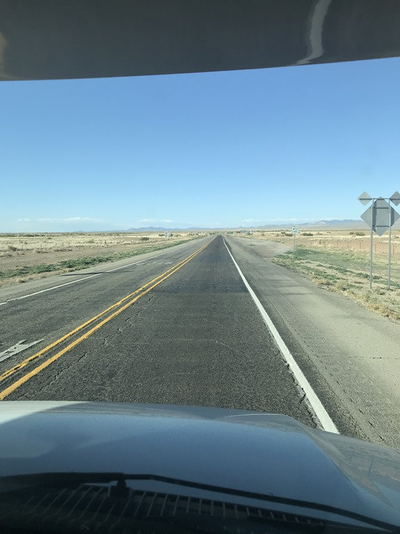
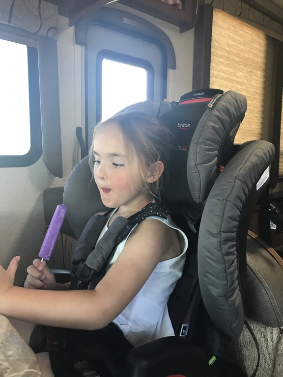
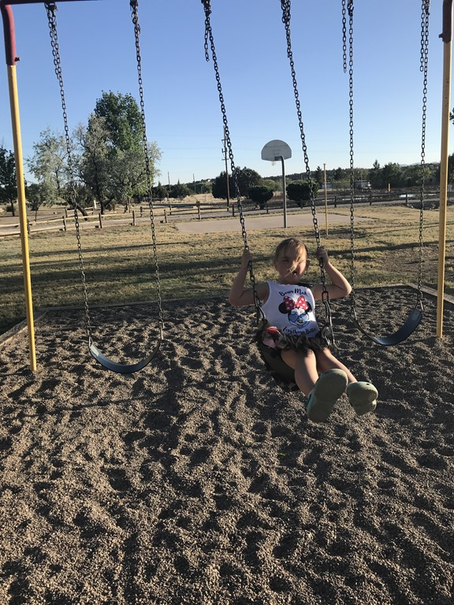

Nadat ik vanmorgen de huurauto heb terug gebracht, zijn we vertrokken richting Willcox. Dit plaatsje ligt al richting onze volgende bestemming Silver City, en hier hadden we een camping gevonden met een zwembad (die zijn in deze regio blijkbaar niet ruim voor handen). Bij aankomst bleek echter dat het zwembad gesloten was wegens onderhoud. We besloten om dan maar door te rijden naar Silver City, zo'n twee uur verder. Sofie was teleurgesteld natuurlijk, want ze had zich verheugd om te gaan zwemmen. De eigenaar van de camping vond dat zo erg, dat hij haar twee speeltjes heeft gegeven: een tennis-setje en de zoveelste bellenblaas.

Op de KOA in Silver City werden we hartelijk ontvangen, inclusief een koekje voor iedereen. Terwijl papa de camper ging installeren, is de speeltuin aan een uitvoerige test onderworpen en goedgekeurd.

## 1 opmerking

### Gerard 4 mei 2018 om 22:22

De weg lijkt bijna aan de horizon te verdwijnen....
