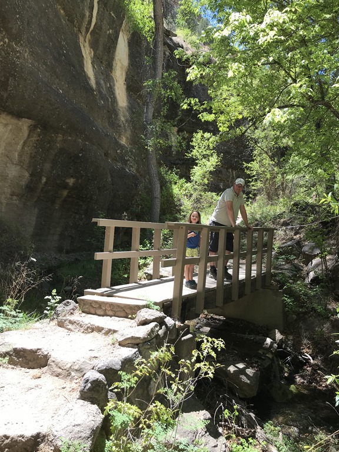
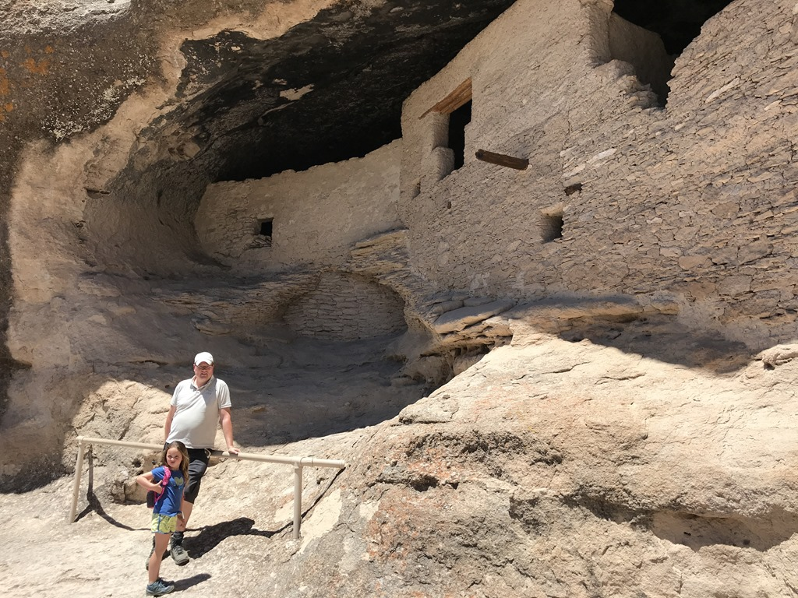
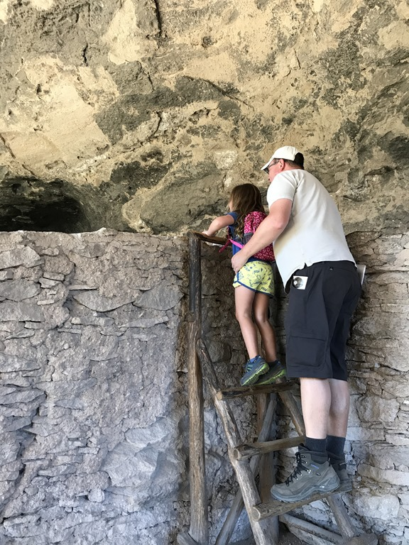
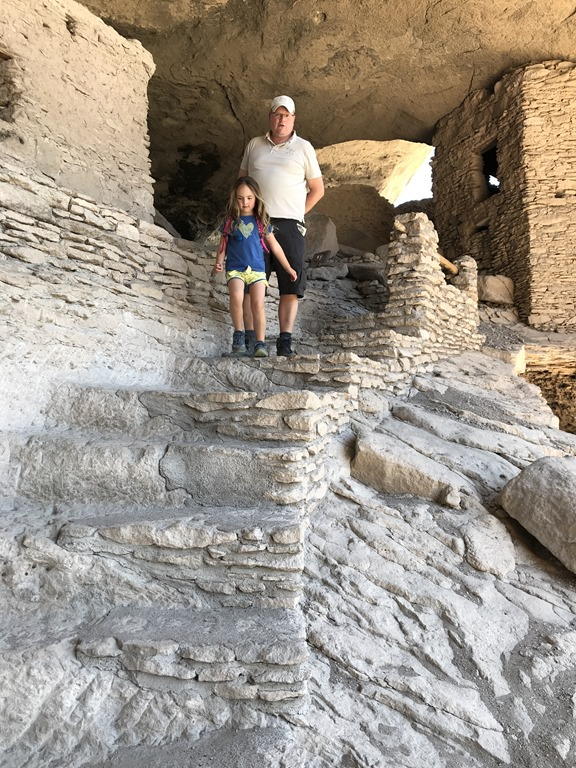
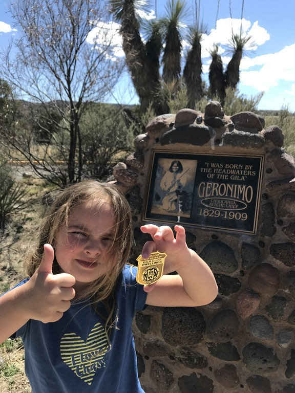
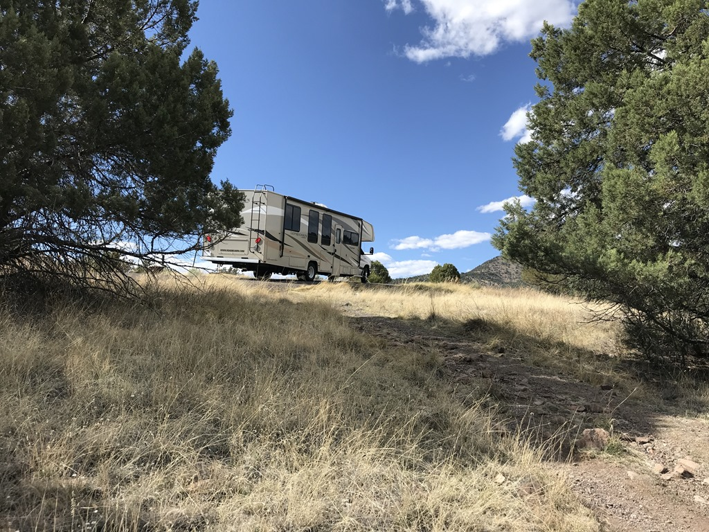
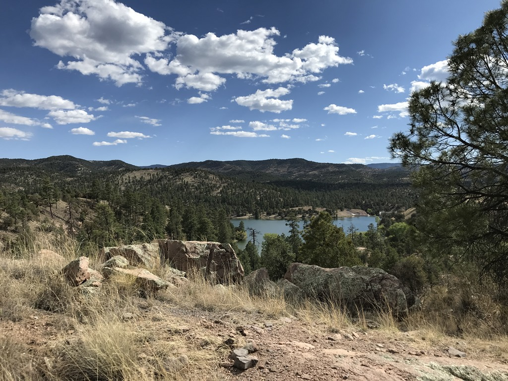

Na al het woestijnlandschap van de afgelopen dagen, waren de rijkelijk van bomen voorziene bergen vandaag meer dan welkom. Via de fantastische NM-35 en NM-15 zijn we in een kleine 2 uur naar genoemd monument op en neer en van links naar rechts geslingerd. Hier en daar moesten we in de eerste versnelling naar beneden, zo steil was het.

Het monument zelf betreft ruim 700 jaar oude overblijfselen van een nederzetting van de Mogollon indianen, waarvan zo'n 80% nog in originele staat is (dit in tegenstelling tot het bekendere Mesa Verde wat grotendeels gerestaureerd is). Omdat het monument wat afgelegen ligt, is het er helemaal niet druk. Mooie kans voor ons dus om op ons gemak van het 1 mijl lange wandelpaadje te genieten, en dus hadden we alle tijd om het junior ranger boekje van Sofie in te vullen.

Het wandelingetje begon heel eenvoudig, waarna je via een behoorlijk aantal traptreden en switchbacks omhoog moet klimmen om bij de grotten te komen waarin de huisjes zijn weggewerkt.

Aan het einde van de klim en klauter partij konden we de badge ophalen in het bezoekerscentrum. Sofie was weer zo trots als een pauw.

Hierna konden we dezelfde weg weer helemaal terug rijden naar de KOA in Silver City. Maar dat was geen straf, want onderweg was veel moois te zien.

## 3 opmerkingen

### Gerard 6 mei 2018 om 00:49

Leuk om bij al die mooie plaatjes ook een stukje geschiedenis te lezen. En onze kleine wereldburger klautert er lustig op los

### Anoniem 6 mei 2018 om 22:25

Het is weer genieten zien we. Wel een beetje jaloers hoor, lekker met de RV.
Have fun!
Groetjes van ons 5-jes

### opa 7 mei 2018 om 13:47

waren jullie hier al eerder geweest?, lijkt me bijzonder mooi en Geronimo komt me ook bekend voor.geweldig !
