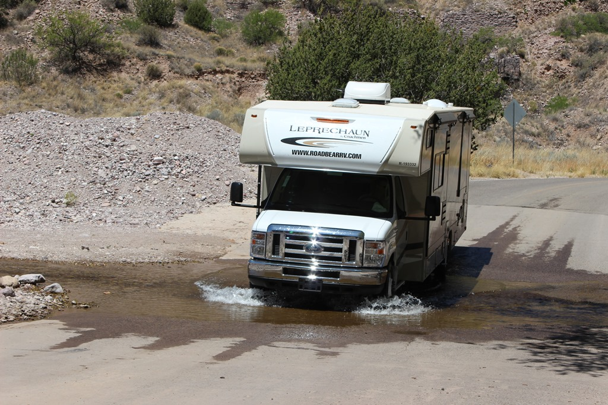
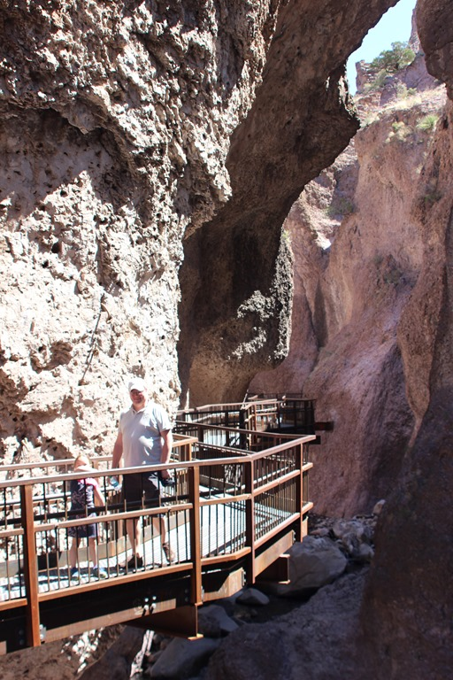
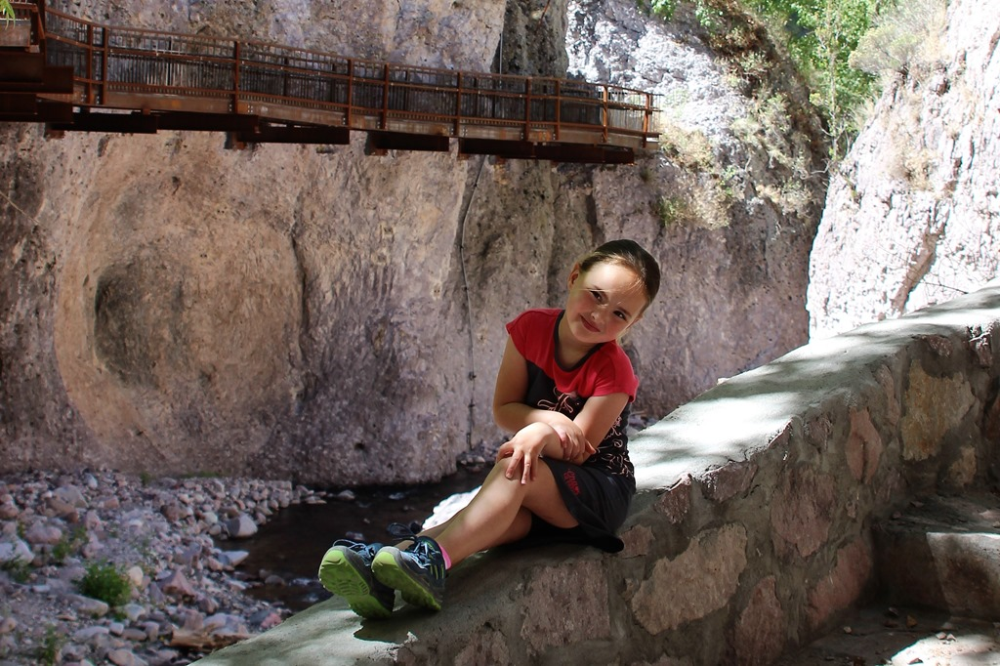
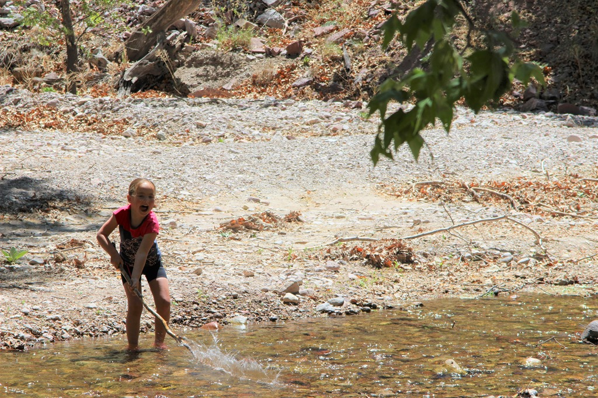
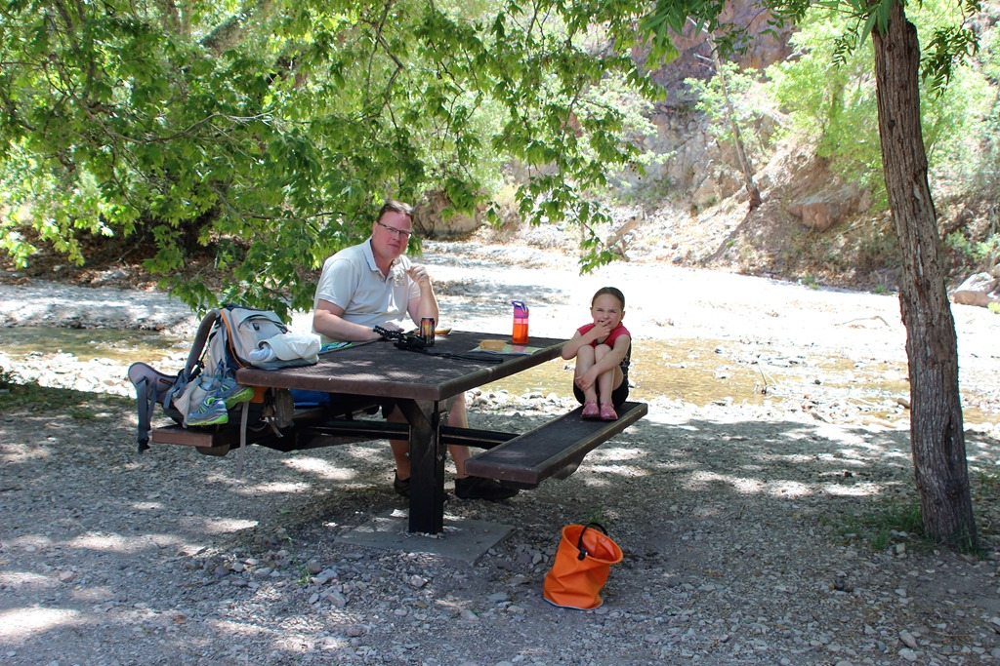
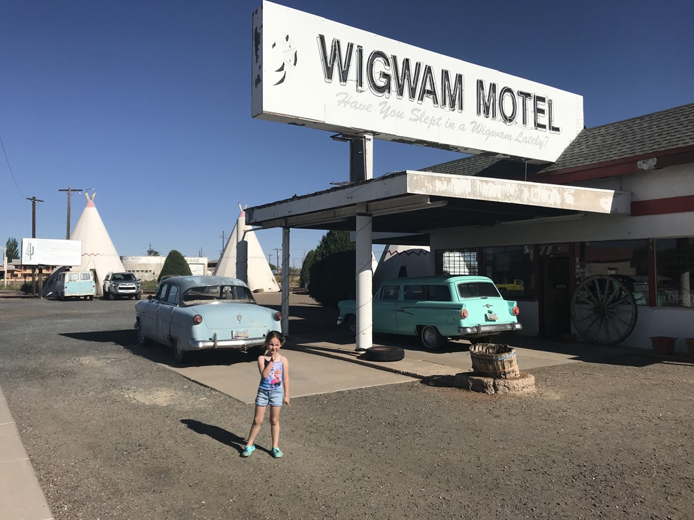
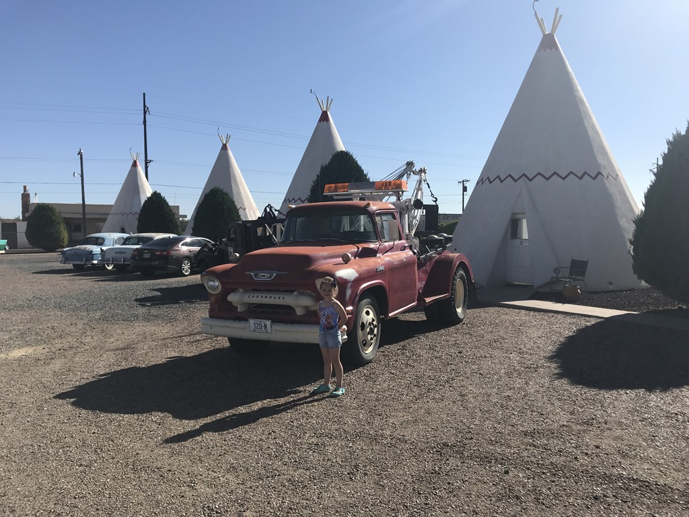

Onze volgende camping ligt in Holbrook, Arizona en dient voor ons als uitvalsbasis voor ons bezoek aan Petrified Forest National Park van morgen. Om de rit van ruim vier uur een beetje te onderbreken, stoppen we onderweg bij de zogenaamde Catwalk. Direct na de afslag naar deze recreation area werd het weggetje smaller en smaller en beloofde niet veel goeds voor de rest van de 6 kilometer die we nog moesten afleggen. We maakten al plannen om om te draaien, maar gelukkig werd de weg al snel een heel stuk beter berijdbaar voor onze motorhome. Hoewel, op een gegeven moment moesten we door de rivier met de 30 voeter.

Na alle ontberingen onderweg doorstaan te hebben, kwamen we op een riante parkeerplaats met zelfs aparte plekken voor RV's. Het bleek een heerlijk plekje te zijn, met een spectaculaire wandeling van anderhalve kilometer over een soort balkon boven de rivier in de canyon.

Tot ons grote genoegen vonden we ook nog een mooie plek voor de picknick, pal aan de rivier. Het is helemaal niet druk, ondanks dat het zaterdag is, maar dat komt waarschijnlijk omdat het een roteind van alles verwijderd is. We hebben ons al met al een uur of 4 prima vermaakt.

Daarna gingen we verder naar het noorden, via de prachtige AZ-180 naar Holbrook. Gelukkig zat de tank in Silver City nog redelijk vol, want we hebben onderweg heel weinig tankstations, maar ook amper tegenliggers of dorpjes gezien. Holbrook ligt aan Route 66, en dat wordt behoorlijk uitgemolken. Overal dino's van groot tot klein, en de meest foute, van armoe uit elkaar vallende motelletjes. Stiekem vind ik het eigenlijk best wel wat hebben.

Het Wigwam hotel en de tipi's zijn een inspiratiebron geweest voor de Pixar film Cars.

De KOA was een grindveld met stroom, niet veel bijzonders dus, maar het zwembad was prima.
