Vanmorgen zaten we om half acht aan de all you can eat pancake extravaganza op de camping. Amerikaanse pannenkoeken zijn ongeveer een halve centimeter dik, dus na twee van die dingen zaten we behoorlijk vol. Vandaag hebben we trouwens gezelschap van een echte cowgirl!

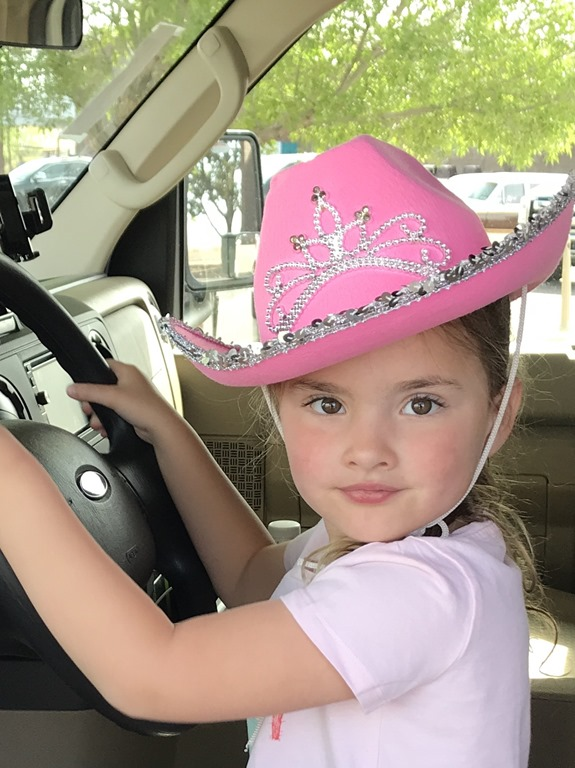

De noordelijke ingang van het nationale park ligt op ongeveer een half uurtje rijden, dus iets na negenen meldden we ons bij de ranger voor het junior ranger boekje. Dit is niet echt een doe-park, maar meer een rij-er-doorheen-en-bekijk-af-en-toe-wat-park. Eerste stop was de painted desert, met mooie vergezichten en de meest uiteenlopende kleuren.

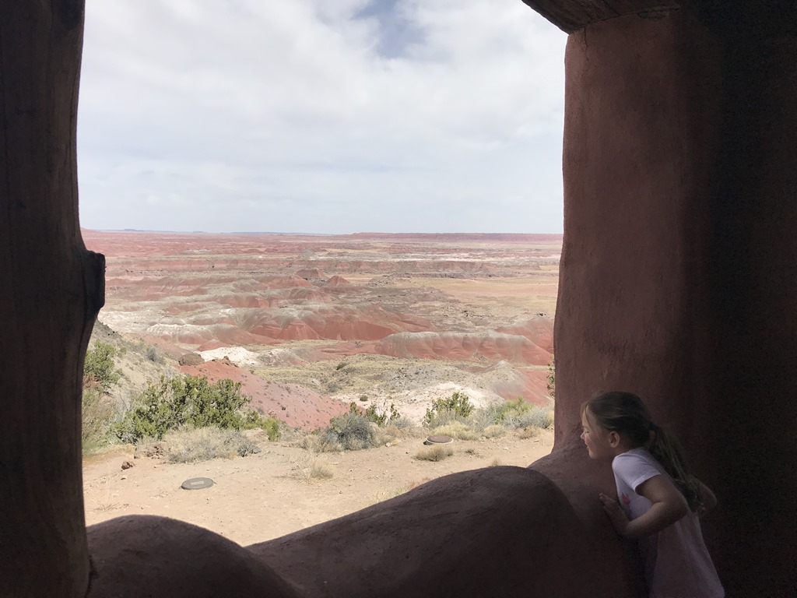

Tot de aanleg van Interstate 40, liep de fameuze Route 66 dwars door dit park. Een gestrande Studebaker herinnert nog aan die tijd.

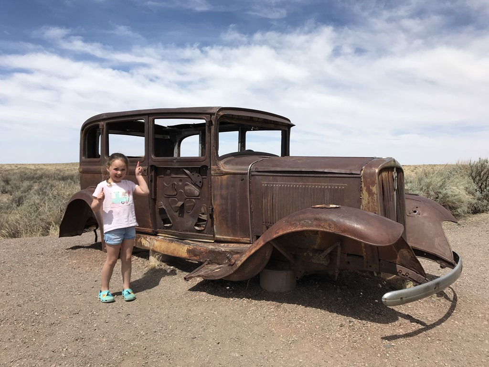

Een stukje verder kwamen we bij Blue Mesa waar we een wandelingetje van een mijl gedaan hebben.

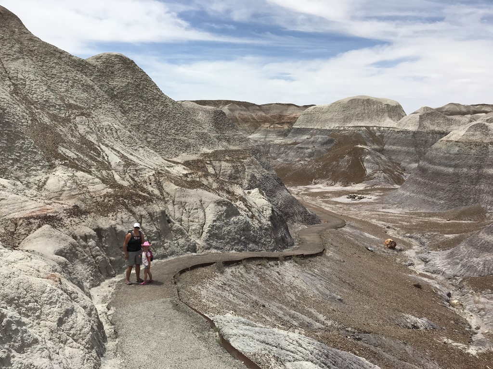

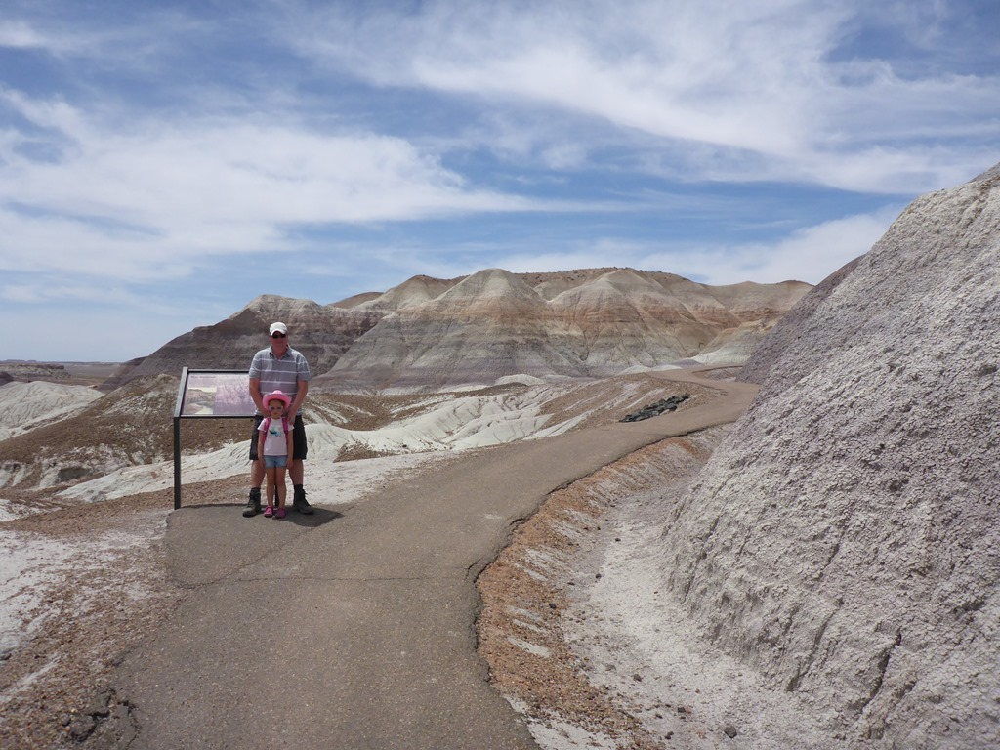

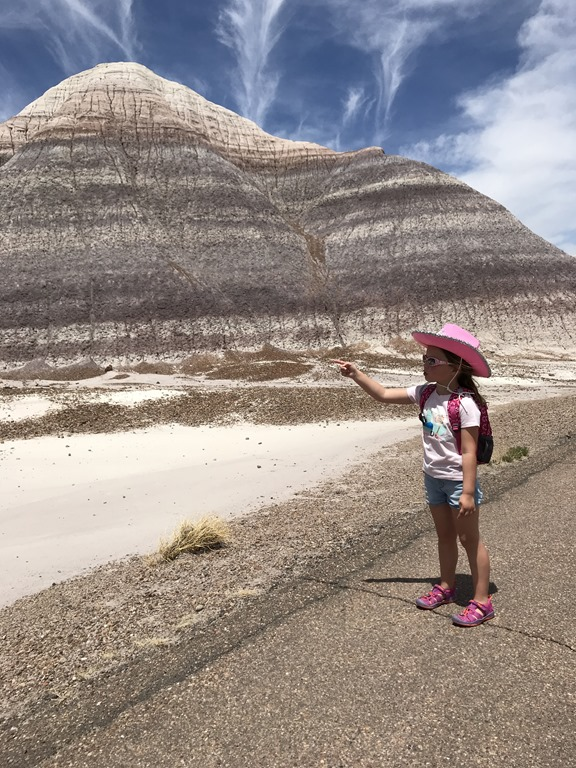

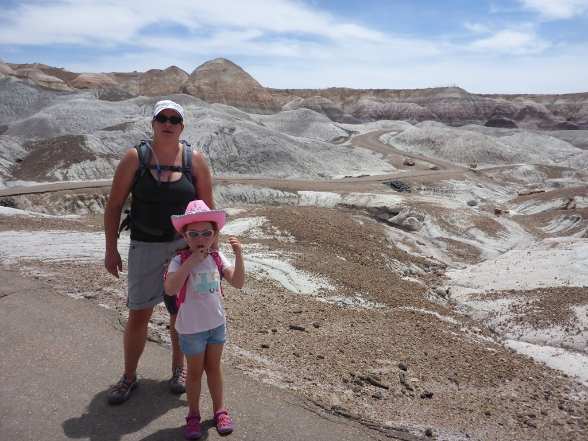

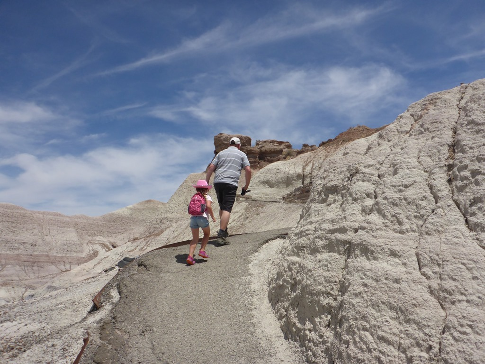

Na de lunch hebben we nog wat petroglyphen bekeken, en zijn we doorgereden naar de zuidelijke uitgang waar we nog wat versteende bomen hebben aanschouwd, om vervolgens de welverdiende badge op te halen.

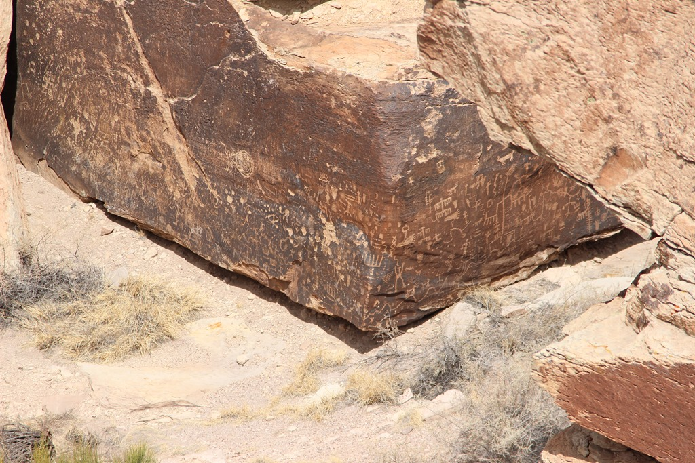

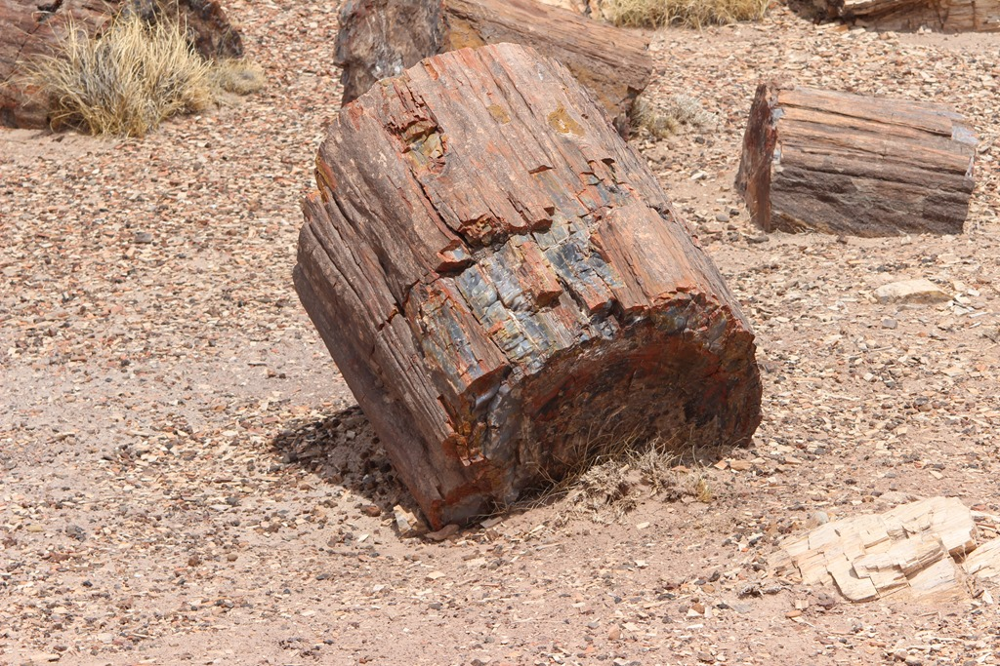

We overnachten op de Christopher Creek Campground, een waanzinnig mooie camping. Er staat slechts een handvol andere kampeerders. Er is vanwege de droogte in heel Arizona een verbod op (kamp-)vuurtjes, gelukkig mogen we de gas-BBQ wel gebruiken. De parkranger die ons net kwam controleren vertelde dat als de droogte nog langer aanhoudt, men waarschijnlijk alle campings op US Forest grondgebied gaat sluiten.

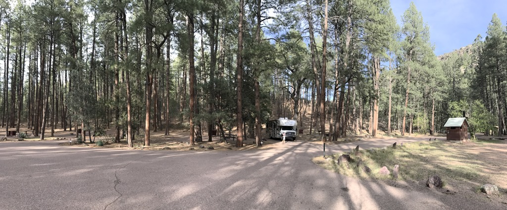

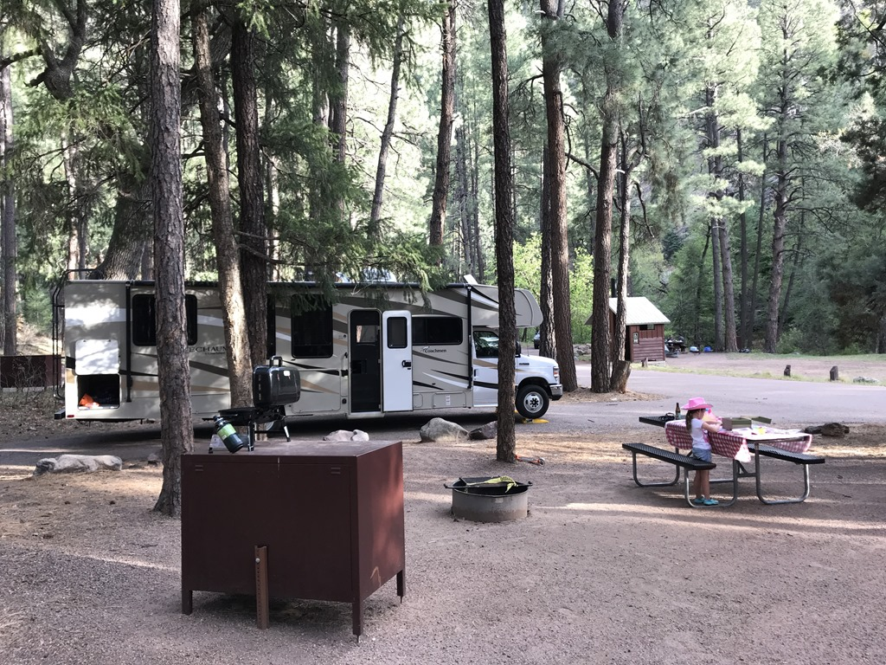

## 1 opmerking

### Gerard 9 mei 2018 om 23:56

Zoveel moois en kleine Sofie die dat zo jong al meemaakt. Fijn als je samen zoveel plezier hebt.
