Na het ontbijt hebben de met pijn in het hart de Christopher Creek Campground verlaten, wat een fijne camping zeg. We draaiden weer de AZ-260 op richting het westen. Iets voorbij Payson ligt het miniscule Tonto Natural Bridge State Park met, zoals de naam wellicht al doet vermoeden, een Natuurlijke Brug. En wat voor één, bleek na een korte wandeling via het Anna Mae Trail naar beneden.

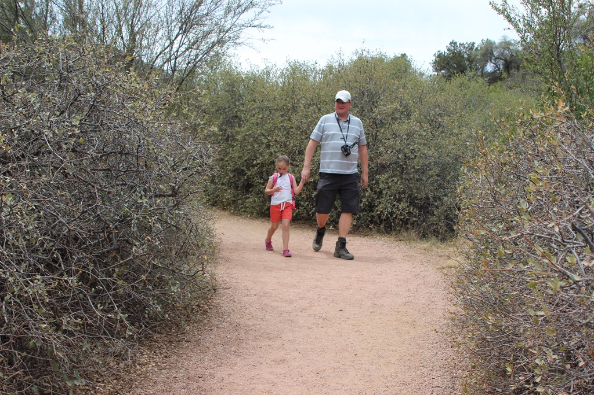

Na een korte maar steile afdaling kwamen we aan bij het stroompje. Sofie ging meteen in het water stampen.

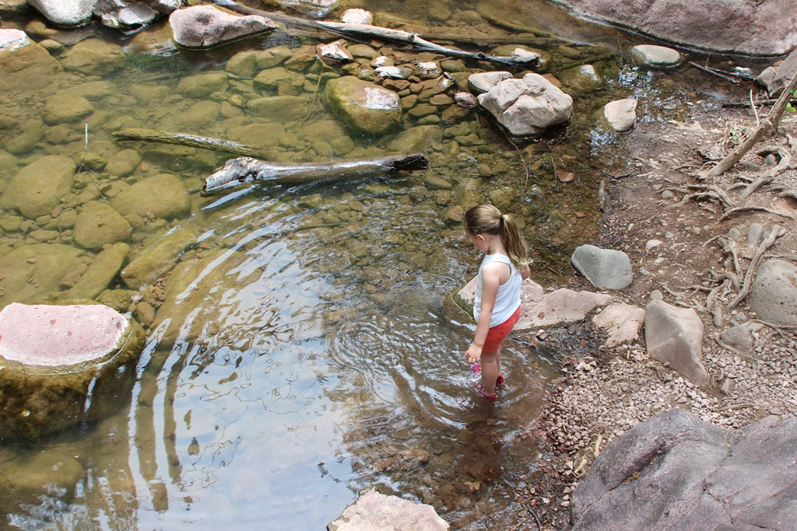

Na wat klim en klauterwerk over rotsblokken kwamen we bij de brug waar het in dit park allemaal om draait.

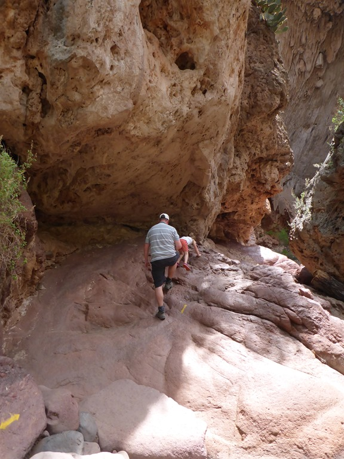

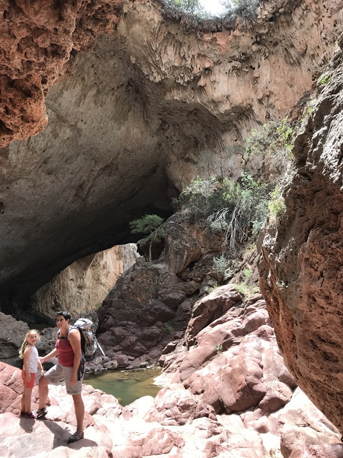

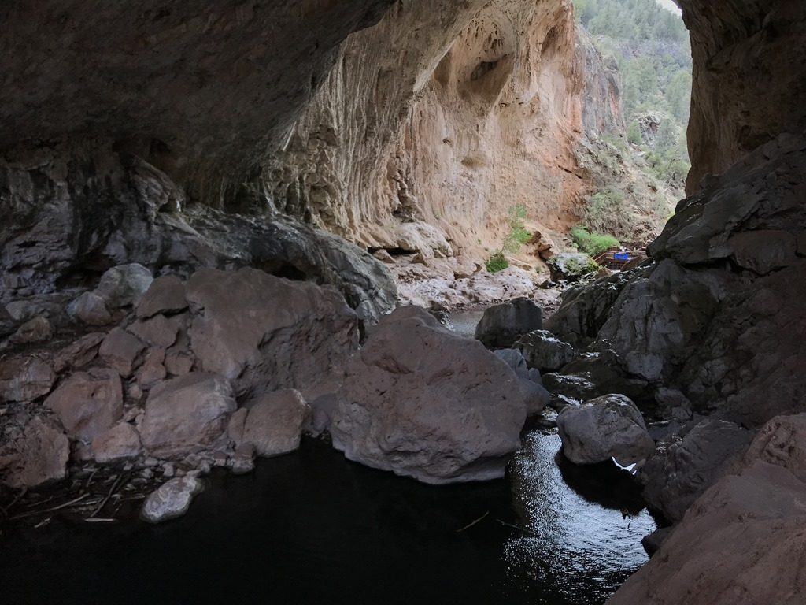

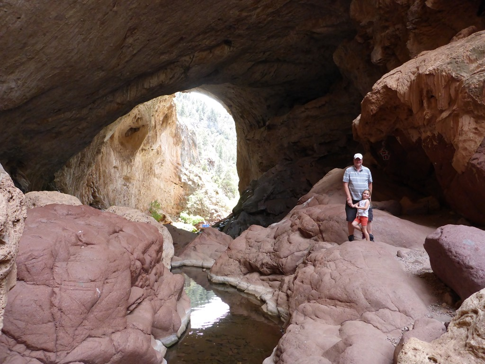

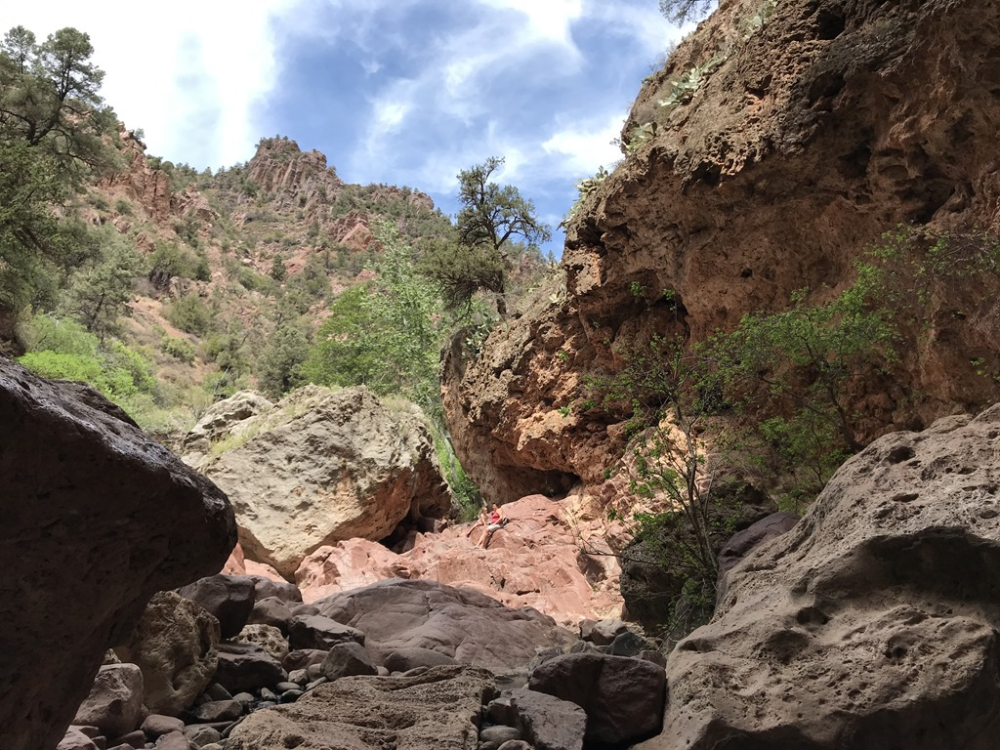

Het was een erg mooi plekje waar we even snel wat snacken en drinken. We besluiten terug te gaan via de Pine Creek Trail, een "pad" van slechts 800 meter, maar wel een waarvan men aangeeft dat je er een uur over doet. Helaas lazen wij dat pas toen we met bloed, zweet en tranen uiteindelijk weer bij de parkeerplaats uitkwamen: het was ouderwets spoorzoeken naar rotsen met pijlen die de weg aan geven.

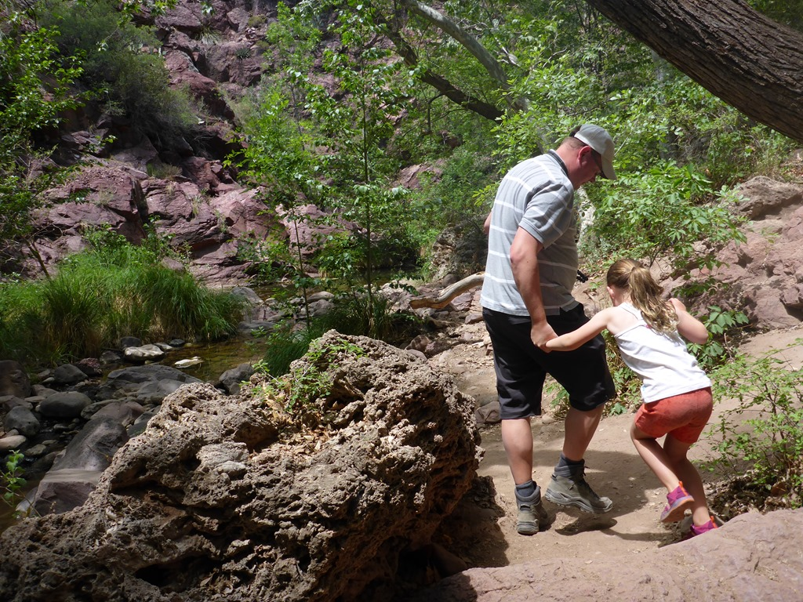

Op sommige stukken moest Chantal Sofie optillen om op een rots te klimmen, terwijl ik aan de andere kant haar hangend aan twee handen weer op de grond moest zetten.

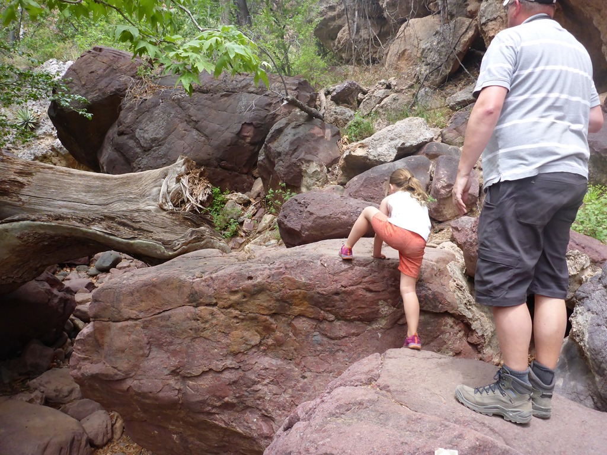

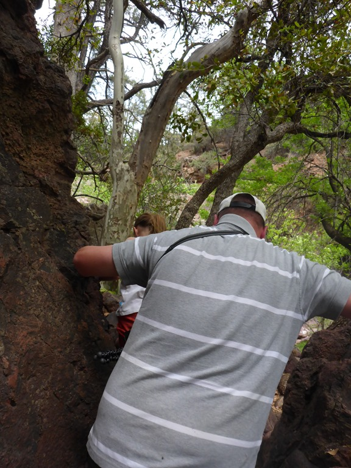

Maar als volleerd klimgeit vond ze het zowel spannend als leuk, en uiteindelijk kwamen we er allemaal zonder kleerscheuren vanaf.

Na een bijzonder smakelijke lunch op de parkeerplaats hebben we dit leuke State Park achter ons gelaten en zijn we via de Interstates 17 en 40 naar Williams gereden. Weer op een KOA, want  hier hebben ze een overdekt zwembad, mega speeltuin en een springkussen!

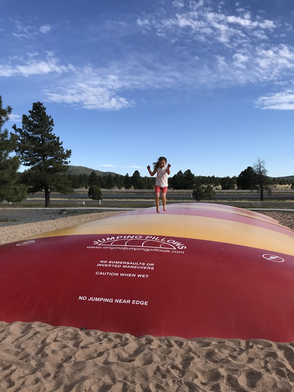

Morgen gaan we voor twee nachten naar de Grand Canyon, en daar kijken we best wel naar uit. Het blijft altijd een bijzonder gezicht, die enorme kloof.

## 1 opmerking

### Gerard 10 mei 2018 om 00:12

Wij genieten echt mee van alle mooie plaatjes
