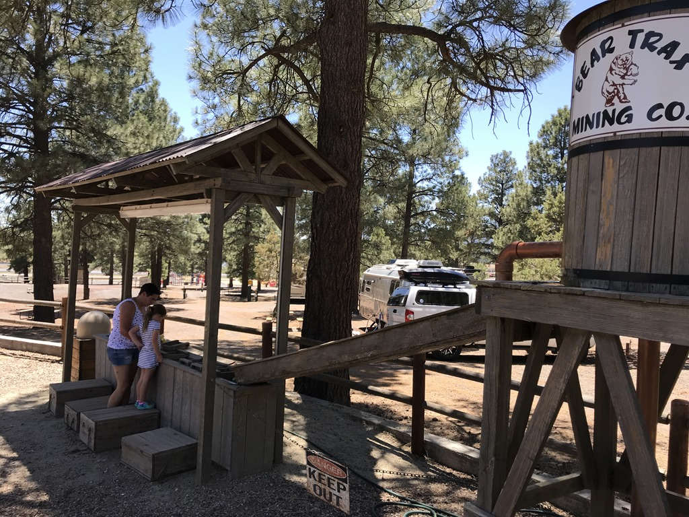
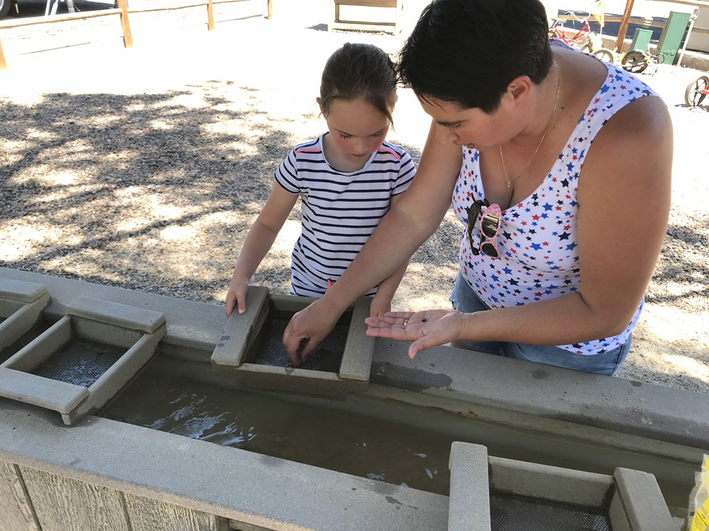
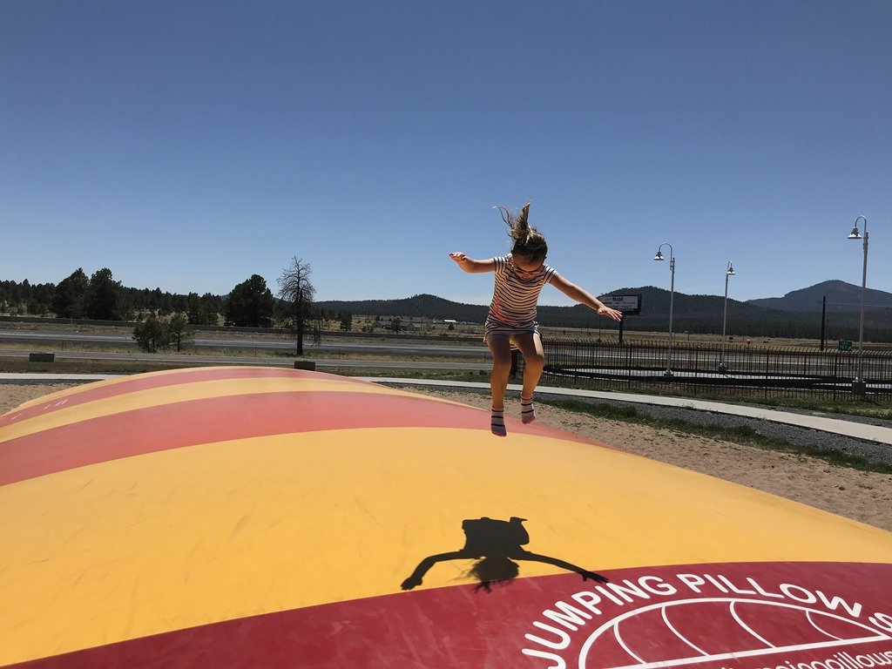
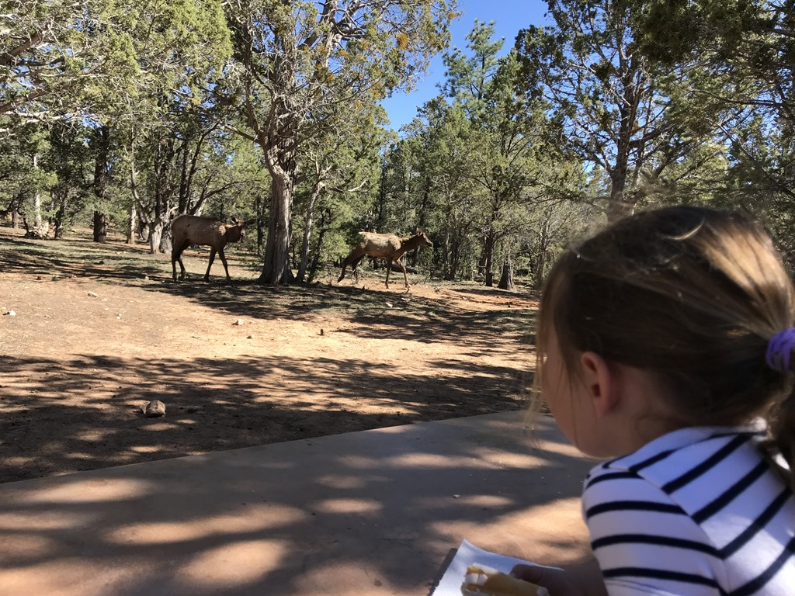

Vanuit de KOA in Williams is het ongeveer een uurtje rijden naar de Grand Canyon, dus we hebben 's morgens rustig aan gedaan. Na een plons in het zwembad, zijn we nog op zoek gegaan naar goud (maar niet gevonden) en heeft Sofie voor de laatste keer op het springkussen gestaan.

Na de lunch zijn we vertrokken naar de Canyon. De weg vanuit Williams is oer en oersaai en is gelukkig niet representatief voor hetgeen de Grand Canyon aan schoonheid te bieden heeft. We waren rond 3 uur op de camping, en dus was het tijd voor een snack. We hadden de eerste hap nog niet weg of de familie hert kwam op hun dooie gemak over onze site (nr 92, hier stonden we toevallig 2 jaar geleden ook) gewandeld.

Met de shuttlebus zijn we naar het visitor center gereden om het Junior Ranger boekje op te halen. 's Avonds hebben we gegeten in de lodge bij Marketplaza: een pizza ter grootte van een karrenwiel. Hij smaakte erg goed!
