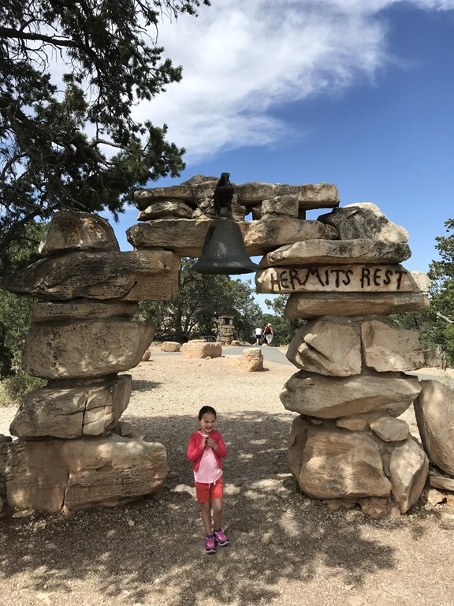
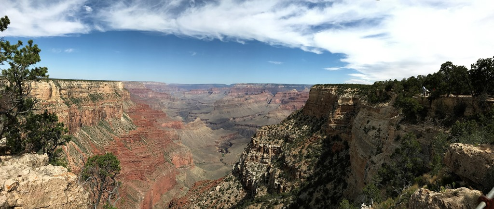
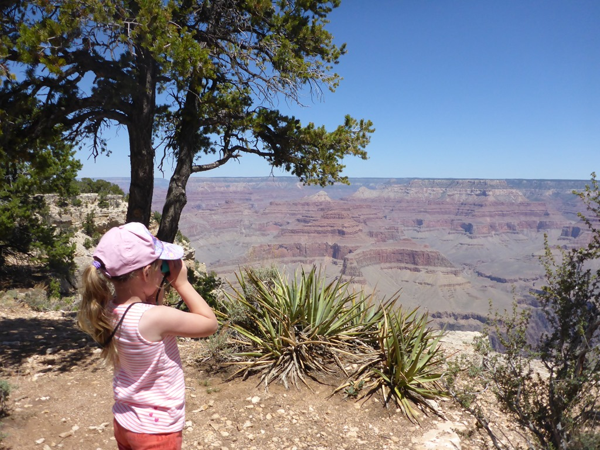
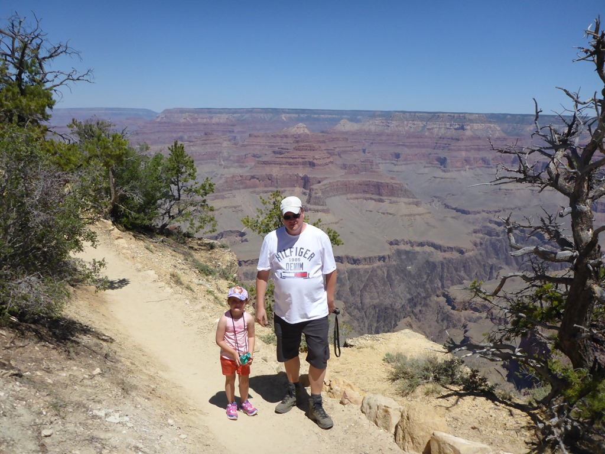
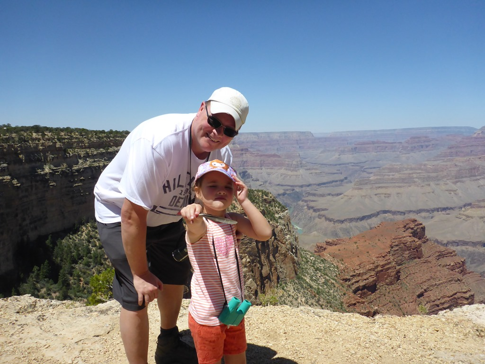
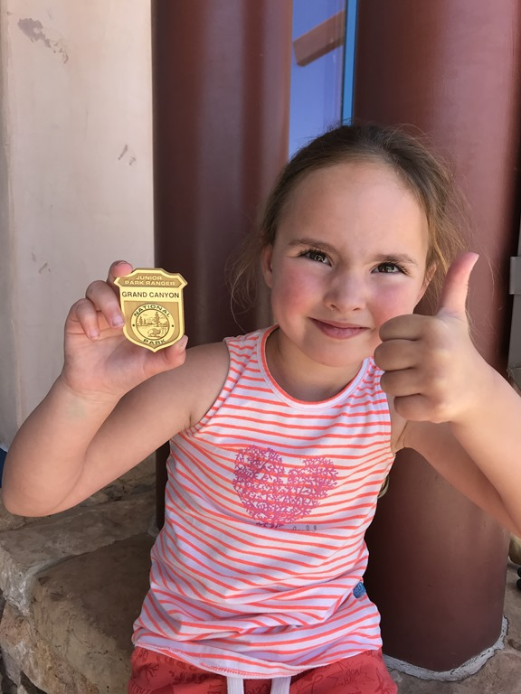

Het plan was eigenlijk om twee nachten in de Grand Canyon te blijven, maar we besluiten om de rit van ruim 5 uur naar Sand Hollow State Park op te knippen in twee wat meer acceptabele delen, en dus zorgen we ervoor dat we tegen 3 uur weer terug zijn bij de camper om vervolgens alvast naar Page te rijden.

Dus we zijn vroeg uit de veren om met de shuttlebus naar Hermits Rest te rijden. We rijden helemaal naar het einde van de route en gaan daar even wat eten en drinken. Bij het eindpunt hangt een klok, en het verhaal gaat dat een foto nemen onder de klok geluk brengt. En laten wij nu eind deze week naar Las Vegas gaan...

De Canyon zelf blijft natuurlijk enorm imposant, en het is moeilijk voor te stellen dat het allemaal is uitgesleten door dat ene riviertje de Colorado.

We hebben nog een heel stuk langs de rand gewandeld en daarna weer de bus genomen terug naar het Visitor Center. Daar moest Sofie als onderdeel van het Junior Ranger programma nog naar een film kijken (was vast interessant, ik had heel veel moeite m'n ogen open te houden) en daarna mocht ze haar welverdiende badge ophalen.

En toen was het dus (iets eerder dan gepland) tijd om de Grand Canyon te verlaten, en in ruim 2,5 uur naar Page te rijden. We komen uiteindelijk toch weer uit op de Wahweep campground in het Glen Canyon Recreational Area. Een wonderschoon plekje, maar wel heel erg warm. Sofie heeft nog even kunnen spelen met een Nederlands buurmeisje.

## 1 opmerking

### Gerard 12 mei 2018 om 07:38

De Grand Canyon is werkelijk imposant, zeker voor kleine Sofie.
