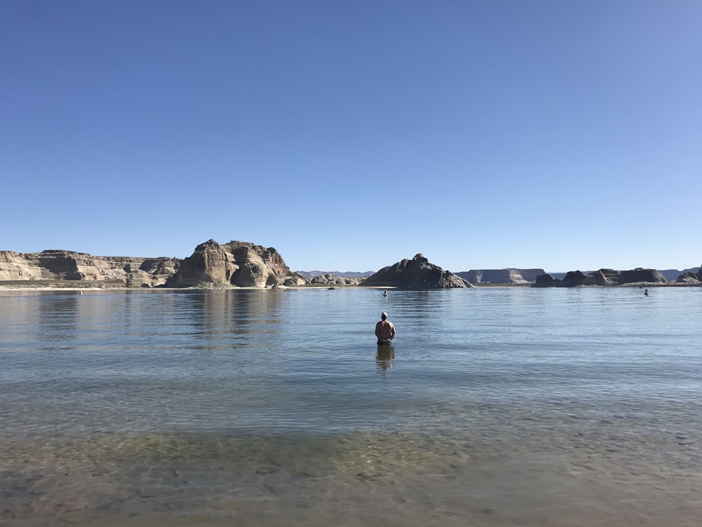
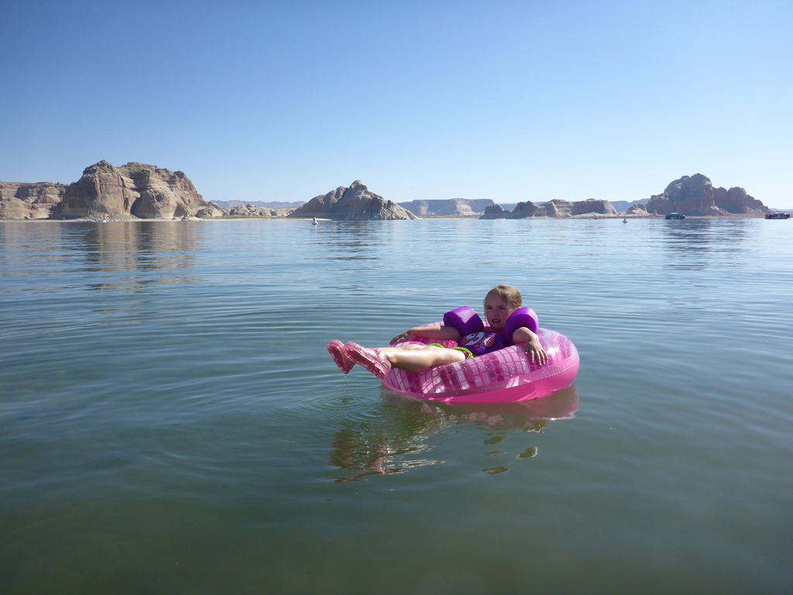
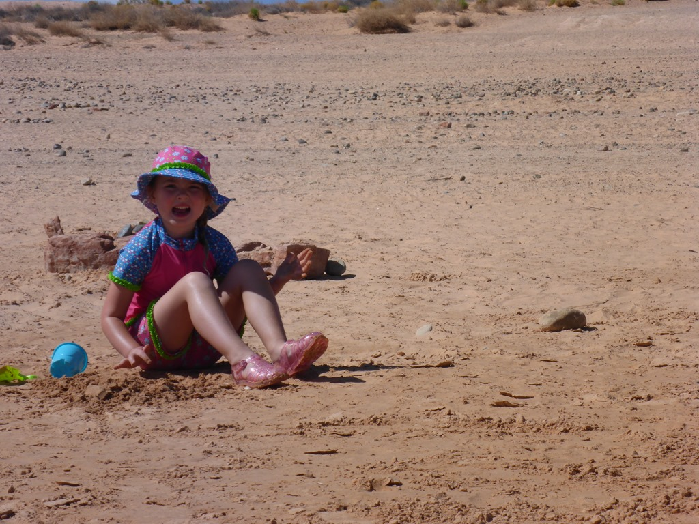
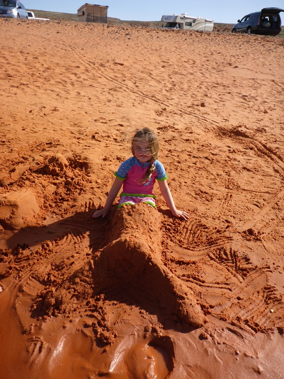
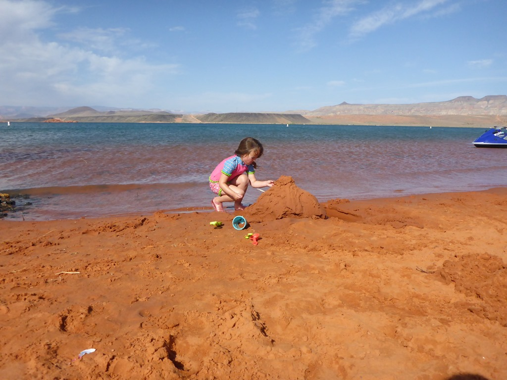

We waren erg vroeg wakker allemaal, dus om acht uur stonden we al op het strand van Lake Powell. We waren er helemaal alleen, op een verdwaalde meeuw na. Het water zag er aanlokkelijk uit, maar dat was het bij nader inzien niet: het was een wel heel erg frisse ochtendduik!

Na een uurtje spetteren en zandkastelen bouwen, hebben we ons droge goed weer aangetrokken, en zijn even boodschappen gaan doen bij de Safeway in Page. Na de lunch zijn we vertrokken naar een voor ons totaal nieuwe bestemming: Sand Hollow State Park. Dit ligt op ongeveer drie kwartier rijden van Zion National Park (staat voor morgen op het programma). Ook bij dit State Park ligt een meer en daar hebben de dames uitgebreid van genoten.

## 3 opmerkingen

### Anoniem 12 mei 2018 om 02:49

Hé Sofie, wat een mooie zeemeerminstaart heb je daar! Misschien wil mama wel een echte zeemeerminzwemstaart voor je kopen of heb je die al? Veel plezier in Zion! Groetjes uit Phantasialand

### Gerard 12 mei 2018 om 07:31

Het lijkt erop of het meer alleen voor jullie is. Wel gezellig toch. En Sofie dobbert zo leuk alleen rond

### 2-op-reis 14 mei 2018 om 22:12

Stonden de sporen van een 30 voeter of van Aalburgse sloffen nog in het strand? Heerlijk daar
