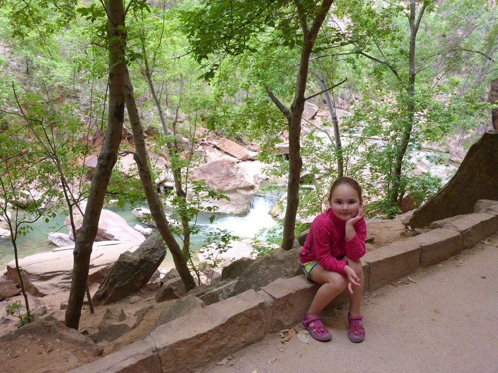
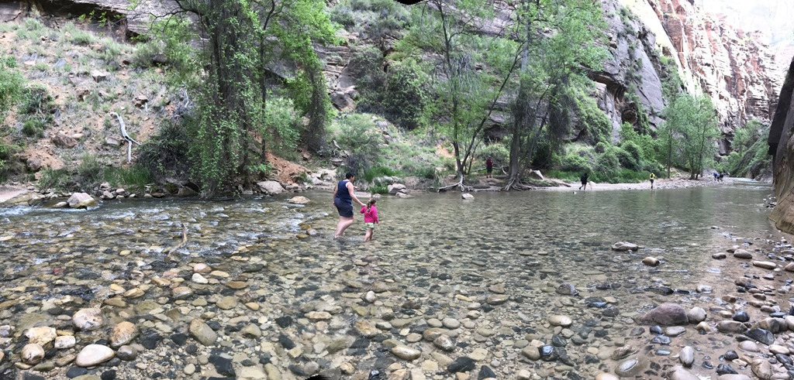
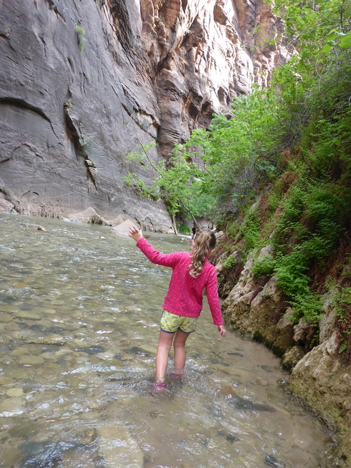
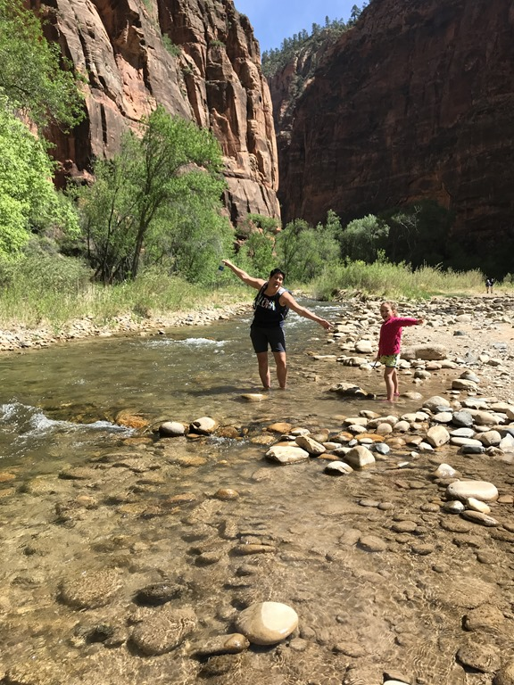
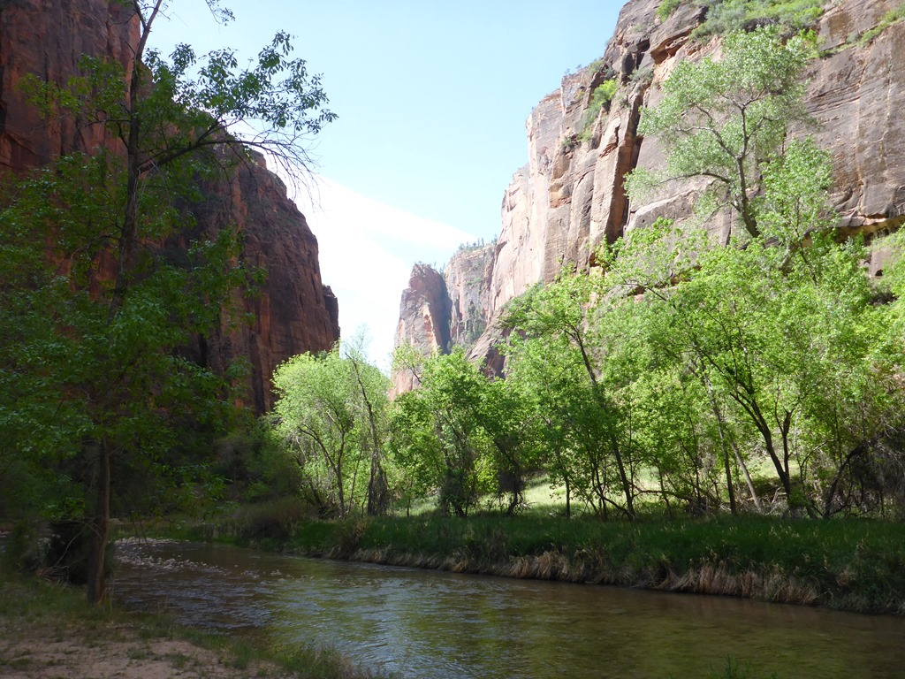
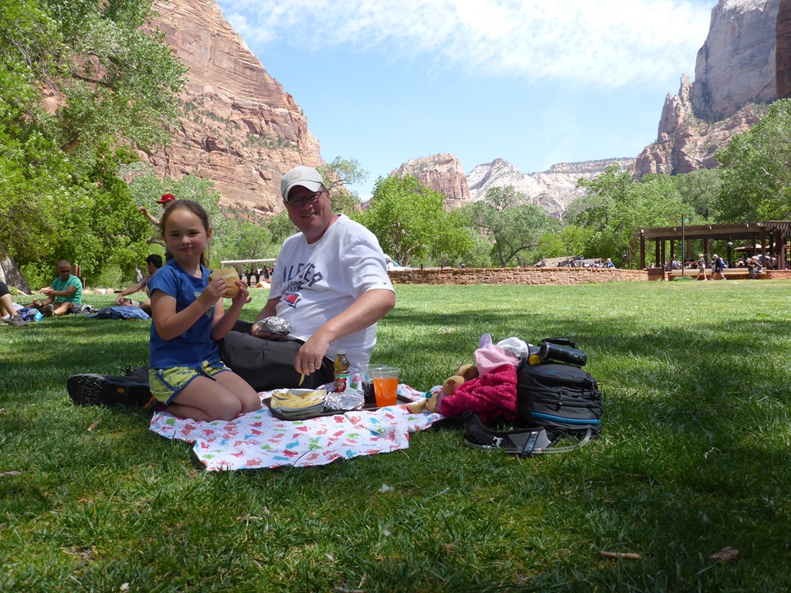

Aangezien het parkeren in Zion NP een ramp is, ging vanmorgen om kwart voor zes de wekker om vroeg in het park een parkeerplekje te claimen op de RV parking lot. We waren er iets na zeven uur, en toen was de parkeerplaats voor een kwart gevuld. Na ons ontbijt was het al bijna vol, dus maar goed dat we vroeg waren opgestaan.

We hebben de shuttlebus helemaal naar het eindpunt genomen om daar de Riverside Walk te gaan doen. Dit is het pad naar het beginpunt van de The Narrows wandeling waarbij je meerdere mijlen door de rivier wandelt met stokken en aangepast schoeisel. Dat hebben we een paar jaar geleden al een keer gedaan, en is voor Sofie nu nog wat te uitdagend, dus dat doen we vast nog wel een keer bij een volgend bezoek.

Ondanks dat het een verhard pad is, is het eigenlijk een erg leuk wandelingetje van ongeveer drie kilometer. Er is onderweg voldoende te zien. Aan het einde van het verharde pad, begint zoals gezegd The Narrows. De dames hebben een klein stukje door de rivier gewandeld, en Sofie vond het natuurlijk erg leuk om in het water te plonzen.

Terug hebben we langs de rivier gelopen over een zandpad. Hier en daar werden de voetjes nog eens extra nat gemaakt.

Na afloop van de wandeling hebben we weer de bus genomen en zijn gestopt bij de lodge om daar op het grasveld de lunch te nuttigen.

Na het korte avontuur in ons favoriete national park hebben we koers gezet richting de KOA in Cedar City. Morgen willen we de Kolob Canyons bezoeken, ook een onderdeel van Zion National Park, waar wij nog niet eerder zijn geweest. Bij het inchecken werd ik in het Limburgs aangesproken door meneer Pieter achter de balie. Hij woont al zestig jaar in de VS, komt uit Hoensbroek, is nooit meer terug geweest naar Nederland, en spreekt nog "accentloos" Limburgs.

Toen we over de Interstate richting Cedar City reden, zagen we trouwens dat de afrit naar Kolob Canyon is afgesloten... Blijkt dus dat dit deel van Zion sinds 1 mei voorlopig niet toegankelijk is (grrrrr). Dus moeten we morgen maar wat anders verzinnen om te gaan doen.

## 1 opmerking

### Gerard 15 mei 2018 om 12:16

Sofie vindt het water erg leuk maar mama ook zo te zien. Geniet maar lekker samen. Het zit er zo weer op
